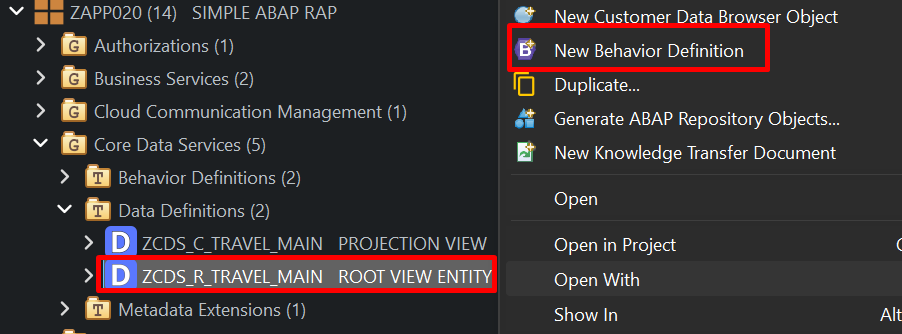
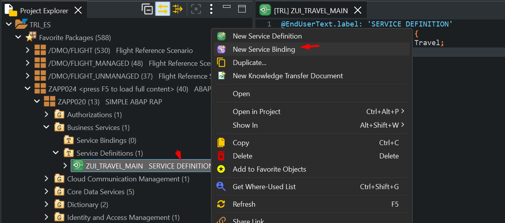
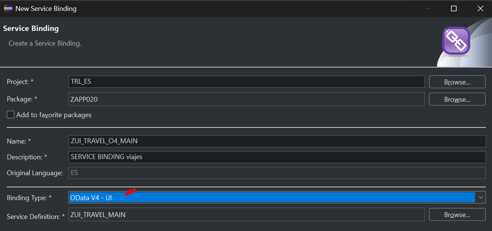
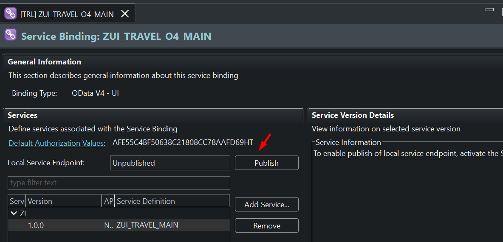
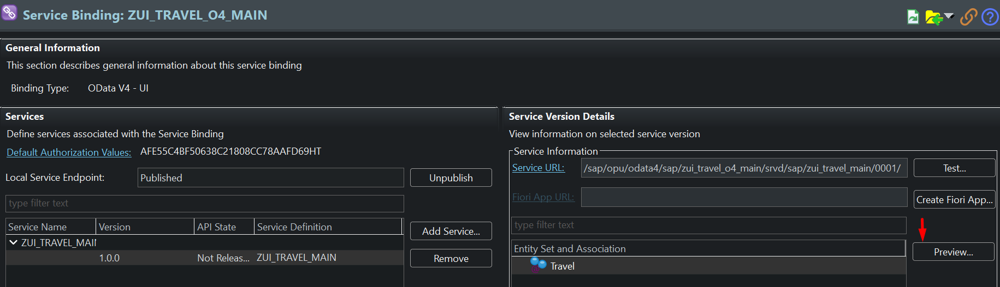
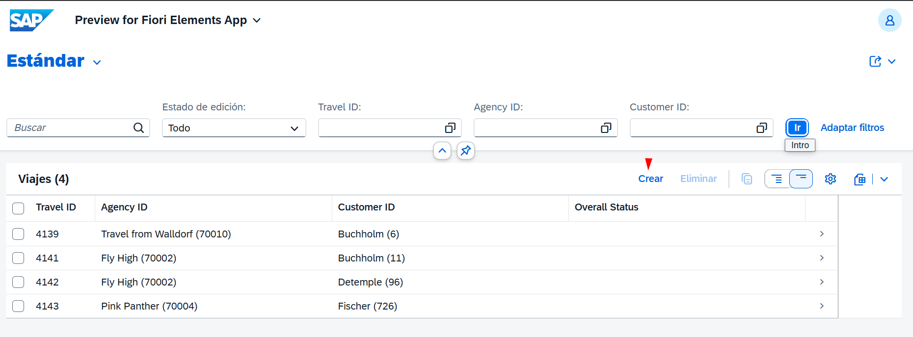
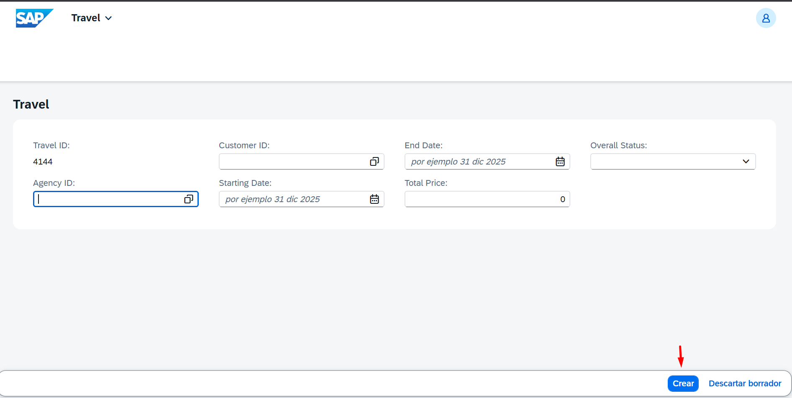

# MANAGED APP

1. [DICTIONARY](#dictionary)
   - 1.1 [Tabla BBDD](#11-tabla-bbdd)
   - 1.2 [Tabla BBDD DRAFT](#12-tabla-bbdd-draft)

2. [Core Data Services](#core-data-services)
   - 2.1 [DATA DEFINITIONS](#21-data-definitions)
     - 2.1.1 [ROOT VIEW](#211-root-view)
     - 2.1.2 [PROJECTION VIEW](#212-projection-view)
   - 2.2 [METADATA EXTENSIONS](#22-metadata-extensions)
   - 2.3 [BEHAVIOR DEFINITIONS](#23-behavior-definitions)
     - 2.3.1 [BEHAVIOR DEFINITIONS](#231-behavior-definitions)
     - 2.3.2 [PROJECTION BEHAVIOR](#232-projection-behavior)

3. [Business Services](#business-services)
   - 3.1 [Services Definition](#31-services-definition)
   - 3.2 [Services Binding](#32-services-binding)

4. [Source Code Library](#source-code)
   - 4.1 [Clases](#41-clases)   
---

## DICTIONARY

### 1.1 Tabla BBDD

``` abap
@EndUserText.label : 'Solo tabla travel'
@AbapCatalog.enhancement.category : #NOT_EXTENSIBLE
@AbapCatalog.tableCategory : #TRANSPARENT
@AbapCatalog.deliveryClass : #A
@AbapCatalog.dataMaintenance : #RESTRICTED
define table ztravel_main {

  key client            : abap.clnt not null;
  key travel_id         : /dmo/travel_id not null;
  agency_id             : /dmo/agency_id;
  customer_id           : /dmo/customer_id;
  begin_date            : /dmo/begin_date;
  end_date              : /dmo/end_date;
  @Semantics.amount.currencyCode : 'ztravel_main.currency_code'
  price                 : /dmo/total_price;
  currency_code         : /dmo/currency_code;
  overall_status        : /dmo/overall_status;
  created_by            : abp_creation_user;
  created_at            : abp_creation_tstmpl;
  local_last_changed_by : abp_locinst_lastchange_user;
  local_last_changed_at : abp_locinst_lastchange_tstmpl;
  last_changed_at       : abp_lastchange_tstmpl;

}
```

### 1.2 Tabla BBDD DRAFT

``` abap
@EndUserText.label : 'DRAFT travel main table'
@AbapCatalog.enhancement.category : #EXTENSIBLE_ANY
@AbapCatalog.tableCategory : #TRANSPARENT
@AbapCatalog.deliveryClass : #A
@AbapCatalog.dataMaintenance : #RESTRICTED
define table ztravel_maind {

  key mandt          : mandt not null;
  key travelid       : /dmo/travel_id not null;
  agencyid           : /dmo/agency_id;
  customerid         : /dmo/customer_id;
  begindate          : /dmo/begin_date;
  enddate            : /dmo/end_date;
  @Semantics.amount.currencyCode : 'ztravel_maind.currencycode'
  price              : /dmo/total_price;
  currencycode       : /dmo/currency_code;
  overallstatus      : /dmo/overall_status;
  createdby          : abp_creation_user;
  createdat          : abp_creation_tstmpl;
  locallastchangedby : abp_locinst_lastchange_user;
  locallastchangedat : abp_locinst_lastchange_tstmpl;
  lastchangedat      : abp_lastchange_tstmpl;
  "%admin"           : include sych_bdl_draft_admin_inc;

}
```

## Core Data Services

### 2.1 DATA DEFINITIONS

#### 2.1.1 ROOT VIEW

``` abap
@AccessControl.authorizationCheck: #NOT_REQUIRED
@Metadata.allowExtensions: true
@EndUserText.label: 'ROOT VIEW ENTITY'
@Metadata.ignorePropagatedAnnotations: true
define root view entity ZCDS_R_TRAVEL_MAIN
  as select from ztravel_main as Travel
  association [0..1] to /DMO/I_Agency            as _Agency        on $projection.AgencyID = _Agency.AgencyID
  association [0..1] to /DMO/I_Customer          as _Customer      on $projection.CustomerID = _Customer.CustomerID
  association [1..1] to /DMO/I_Overall_Status_VH as _OverallStatus on $projection.OverallStatus = _OverallStatus.OverallStatus
{
  key travel_id             as TravelID,
      agency_id             as AgencyID,
      customer_id           as CustomerID,
      begin_date            as BeginDate,
      end_date              as EndDate,
      @Semantics.amount.currencyCode: 'CurrencyCode'
      price                 as Price,
      @Consumption.valueHelpDefinition: [ {
        entity.name: 'I_CurrencyStdVH',
        entity.element: 'Currency',
        useForValidation: true
      } ]
      currency_code         as CurrencyCode,
      overall_status        as OverallStatus,
      @Semantics.user.createdBy: true
      created_by            as CreatedBy,
      @Semantics.systemDateTime.createdAt: true
      created_at            as CreatedAt,
      @Semantics.user.localInstanceLastChangedBy: true
      local_last_changed_by as LocalLastChangedBy,
      @Semantics.systemDateTime.localInstanceLastChangedAt: true
      local_last_changed_at as LocalLastChangedAt,
      @Semantics.systemDateTime.lastChangedAt: true
      last_changed_at       as LastChangedAt,

      //public associations
      _Customer,
      _Agency,
      _OverallStatus
}
``` 

#### 2.1.2 PROJECTION VIEW

``` abap
@Metadata.allowExtensions: true
@EndUserText.label: 'PROJECTION VIEW'
@Metadata.ignorePropagatedAnnotations: true
@AccessControl.authorizationCheck: #NOT_REQUIRED
@Search.searchable: true
define root view entity ZCDS_C_TRAVEL_MAIN
  provider contract transactional_query
  as projection on ZCDS_R_TRAVEL_MAIN
{

      @Search.defaultSearchElement: true
      @Search.fuzzinessThreshold: 0.90
  key TravelID,
      @Search.defaultSearchElement: true
      @ObjectModel.text.element: ['AgencyName']
      @Consumption.valueHelpDefinition: [{ entity : {name: '/DMO/I_Agency_StdVH', element: 'AgencyID' }, useForValidation: true }]
      AgencyID,
      _Agency.Name              as AgencyName,
      @Search.defaultSearchElement: true
      @ObjectModel.text.element: ['CustomerName']
      @Consumption.valueHelpDefinition: [{ entity : {name: '/DMO/I_Customer_StdVH', element: 'CustomerID' }, useForValidation: true }]
      CustomerID,
      _Customer.LastName        as CustomerName,
      BeginDate,
      EndDate,
      Price,
      @Semantics.currencyCode: true
      @Consumption: {
        valueHelpDefinition: [ {
          entity.element: 'Currency',
          entity.name: 'I_CurrencyStdVH',
          useForValidation: true
        } ]
      }
      CurrencyCode,
      @ObjectModel.text.element: ['OverallStatusText']
      @Consumption.valueHelpDefinition: [{ entity: {name: '/DMO/I_Overall_Status_VH', element: 'OverallStatus' }, useForValidation: true }]
      OverallStatus,
      _OverallStatus._Text.Text as OverallStatusText : localized,
      CreatedBy,
      CreatedAt,
      LocalLastChangedAt,
      LastChangedAt

}

```

### 2.2 METADATA EXTENSIONS

``` abap
@Metadata.layer: #CUSTOMER
@UI: {
 headerInfo: {
 typeName: 'Travel',
 typeNamePlural: 'Viajes',
 description: { type: #STANDARD, value: 'TravelId' } //case-sensitive
 }
}
annotate entity ZCDS_C_TRAVEL_MAIN with
{
  @UI.facet: [ {
  label: 'Travel',
  id: 'idIdentification',
  purpose: #STANDARD,
  position: 10 ,
  type: #IDENTIFICATION_REFERENCE
  } ]
  @UI: {
  lineItem: [ { position: 10, importance: #HIGH } ],
  identification: [ { position: 10 } ],
  selectionField: [ { position: 10 } ]
  }
  TravelID;
  @UI: {
  lineItem: [ { position: 20, importance: #HIGH } ],
  identification: [ { position: 20 } ],
  selectionField: [ { position: 20 } ]
  }
  AgencyID;
  @UI: {
  lineItem: [ { position: 30, importance: #HIGH } ],
  identification: [ { position: 30 } ],
  selectionField: [ { position: 30 } ]
  }
  CustomerID;
  @UI: {
  lineItem: [ { position: 40, importance: #MEDIUM } ],
  identification: [ { position: 40 } ]
  }
  BeginDate;
  @UI: {
  lineItem: [ { position: 50, importance: #MEDIUM } ],
  identification: [ { position: 50 } ]
  }
  EndDate;
  @UI.identification: [ { position: 60 } ]
  Price;
  @UI: {
  lineItem: [ { position: 70, importance: #HIGH } ],
  identification: [ { position: 70 } ],
  textArrangement: #TEXT_ONLY
  }
  OverallStatus;
  @UI.hidden: true
  CreatedBy;
  @UI.hidden: true
  CreatedAt;

  @UI.hidden: true
  LocalLastChangedAt;
  @UI.hidden: true
  LastChangedAt;

}
```

### 2.3 BEHAVIOR DEFINITIONS

Es un artefacto que especifica QUÉ operaciones están permitidas sobre una entidad 
y CÓMO se comporta esa entidad durante las operaciones CRUD (Create, Read, Update, Delete).

[...detalle](BDEF.MD)

Ventas:
* ✓ Separación de responsabilidades: Lógica de negocio separada de la UI
* ✓ Reutilización: Mismo comportamiento para múltiples interfaces (Fiori, API, etc.)
* ✓ Mantenibilidad: Cambios centralizados en un solo lugar
* ✓ Consistencia: Reglas de negocio aplicadas uniformemente
* ✓ RAP Framework: Aprovecha todas las capacidades del framework moderno de SAP

#### 2.3.1 BEHAVIOR DEFINITIONS

##### Se crea BDEF sobre CDS rot o Interfaz


``` abap
managed
implementation in class zbp_cds_r_travel_main unique;
strict ( 2 );
with draft;
define behavior for ZCDS_R_TRAVEL_MAIN alias Travel
persistent table ztravel_main
draft table ztravel_maind
etag master LocalLastChangedAt
lock master total etag LastChangedAt
authorization master ( global )
early numbering

{

  field ( readonly )
  TravelID;

  create;
  update;
  delete;

  draft action Activate optimized;
  draft action Discard;
  draft action Edit;
  draft action Resume;
  draft determine action Prepare;

  mapping for ztravel_main corresponding
    {
      TravelID           = travel_id;
      AgencyID           = agency_id;
      CustomerID         = customer_id;
      BeginDate          = begin_date;
      EndDate            = end_date;
      Price              = price;
      CurrencyCode       = currency_code;
      OverallStatus      = overall_status;
      CreatedBy          = created_by;
      CreatedAt          = created_at;
      LocalLastChangedBy = local_last_changed_by;
      LocalLastChangedAt = local_last_changed_at;
      LastChangedAt      = last_changed_at;
    }
}
```

#### 2.3.2 PROJECTION BEHAVIOR

``` abap
projection
implementation in class zbp_cds_r_travel_main unique;
strict ( 2 );
use draft;
define behavior for ZCDS_C_TRAVEL_MAIN alias Travel
use etag
{
  use create;
  use update;
  use delete;

  use action Edit;
  use action Activate;
  use action Discard;
  use action Resume;
  use action Prepare;
}
```

## business-services

### 3.1 services-definition

``` abap
@EndUserText.label: 'SERVICE DEFINITION'
define service ZUI_TRAVEL_MAIN {
  expose ZCDS_C_TRAVEL_MAIN as Travel;
}
```

### 3.2 services-binding

Pasos para la creación una nueva vinculación.




Selección del tipo de vinculación


Publicar el servicio


Visualizar


Prueba 1 - Crear o alta de registro.


guardar


## source-code

### 4.1 clases

``` abap
CLASS zbp_cds_r_travel_main DEFINITION PUBLIC ABSTRACT FINAL FOR BEHAVIOR OF zcds_r_travel_main.
ENDCLASS.

CLASS zbp_cds_r_travel_main IMPLEMENTATION.
ENDCLASS.
```

``` abap
CLASS lhc_Travel DEFINITION INHERITING FROM cl_abap_behavior_handler.
  PRIVATE SECTION.
    METHODS get_global_authorizations FOR GLOBAL AUTHORIZATION
      IMPORTING REQUEST requested_authorizations FOR Travel RESULT result.
    METHODS earlynumbering_create FOR NUMBERING
      IMPORTING entities FOR CREATE Travel.

ENDCLASS.


CLASS lhc_Travel IMPLEMENTATION.
  METHOD get_global_authorizations.
  ENDMETHOD.

  METHOD earlynumbering_create.

    DATA entity           TYPE STRUCTURE FOR CREATE zcds_r_travel_main.
    DATA travel_id_max    TYPE /dmo/travel_id.
    DATA use_number_range TYPE abap_bool VALUE abap_true.

    " Ensure Travel ID is not set yet (idempotent)- must be checked when BO is draft-enabled
    LOOP AT entities INTO entity WHERE TravelID IS NOT INITIAL.
      APPEND CORRESPONDING #( entity ) TO mapped-travel.
    ENDLOOP.

    DATA(entities_wo_travelid) = entities.

    " Remove the entries with an existing Travel ID
    DELETE entities_wo_travelid WHERE TravelID IS NOT INITIAL.

    IF use_number_range = abap_true.

      " Get numbers
      TRY.
          cl_numberrange_runtime=>number_get( EXPORTING nr_range_nr       = '01'
                                                        object            = '/DMO/TRV_M'
                                                        quantity          = CONV #( lines( entities_wo_travelid ) )
                                              IMPORTING number            = DATA(number_range_key)
                                              " TODO: variable is assigned but never used (ABAP cleaner)
                                                        returncode        = DATA(number_range_return_code)
                                                        returned_quantity = DATA(number_range_returned_quantity) ).
        CATCH cx_number_ranges INTO DATA(lx_number_ranges).
            " In case of an error, report all entities as failed
          LOOP AT entities_wo_travelid INTO entity.
            APPEND VALUE #( %cid      = entity-%cid
                            %key      = entity-%key
                            %is_draft = entity-%is_draft
                            %msg      = lx_number_ranges )
                   TO reported-travel.

            APPEND VALUE #( %cid      = entity-%cid
                            %key      = entity-%key
                            %is_draft = entity-%is_draft )
                   TO failed-travel.
          ENDLOOP.
          RETURN.
      ENDTRY.

      " determine the first free travel ID from the number range
      travel_id_max = number_range_key - number_range_returned_quantity.
    ELSE.
      " determine the first free travel ID without number range
      " Get max travel ID from active table
      SELECT FROM ztravel_main
       FIELDS MAX( travel_id ) AS travelID
        INTO @travel_id_max UP TO 1 ROWS.

      " Get max travel ID from draft table
      SELECT FROM ztravel_maind
       FIELDS MAX( travelid )
        INTO @DATA(max_travelid_draft) UP TO 1 ROWS.

      IF max_travelid_draft > travel_id_max.
        travel_id_max = max_travelid_draft.
      ENDIF.

    ENDIF.

    " Set Travel ID for new instances w/o ID
    LOOP AT entities_wo_travelid INTO entity.

      travel_id_max += 1.
      entity-TravelID = travel_id_max.

      APPEND VALUE #( %cid      = entity-%cid
                      %key      = entity-%key
                      %is_draft = entity-%is_draft )
             TO mapped-travel.
    ENDLOOP.

  ENDMETHOD.

ENDCLASS.
```