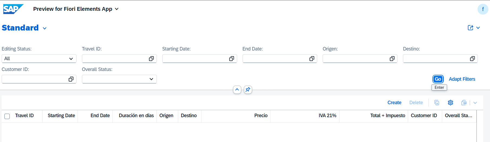
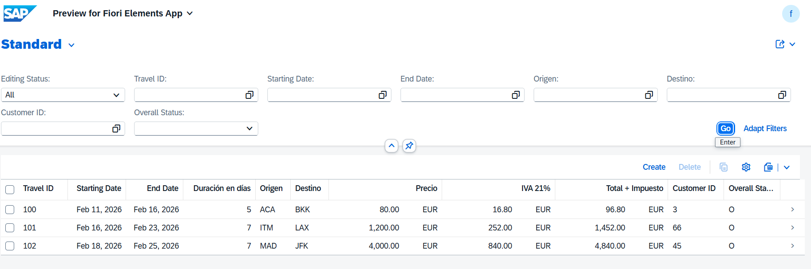
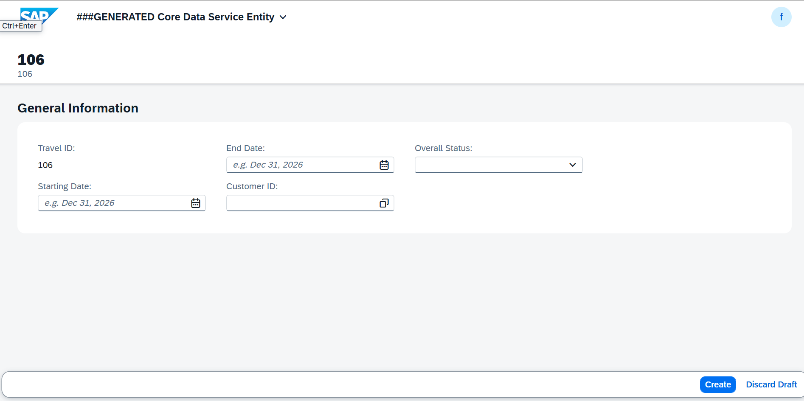
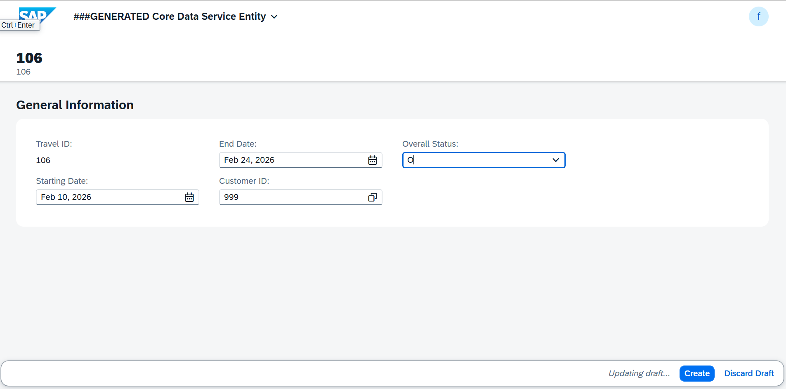

# MANAGED APP

1. [DICTIONARY](#dictionary)
   - 1.1 [Tabla BBDD](#11-tabla-bbdd)
   - 1.2 [Tabla BBDD DRAFT](#12-tabla-bbdd-draft)

2. [Core Data Services](#core-data-services)
   - 2.1 [DATA DEFINITIONS](#21-data-definitions)
     - 2.1.1 [ROOT VIEW](#211-root-view)
     - 2.1.2 [PROJECTION VIEW](#212-projection-view)
     - 2.1.3 [ABSTRACT ENTITY](#213-abstract-entity)
   - 2.2 [METADATA EXTENSIONS ¡Aquí se definen tres botones de interacción!](#22-metadata-extensions)
    - 2.3 [BEHAVIOR DEFINITIONS](#23-behavior-definitions)
     - 2.3.1 [BEHAVIOR DEFINITIONS](#231-behavior-definitions)
     - 2.3.2 [PROJECTION BEHAVIOR](#232-projection-behavior)

3. [Business Services](#business-services)
   - 3.1 [Services Definition](#31-services-definition)
   - 3.2 [Services Binding](#32-services-binding)

4. [Source Code Library](#source-code)
   - 4.1 [Clases](#41-clases)

5. [Pruebas](#pruebas)

---

## DICTIONARY

### 1.1 Tabla BBDD

``` abap
@EndUserText.label : 'Tabla turismo determinaciones'
@AbapCatalog.enhancement.category : #NOT_EXTENSIBLE
@AbapCatalog.tableCategory : #TRANSPARENT
@AbapCatalog.deliveryClass : #A
@AbapCatalog.dataMaintenance : #RESTRICTED
define table ztravel_02 {

  key client             : abap.clnt not null;
  key travel_id          : /dmo/travel_id not null;
  begin_date             : /dmo/begin_date;
  end_date               : /dmo/end_date;
  airport_origin_id      : /dmo/airport_id;
  airport_destination_id : /dmo/airport_id;
  @Semantics.amount.currencyCode : 'ztravel_02.currency_code'
  booking_fee            : /dmo/booking_fee;
  @Semantics.amount.currencyCode : 'ztravel_02.currency_code'
  tax_amount             : /dmo/total_price;
  @Semantics.amount.currencyCode : 'ztravel_02.currency_code'
  total_price            : /dmo/total_price;
  currency_code          : /dmo/currency_code;
  customer_id            : /dmo/customer_id;
  overall_status         : /dmo/overall_status;
  duration_days          : abap.int4;
  created_by             : abp_creation_user;
  created_at             : abp_creation_tstmpl;
  local_last_changed_by  : abp_locinst_lastchange_user;
  local_last_changed_at  : abp_locinst_lastchange_tstmpl;
  last_changed_at        : timestampl;

}
```

### 1.2 Tabla BBDD DRAFT

``` abap
@EndUserText.label : 'Draft Database Table for ZTRAVEL_02_D'
@AbapCatalog.enhancement.category : #EXTENSIBLE_ANY
@AbapCatalog.tableCategory : #TRANSPARENT
@AbapCatalog.deliveryClass : #A
@AbapCatalog.dataMaintenance : #RESTRICTED
define table ztravel_02_d {

  key mandt            : mandt not null;
  key travelid         : /dmo/travel_id not null;
  begindate            : /dmo/begin_date;
  enddate              : /dmo/end_date;
  airportoriginid      : /dmo/airport_id;
  airportdestinationid : /dmo/airport_id;
  @Semantics.amount.currencyCode : 'ztravel_02_d.currencycode'
  bookingfee           : /dmo/booking_fee;
  @Semantics.amount.currencyCode : 'ztravel_02_d.currencycode'
  taxamount            : /dmo/total_price;
  @Semantics.amount.currencyCode : 'ztravel_02_d.currencycode'
  totalprice           : /dmo/total_price;
  currencycode         : /dmo/currency_code;
  customerid           : /dmo/customer_id;
  overallstatus        : /dmo/overall_status;
  durationdays         : abap.int4;
  createdby            : abp_creation_user;
  createdat            : abp_creation_tstmpl;
  locallastchangedby   : abp_locinst_lastchange_user;
  locallastchangedat   : abp_locinst_lastchange_tstmpl;
  lastchangedat        : timestampl;
  "%admin"             : include sych_bdl_draft_admin_inc;

}
```

## Core Data Services

### 2.1 DATA DEFINITIONS

#### 2.1.1 ROOT VIEW

``` abap
@AccessControl.authorizationCheck: #MANDATORY
@Metadata.allowExtensions: true
@ObjectModel.sapObjectNodeType.name: 'ZTRAVEL_02'
@EndUserText.label: 'DETERMINACIONES'
define root view entity ZR_TRAVEL_02
  as select from ztravel_02
{
  key travel_id              as TravelID,
      begin_date             as BeginDate,
      end_date               as EndDate,
      airport_origin_id      as AirportOriginID,
      airport_destination_id as AirportDestinationID,
      @Semantics.amount.currencyCode: 'CurrencyCode'
      booking_fee            as BookingFee,
      @Semantics.amount.currencyCode: 'CurrencyCode'
      tax_amount             as TaxAmount,
      @Semantics.amount.currencyCode: 'CurrencyCode'
      total_price            as TotalPrice,
      currency_code          as CurrencyCode,
      customer_id            as CustomerID,
      overall_status         as OverallStatus,      
      duration_days          as DurationDays,
      @Semantics.user.createdBy: true
      created_by             as CreatedBy,
      @Semantics.systemDateTime.createdAt: true
      created_at             as CreatedAt,
      @Semantics.user.localInstanceLastChangedBy: true
      local_last_changed_by  as LocalLastChangedBy,
      @Semantics.systemDateTime.localInstanceLastChangedAt: true
      local_last_changed_at  as LocalLastChangedAt,
      last_changed_at        as LastChangedAt
}

``` 

#### 2.1.2 PROJECTION VIEW

``` abap
@AccessControl.authorizationCheck: #MANDATORY
@EndUserText.label: 'DETERMINACIONES'
@Metadata.allowExtensions: true
@Metadata.ignorePropagatedAnnotations: true
@ObjectModel.sapObjectNodeType.name: 'ZTRAVEL_02'

define root view entity ZC_TRAVEL_02000
  provider contract transactional_query
  as projection on ZR_TRAVEL_02

  association [1..1] to ZR_TRAVEL_02 as _BaseEntity on $projection.TravelID = _BaseEntity.TravelID

{
  key TravelID,

      BeginDate,
      EndDate,

      @Consumption.valueHelpDefinition: [
        { entity: { name: '/DMO/I_Airport_StdVH', 
                    element: 'AirportID' } } ]
      AirportOriginID,

      @Consumption.valueHelpDefinition: [ 
        { entity: { name: '/DMO/I_Airport_StdVH', 
          element: 'AirportID' } } ]
      AirportDestinationID,

      @Semantics.amount.currencyCode: 'CurrencyCode'
      BookingFee,

      @Semantics.amount.currencyCode: 'CurrencyCode'
      TaxAmount,

      @Semantics.amount.currencyCode: 'CurrencyCode'
      TotalPrice,

      @Consumption.valueHelpDefinition: [ 
        { entity: { element: 'Currency', 
                    name: 'I_CurrencyStdVH' },
                    useForValidation: true } ]
      CurrencyCode,

      @Consumption.valueHelpDefinition: [ 
        { entity: { name: '/DMO/I_Customer_StdVH', 
                    element: 'CustomerID' } } ]
      CustomerID,

      @Consumption.valueHelpDefinition: [
            { entity: { name: '/DMO/I_Overall_Status_VH_Text', 
              element: 'OverallStatus' } 
              
              } ]
      OverallStatus,
      DurationDays,

      @Semantics.user.createdBy: true
      CreatedBy,

      @Semantics.systemDateTime.createdAt: true
      CreatedAt,

      @Semantics.user.localInstanceLastChangedBy: true
      LocalLastChangedBy,

      @Semantics.systemDateTime.localInstanceLastChangedAt: true
      LocalLastChangedAt,

      LastChangedAt,

      _BaseEntity
}

```

#### 2.1.3 ABSTRACT ENTITY

``` abap
no aplica
```
Anotaciones clave:
```js
no aplica
```

### 2.2 METADATA EXTENSIONS

Los Metadata Extensions sirven para definir la configuración de la UI (interfaz de usuario) de forma declarativa, permitiendo la separación entre:

* Lógica de datos (CDS View)
* Presentación visual (anotaciones UI)

Estas anotaciones se publican automáticamente en el servicio **OData** y son interpretadas por **Fiori Elements** para generar la interfaz sin programación manual.

Configuran cómo se ve y comporta la aplicación Fiori sin tocar código de datos ni frontend.

[...detalle](../0.%20Developing%20LIST%20REPORT%20APP%20FOR%20CREATE/md_docs/metadata_extensions.md)

``` abap
@Metadata.layer: #CORE

@UI.headerInfo: { 

                  title: { type: #STANDARD, value: 'TravelID' },
                  description: { type: #STANDARD, value: 'TravelID' } }

annotate view ZC_TRAVEL_02000 with

{
  @UI.facet: [ { label: 'General Information',
                 id: 'GeneralInfo',
                 purpose: #STANDARD,
                 position: 10,
                 type: #IDENTIFICATION_REFERENCE } ]
                 
  @UI.identification: [ { position: 10 } ]
  @UI.lineItem: [ { position: 10 } ]
  @UI.selectionField: [ { position: 10 } ]
  TravelID;

  @UI.identification: [ { position: 20 } ]
  @UI.lineItem: [ { position: 20 } ]
  @UI.selectionField: [ { position: 20 } ]
  BeginDate;

  @UI.identification: [ { position: 30 } ]
  @UI.lineItem: [ { position: 30 } ]
  @UI.selectionField: [ { position: 30 } ]
  EndDate;

  @UI.identification: [ { position: 40 } ]
  @UI.lineItem: [ { position: 40 } ]
  @EndUserText.label: 'Duración en días'
  DurationDays;
  
  @UI.identification: [ { position: 50 } ]
  @UI.lineItem: [ { position: 50, label: 'Origen' } ]
  @UI.selectionField: [ { position: 50 } ]
  @EndUserText.label: 'Origen'
  AirportOriginID;

  @UI.identification: [ { position: 60 } ]
  @UI.lineItem: [ { position: 60, label: 'Destino' } ]
  @UI.selectionField: [ { position: 60 } ]
  @EndUserText.label: 'Destino'
  AirportDestinationID;

  @UI.identification: [ { position: 70 } ]
  @UI.lineItem: [ { position: 70 } ]
  @EndUserText.label: 'Precio'
  BookingFee;

  @UI.identification: [ { position: 80 } ]
  @UI.lineItem: [ { position: 80 } ]
  @EndUserText.label: 'IVA 21%'
  TaxAmount;

  @UI.identification: [ { position: 90 } ]
  @UI.lineItem: [ { position: 90 } ]
  @EndUserText.label: 'Total + Impuesto'
  TotalPrice;

  @UI.identification: [ { position: 100 } ]
  @UI.lineItem: [ { position: 100 } ]
  @UI.selectionField: [ { position: 100 } ]
  CustomerID;

  @UI.identification: [ { position: 110 } ]
  @UI.lineItem: [ { position: 110 } ]
  @UI.selectionField: [ { position: 110 } ]
  OverallStatus;

  @UI.hidden: true
  CreatedBy;

  @UI.hidden: true
  CreatedAt;

  @UI.hidden: true
  LocalLastChangedBy;

  @UI.hidden: true
  LocalLastChangedAt;

  @UI.hidden: true
  LastChangedAt;

  @UI.hidden: true
  _BaseEntity;
}
```


### 2.3 BEHAVIOR DEFINITIONS

Es un artefacto que especifica QUÉ operaciones están permitidas sobre una entidad 
y CÓMO se comporta esa entidad durante las operaciones CRUD (Create, Read, Update, Delete).

[...detalle](../0.%20Developing%20LIST%20REPORT%20APP%20FOR%20CREATE/md_docs/BDEF.MD)

Ventas:
* ✓ Separación de responsabilidades: Lógica de negocio separada de la UI
* ✓ Reutilización: Mismo comportamiento para múltiples interfaces (Fiori, API, etc.)
* ✓ Mantenibilidad: Cambios centralizados en un solo lugar
* ✓ Consistencia: Reglas de negocio aplicadas uniformemente
* ✓ RAP Framework: Aprovecha todas las capacidades del framework moderno de SAP

#### 2.3.1 BEHAVIOR DEFINITIONS

##### Se crea BDEF sobre CDS root o Interfaz


``` abap
managed implementation in class ZBP_R_TRAVEL_02 unique;
strict ( 2 );
with draft;
extensible;
define behavior for ZR_TRAVEL_02 alias ZrTravel02
persistent table ztravel_02
extensible
draft table ztravel_02_d
etag master LocalLastChangedAt
lock master total etag LocalLastChangedAt
authorization master ( global )
{
  field ( mandatory : create )
  TravelID;

  field ( readonly )
  CreatedBy,
  CreatedAt,
  LocalLastChangedBy,
  LocalLastChangedAt,
  TaxAmount,      // Campo calculado
  TotalPrice,     // Campo calculado
  DurationDays;   // Campo calculado

  field ( readonly : update )
  TravelID;


  create;
  update;
  delete;

  draft action Activate optimized;
  draft action Discard;
  draft action Edit;
  draft action Resume;
  draft determine action Prepare;


// ══════════════════════════════════════════════════════════
// DETERMINACIONES
// ══════════════════════════════════════════════════════════

  // Opción A: Se ejecuta siempre al guardar durante creación
  determination setDefaultCurrency on save { create; }

  // Opción B (RECOMENDADA): Se ejecuta cuando cambian las fechas
  determination calculateDuration on modify { field BeginDate, EndDate; }

  determination calculateTaxAmount on modify { field BookingFee; }

  determination calculateTotalPrice on modify { field BookingFee, TaxAmount; }


  mapping for ztravel_02 corresponding extensible
    {
      TravelID             = travel_id;
      BeginDate            = begin_date;
      EndDate              = end_date;
      AirportOriginID      = airport_origin_id;
      AirportDestinationID = airport_destination_id;
      BookingFee           = booking_fee;
      TaxAmount            = tax_amount;
      TotalPrice           = total_price;
      CurrencyCode         = currency_code;
      CustomerID           = customer_id;
      OverallStatus        = overall_status;
      DurationDays         = duration_days;
      CreatedBy            = created_by;
      CreatedAt            = created_at;
      LocalLastChangedBy   = local_last_changed_by;
      LocalLastChangedAt   = local_last_changed_at;
      LastChangedAt        = last_changed_at;
    }

}
```

#### 2.3.2 PROJECTION BEHAVIOR

#### Ventajas

1. Separación de Responsabilidades: Interface (lógica) vs Consumption (UI)
2. Múltiples UIs: Puedes tener varias proyecciones para diferentes roles
3. Mantenibilidad: Cambios en la lógica se reflejan automáticamente
4. Seguridad: Controlas qué expones en cada capa

``` abap
projection implementation in class ZBP_C_TRAVEL_02 unique;
strict ( 2 );
extensible;
use draft;
use side effects;
define behavior for ZC_TRAVEL_02000 alias ZcTravel02000
extensible
use etag
{
  use create;
  use update;
  use delete;

  use action Edit;
  use action Activate;
  use action Discard;
  use action Resume;
  use action Prepare;

}
```

``` abap
```

## business-services

### 3.1 services-definition

``` abap
@EndUserText: {
  label: 'Service Definition for ZC_TRAVEL_02000'
}
@ObjectModel: {
  leadingEntity: {
    name: 'ZC_TRAVEL_02000'
  }
}
define service ZUI_TRAVEL_02_O4 provider contracts odata_v4_ui {
  expose ZC_TRAVEL_02000;
}
```

### 3.2 services-binding

Pasos para la creación una nueva vinculación.


<!--  -->


Selección del tipo de vinculación
<!--  -->


Publicar el servicio
<!--  -->


Visualizar
<!--  -->


## source-code

### 4.1 clases

``` abap
class ZBP_R_TRAVEL_02 definition
  public
  abstract
  final
  for behavior of ZR_TRAVEL_02 .

public section.
protected section.
private section.
ENDCLASS.

CLASS ZBP_R_TRAVEL_02 IMPLEMENTATION.
ENDCLASS.

```

``` abap
class lhc_zr_travel_02 definition inheriting from cl_abap_behavior_handler.
  public section.
    " ══════════════════════════════════════════════════════════
    " CONSTANTES
    " ══════════════════════════════════════════════════════════
    constants c_tax_rate         type p length 5 decimals 2 value '0.21'. " 21% IVA
    constants c_default_currency type /dmo/currency_code    value 'EUR'.

  private section.
    methods get_global_authorizations for global authorization
              importing
                 request requested_authorizations for ZrTravel02
              result result.

    " ══════════════════════════════════════════════════════════
    " MÉTODOS DE DETERMINACIONES
    " ══════════════════════════════════════════════════════════
    methods calculateDuration for determine on modify
                  importing keys for ZrTravel02~calculateDuration.

    methods calculateTaxAmount for determine on modify
      importing keys for ZrTravel02~calculateTaxAmount.

    methods calculateTotalPrice for determine on modify
      importing keys for ZrTravel02~calculateTotalPrice.

    methods setDefaultCurrency for determine on save
      importing keys for ZrTravel02~setDefaultCurrency.
endclass.


class lhc_zr_travel_02 implementation.
  method get_global_authorizations.
  endmethod.

  method calculateDuration.
    " ══════════════════════════════════════════════════════════════════
    " DETERMINACIÓN 2: Calcular Duración del Viaje en Días
    " Trigger: ON MODIFY { field BeginDate, EndDate }
    " Se ejecuta: Cuando el usuario cambia begin_date o end_date
    " ══════════════════════════════════════════════════════════════════
    " Paso 1: Leer las fechas actuales
    read entities of zr_travel_02 in local mode
         entity ZrTravel02
         fields ( BeginDate EndDate DurationDays )
         with corresponding #( keys )
         result data(lt_travels).

    " Paso 2: Calcular duración solo si ambas fechas existen
    modify entities of zr_travel_02 in local mode
           entity ZrTravel02
           update fields ( DurationDays )
           with value #( for ls_travel in lt_travels
                         where (     BeginDate is not initial
                                 and EndDate   is not initial )
                         ( %tky         = ls_travel-%tky
                           DurationDays = ls_travel-EndDate - ls_travel-BeginDate ) ).
  endmethod.

  " ══════════════════════════════════════════════════════════════════
  " DETERMINACIÓN 3: Calcular Impuestos (Tax Amount)
  " Trigger: ON MODIFY { field BookingFee }
  " Se ejecuta: Cuando el usuario cambia el booking_fee
  " Fórmula: TaxAmount = BookingFee × 21%
  " ══════════════════════════════════════════════════════════════════
  method calculateTaxAmount.
    " Paso 1: Leer el booking_fee actual
    read entities of zr_travel_02 in local mode
         entity ZrTravel02
         fields ( BookingFee TaxAmount CurrencyCode )
         with corresponding #( keys )
         result data(lt_travels).

    " Paso 2: Calcular impuestos
    modify entities of zr_travel_02 in local mode
           entity ZrTravel02
           update fields ( TaxAmount )
           with value #( for ls_travel in lt_travels
                         where ( BookingFee is not initial )
                         ( %tky      = ls_travel-%tky
                           TaxAmount = ls_travel-BookingFee * c_tax_rate ) ).
  endmethod.

  " ══════════════════════════════════════════════════════════════════
  " DETERMINACIÓN 4: Calcular Precio Total
  " Trigger: ON MODIFY { field BookingFee, TaxAmount }
  " Se ejecuta: Cuando cambia booking_fee O tax_amount
  " Fórmula: TotalPrice = BookingFee + TaxAmount
  " ══════════════════════════════════════════════════════════════════
  method calculateTotalPrice.
    " Paso 1: Leer booking_fee y tax_amount actuales
    read entities of zr_travel_02 in local mode
         entity ZrTravel02
         fields ( BookingFee TaxAmount TotalPrice CurrencyCode )
         with corresponding #( keys )
         result data(lt_travels).

    " Paso 2: Calcular precio total
    modify entities of zr_travel_02 in local mode
           entity ZrTravel02
           update fields ( TotalPrice )
           with value #( for ls_travel in lt_travels
                         ( %tky       = ls_travel-%tky
                           TotalPrice = ls_travel-BookingFee + ls_travel-TaxAmount ) ).
  endmethod.

  " ══════════════════════════════════════════════════════════════════
  " DETERMINACIÓN 1: Asignar Moneda por Defecto (EUR)
  " Trigger: ON SAVE { create }
  " Se ejecuta: Al crear un nuevo registro, justo antes de guardar
  " ══════════════════════════════════════════════════════════════════
  method setDefaultCurrency.
    " Paso 1: Leer los registros actuales
    read entities of zr_travel_02 in local mode
         entity ZrTravel02
         fields ( CurrencyCode )
         with corresponding #( keys )
         result data(lt_travels).

    " Paso 2: Filtrar solo los que tienen moneda vacía
    delete lt_travels where CurrencyCode is not initial.

    " Paso 3: Si hay registros sin moneda, asignar EUR
    if lt_travels is not initial.
      modify entities of zr_travel_02 in local mode
             entity ZrTravel02
             update fields ( CurrencyCode )
             with value #( for ls_travel in lt_travels
                           ( %tky         = ls_travel-%tky
                             CurrencyCode = c_default_currency ) ).
    endif.
  endmethod.
endclass.
```

## pruebas









