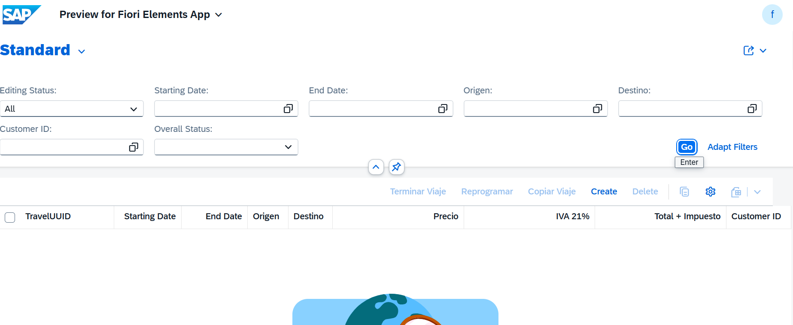
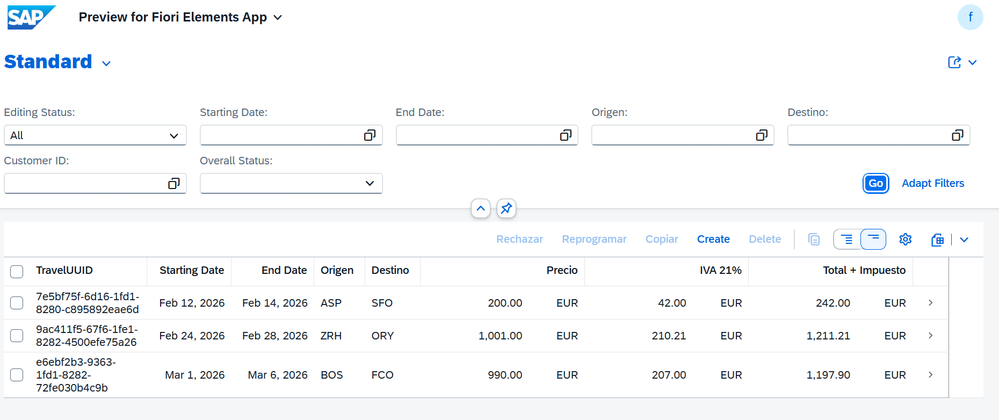
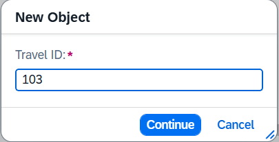
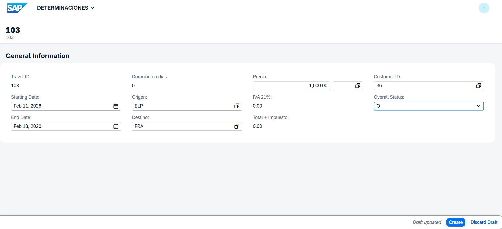

# MANAGED APP

1. [DICTIONARY](#dictionary)
   - 1.1 [Tabla BBDD](#11-tabla-bbdd)
   - 1.2 [Tabla BBDD DRAFT](#12-tabla-bbdd-draft)

2. [Core Data Services](#core-data-services)
   - 2.1 [DATA DEFINITIONS](#21-data-definitions)
     - 2.1.1 [ROOT VIEW](#211-root-view)
     - 2.1.2 [PROJECTION VIEW](#212-projection-view)
     - 2.1.3 [ABSTRACT ENTITY](#213-abstract-entity)
   - 2.2 [METADATA EXTENSIONS ¡Aquí se definen tres botones de interacción!](#22-metadata-extensions)
    - 2.3 [BEHAVIOR DEFINITIONS](#23-behavior-definitions)
     - 2.3.1 [BEHAVIOR DEFINITIONS](#231-behavior-definitions)
     - 2.3.2 [PROJECTION BEHAVIOR](#232-projection-behavior)

3. [Business Services](#business-services)
   - 3.1 [Services Definition](#31-services-definition)
   - 3.2 [Services Binding](#32-services-binding)

4. [Source Code Library](#source-code)
   - 4.1 [Clases](#41-clases)

5. [Pruebas](#pruebas)

---

## DICTIONARY

### 1.1 Tabla BBDD

``` abap
@EndUserText.label : 'Tabla turismo para acciones'
@AbapCatalog.enhancement.category : #NOT_EXTENSIBLE
@AbapCatalog.tableCategory : #TRANSPARENT
@AbapCatalog.deliveryClass : #A
@AbapCatalog.dataMaintenance : #RESTRICTED
define table ztravel_03 {

  key client             : abap.clnt not null;
  key travel_uuid        : sysuuid_x16 not null;
  begin_date             : /dmo/begin_date;
  end_date               : /dmo/end_date;
  airport_origin_id      : /dmo/airport_id;
  airport_destination_id : /dmo/airport_id;
  @Semantics.amount.currencyCode : 'ztravel_03.currency_code'
  booking_fee            : /dmo/booking_fee;
  @Semantics.amount.currencyCode : 'ztravel_03.currency_code'
  tax_amount             : /dmo/total_price;
  @Semantics.amount.currencyCode : 'ztravel_03.currency_code'
  total_price            : /dmo/total_price;
  currency_code          : /dmo/currency_code;
  customer_id            : /dmo/customer_id;
  overall_status         : /dmo/overall_status;
  duration_days          : abap.int4;
  created_by             : abp_creation_user;
  created_at             : abp_creation_tstmpl;
  local_last_changed_by  : abp_locinst_lastchange_user;
  local_last_changed_at  : abp_locinst_lastchange_tstmpl;
  last_changed_at        : timestampl;

}
```

### 1.2 Tabla BBDD DRAFT

``` abap
@EndUserText.label : 'Draft Database Table for ZTRAVEL_03_D'
@AbapCatalog.enhancement.category : #EXTENSIBLE_ANY
@AbapCatalog.tableCategory : #TRANSPARENT
@AbapCatalog.deliveryClass : #A
@AbapCatalog.dataMaintenance : #RESTRICTED
define table ztravel_03_d {

  key mandt            : mandt not null;
  key traveluuid       : sysuuid_x16 not null;
  begindate            : /dmo/begin_date;
  enddate              : /dmo/end_date;
  airportoriginid      : /dmo/airport_id;
  airportdestinationid : /dmo/airport_id;
  @Semantics.amount.currencyCode : 'ztravel_03_d.currencycode'
  bookingfee           : /dmo/booking_fee;
  @Semantics.amount.currencyCode : 'ztravel_03_d.currencycode'
  taxamount            : /dmo/total_price;
  @Semantics.amount.currencyCode : 'ztravel_03_d.currencycode'
  totalprice           : /dmo/total_price;
  currencycode         : /dmo/currency_code;
  customerid           : /dmo/customer_id;
  overallstatus        : /dmo/overall_status;
  durationdays         : abap.int4;
  createdby            : abp_creation_user;
  createdat            : abp_creation_tstmpl;
  locallastchangedby   : abp_locinst_lastchange_user;
  locallastchangedat   : abp_locinst_lastchange_tstmpl;
  lastchangedat        : timestampl;
  "%admin"             : include sych_bdl_draft_admin_inc;

}
```

## Core Data Services

### 2.1 DATA DEFINITIONS

#### 2.1.1 ROOT VIEW

``` abap
@AccessControl.authorizationCheck: #MANDATORY
@EndUserText.label: '###GENERATED Core Data Service Entity'
@Metadata.allowExtensions: true
@ObjectModel.sapObjectNodeType.name: 'ZTRAVEL_03'

define root view entity ZR_TRAVEL_03
  as select from ztravel_03

{
  key travel_uuid            as TravelUUID,

      begin_date             as BeginDate,
      end_date               as EndDate,
      airport_origin_id      as AirportOriginID,
      airport_destination_id as AirportDestinationID,

      @Semantics.amount.currencyCode: 'CurrencyCode'
      booking_fee            as BookingFee,

      @Semantics.amount.currencyCode: 'CurrencyCode'
      tax_amount             as TaxAmount,

      @Semantics.amount.currencyCode: 'CurrencyCode'
      total_price            as TotalPrice,

      currency_code          as CurrencyCode,

      customer_id            as CustomerID,
      overall_status         as OverallStatus,
      duration_days          as DurationDays,

      @Semantics.user.createdBy: true
      created_by             as CreatedBy,

      @Semantics.systemDateTime.createdAt: true
      created_at             as CreatedAt,

      @Semantics.user.localInstanceLastChangedBy: true
      local_last_changed_by  as LocalLastChangedBy,

      @Semantics.systemDateTime.localInstanceLastChangedAt: true
      local_last_changed_at  as LocalLastChangedAt,

      last_changed_at        as LastChangedAt
}
``` 

#### 2.1.2 PROJECTION VIEW

``` abap
@AccessControl.authorizationCheck: #MANDATORY
@EndUserText.label: '###GENERATED Core Data Service Entity'
@Metadata.allowExtensions: true
@Metadata.ignorePropagatedAnnotations: true
@ObjectModel.sapObjectNodeType.name: 'ZTRAVEL_03'

define root view entity ZC_TRAVEL_03
  provider contract transactional_query
  as projection on ZR_TRAVEL_03

  association [1..1] to ZR_TRAVEL_03 as _BaseEntity on $projection.TravelUUID = _BaseEntity.TravelUUID

{
  key TravelUUID,

      BeginDate,
      EndDate,

      @Consumption.valueHelpDefinition: [
        { entity: { name: '/DMO/I_Airport_StdVH', 
                    element: 'AirportID' } } ]      
      AirportOriginID,

      @Consumption.valueHelpDefinition: [
        { entity: { name: '/DMO/I_Airport_StdVH', 
                    element: 'AirportID' } } ]      
      AirportDestinationID,

      @Semantics.amount.currencyCode: 'CurrencyCode'
      BookingFee,

      @Semantics.amount.currencyCode: 'CurrencyCode'
      TaxAmount,

      @Semantics.amount.currencyCode: 'CurrencyCode'
      TotalPrice,

      @Consumption.valueHelpDefinition: [ { entity: { element: 'Currency', name: 'I_CurrencyStdVH' },
                                            useForValidation: true } ]
      CurrencyCode,

      @Consumption.valueHelpDefinition: [ 
        { entity: { name: '/DMO/I_Customer_StdVH', 
                    element: 'CustomerID' } } ]
      CustomerID,

      @Consumption.valueHelpDefinition: [
            { entity: { name: '/DMO/I_Overall_Status_VH_Text', 
              element: 'OverallStatus' } 
              
              } ]      
      OverallStatus,
      
      DurationDays,

      @Semantics.user.createdBy: true
      CreatedBy,

      @Semantics.systemDateTime.createdAt: true
      CreatedAt,

      @Semantics.user.localInstanceLastChangedBy: true
      LocalLastChangedBy,

      @Semantics.systemDateTime.localInstanceLastChangedAt: true
      LocalLastChangedAt,

      LastChangedAt,

      _BaseEntity
```

#### 2.1.3 ABSTRACT ENTITY

Se comporta como la definicion de una estructura de datos para pasar parámetros
``` abap
@EndUserText.label: 'Seleccionar las nuevas fechas'
define abstract entity Z_A_ReprogramarDates

{
  @EndUserText.label: 'Nueva Fecha Inicio'
  begin_date : /dmo/begin_date;

  @EndUserText.label: 'Nueva Fecha Fin'
  end_date   : /dmo/end_date;
}

```
Anotaciones clave:
```js
no aplica
```

### 2.2 METADATA EXTENSIONS

Los Metadata Extensions sirven para definir la configuración de la UI (interfaz de usuario) de forma declarativa, permitiendo la separación entre:

* Lógica de datos (CDS View)
* Presentación visual (anotaciones UI)

Estas anotaciones se publican automáticamente en el servicio **OData** y son interpretadas por **Fiori Elements** para generar la interfaz sin programación manual.

Configuran cómo se ve y comporta la aplicación Fiori sin tocar código de datos ni frontend.

[...detalle](../0.%20Developing%20LIST%20REPORT%20APP%20FOR%20CREATE/md_docs/metadata_extensions.md)

``` abap
@Metadata.layer: #CORE

@UI.headerInfo: { title: { type: #STANDARD, value: 'TravelUUID' },
                  description: { type: #STANDARD, value: 'TravelUUID' } }

annotate view ZC_TRAVEL_03 with

{
  @EndUserText.label: 'TravelUUID'
  @UI.facet: [ { label: 'General Information',
                 id: 'GeneralInfo',
                 purpose: #STANDARD,
                 position: 10,
                 type: #IDENTIFICATION_REFERENCE } ]
  @UI.identification: [ { position: 10, label: 'TravelUUID' } ]
  @UI.lineItem: [ { position: 10, label: 'TravelUUID' } ]
  TravelUUID;

  @UI.identification: [ { position: 20 } ]
  @UI.lineItem: [ { position: 20 } ]
  @UI.selectionField: [ { position: 20 } ]
  BeginDate;

  @UI.identification: [ { position: 30 } ]
  @UI.lineItem: [ { position: 30 } ]
  @UI.selectionField: [ { position: 30 } ]
  EndDate;

  @EndUserText.label: 'Origen'
  @UI.identification: [ { position: 40 } ]
  @UI.lineItem: [ { position: 40 } ]
  @UI.selectionField: [ { position: 40 } ]
  AirportOriginID;

  @EndUserText.label: 'Destino'
  @UI.identification: [ { position: 50 } ]
  @UI.lineItem: [ { position: 50 } ]
  @UI.selectionField: [ { position: 50 } ]
  AirportDestinationID;

  @EndUserText.label: 'Precio'
  @UI.identification: [ { position: 60 } ]
  @UI.lineItem: [ { position: 60 } ]
  BookingFee;

  @EndUserText.label: 'IVA 21%'
  @UI.identification: [ { position: 70 } ]
  @UI.lineItem: [ { position: 70 } ]
  TaxAmount;

  @EndUserText.label: 'Total + Impuesto'
  @UI.identification: [ { position: 80 } ]
  @UI.lineItem: [ { position: 80 } ]
  TotalPrice;

  @UI.identification: [ { position: 90 } ]
  @UI.lineItem: [ { position: 90 } ]
  @UI.selectionField: [ { position: 90 } ]
  CustomerID;

  // ---------------------------------------------------------
  // !BOTONES!
  // ---------------------------------------------------------
  @UI.identification: [ { position: 100 },
                        { type: #FOR_ACTION, dataAction: 'setTerminado', label: 'Terminar Viaje' },
                        { type: #FOR_ACTION, dataAction: 'reprogramarViaje', label: 'Reprogramar' },
                        { type: #FOR_ACTION, dataAction: 'copiarViaje', label: 'Copiar Viaje' } ]
  @UI.lineItem: [ { position: 100 },
                  { type: #FOR_ACTION, dataAction: 'setTerminado', label: 'Terminar Viaje' },
                  { type: #FOR_ACTION, dataAction: 'reprogramarViaje', label: 'Reprogramar' },
                  { type: #FOR_ACTION, dataAction: 'copiarViaje', label: 'Copiar Viaje' } ]
  @UI.selectionField: [ { position: 100 } ]
  OverallStatus;
  // ---------------------------------------------------------

  @EndUserText.label: 'DurationDays'
  @UI.identification: [ { position: 110, label: 'DurationDays' } ]
  @UI.lineItem: [ { position: 110, label: 'DurationDays' } ]
  DurationDays;

  @UI.identification: [ { position: 120 } ]
  @UI.lineItem: [ { position: 120 } ]
  CreatedBy;

  @UI.identification: [ { position: 130 } ]
  @UI.lineItem: [ { position: 130 } ]
  CreatedAt;

  @UI.hidden: true
  LocalLastChangedBy;

  @UI.hidden: true
  LocalLastChangedAt;

  @UI.hidden: true
  LastChangedAt;

  @UI.hidden: true
  _BaseEntity;
}
```


### 2.3 BEHAVIOR DEFINITIONS

Es un artefacto que especifica QUÉ operaciones están permitidas sobre una entidad 
y CÓMO se comporta esa entidad durante las operaciones CRUD (Create, Read, Update, Delete).

[...detalle](../0.%20Developing%20LIST%20REPORT%20APP%20FOR%20CREATE/md_docs/BDEF.MD)

Ventas:
* ✓ Separación de responsabilidades: Lógica de negocio separada de la UI
* ✓ Reutilización: Mismo comportamiento para múltiples interfaces (Fiori, API, etc.)
* ✓ Mantenibilidad: Cambios centralizados en un solo lugar
* ✓ Consistencia: Reglas de negocio aplicadas uniformemente
* ✓ RAP Framework: Aprovecha todas las capacidades del framework moderno de SAP

#### 2.3.1 BEHAVIOR DEFINITIONS

##### Se crea BDEF sobre CDS root o Interfaz


``` abap
managed implementation in class ZBP_R_TRAVEL_03 unique;
strict ( 2 );
with draft;
extensible;
define behavior for ZR_TRAVEL_03 alias ZrTravel03
persistent table ztravel_03
extensible
draft table ztravel_03_d
etag master LocalLastChangedAt
lock master total etag LocalLastChangedAt
authorization master ( global )
{
  field ( readonly )
  TravelUUID,
  CreatedBy,
  CreatedAt,
  LocalLastChangedBy,
  LocalLastChangedAt;

  field ( numbering : managed )
  TravelUUID;

  create;
  update;
  delete;

  draft action Activate optimized;
  draft action Discard;
  draft action Edit;
  draft action Resume;
  draft determine action Prepare;

  // -----------------------------------------------------------
  // ACÁ DEFINIMOS LAS ACCIONES (LOS BOTONES)
  // -----------------------------------------------------------

  // Botón "Terminar Viaje" (Simple)
  // CAMBIÁ ESTO: De 'factory action' a 'action' común de instancia
  // El 'result [1] $self' le dice que devuelve la misma fila actualizada
  action setTerminado result [1] $self;

  // Botón "Copiar Viaje" (Crea uno nuevo)
  // El [1] significa que la acción devuelve exactamente una nueva instancia
  factory action copiarViaje [1];

  // Botón "Reprogramar" (Con Popup - requiere Abstract Entity)
  action ( features : instance ) reprogramarViaje parameter Z_A_ReprogramarDates result [1] $self;

  // -----------------------------------------------------------

  mapping for ztravel_03 corresponding extensible
    {
      TravelUUID           = travel_uuid;
      BeginDate            = begin_date;
      EndDate              = end_date;
      AirportOriginID      = airport_origin_id;
      AirportDestinationID = airport_destination_id;
      BookingFee           = booking_fee;
      TaxAmount            = tax_amount;
      TotalPrice           = total_price;
      CurrencyCode         = currency_code;
      CustomerID           = customer_id;
      OverallStatus        = overall_status;
      DurationDays         = duration_days;
      CreatedBy            = created_by;
      CreatedAt            = created_at;
      LocalLastChangedBy   = local_last_changed_by;
      LocalLastChangedAt   = local_last_changed_at;
      LastChangedAt        = last_changed_at;
    }

}
```

#### 2.3.2 PROJECTION BEHAVIOR

#### Ventajas

1. Separación de Responsabilidades: Interface (lógica) vs Consumption (UI)
2. Múltiples UIs: Puedes tener varias proyecciones para diferentes roles
3. Mantenibilidad: Cambios en la lógica se reflejan automáticamente
4. Seguridad: Controlas qué expones en cada capa

### Se exponen los botones: TerminarViaje, copiarViaje, reprogramarViaje
``` abap
projection implementation in class ZBP_C_TRAVEL_03 unique;
strict ( 2 );
extensible;
use draft;
use side effects;
define behavior for ZC_TRAVEL_03 alias ZcTravel03
extensible
use etag
{
  use create;
  use update;
  use delete;

  use action setTerminado;
  use action copiarViaje;
  use action reprogramarViaje;

  use action Edit;
  use action Activate;
  use action Discard;
  use action Resume;
  use action Prepare;

}
```

``` abap
```

## business-services

### 3.1 services-definition

``` abap
@EndUserText: {
  label: 'Service Definition for ZC_TRAVEL_03'
}
@ObjectModel: {
  leadingEntity: {
    name: 'ZC_TRAVEL_03'
  }
}
define service ZUI_TRAVEL_03_O4 provider contracts odata_v4_ui {
  expose ZC_TRAVEL_03;
}
```

### 3.2 services-binding

Pasos para la creación una nueva vinculación.


<!--  -->


Selección del tipo de vinculación
<!--  -->


Publicar el servicio
<!--  -->


Visualizar
<!--  -->


## source-code

### 4.1 clases

``` abap
class ZBP_R_TRAVEL_03 definition
  public
  abstract
  final
  for behavior of ZR_TRAVEL_03 .

public section.
protected section.
private section.
ENDCLASS.


CLASS ZBP_R_TRAVEL_03 IMPLEMENTATION.
ENDCLASS.
```

``` abap
class lhc_zr_travel_03 definition inheriting from cl_abap_behavior_handler.
  private section.
    methods get_global_authorizations for global authorization
              importing
                 request requested_authorizations for ZrTravel03
              result result.

    methods get_instance_features for instance features
                  importing keys request requested_features for ZrTravel03 result result.

    methods copiarViaje for modify
      importing keys for action ZrTravel03~copiarViaje.

    methods reprogramarViaje for modify
      importing keys for action ZrTravel03~reprogramarViaje result result.

    methods setTerminado for modify
      importing keys for action ZrTravel03~setTerminado result result.
endclass.


class lhc_zr_travel_03 implementation.
  method get_global_authorizations.
  endmethod.

  method get_instance_features.
  endmethod.

  method copiarViaje.
    " 1. Leemos los datos del viaje original que queremos copiar
    read entities of zr_travel_03 in local mode
         entity ZrTravel03
         all fields with corresponding #( keys )
         result data(lt_travel_read).

    " 2. Preparamos la tabla para crear el nuevo registro
    " %is_draft: Si usás draft, esto decide si el nuevo nace como borrador
    data lt_travel_create type table for create zr_travel_03\\ZrTravel03.

    lt_travel_create = value #( for travel in lt_travel_read
                                ( %is_draft = travel-%is_draft
                                  " Copiamos todo menos el ID
                                  %data     = corresponding #( travel except TravelUUID ) ) ).

    " 3. Ejecutamos la creación
    modify entities of zr_travel_03 in local mode
           entity ZrTravel03
           create fields ( BeginDate EndDate AirportOriginID AirportDestinationID
                           BookingFee TaxAmount TotalPrice CurrencyCode CustomerID OverallStatus )
           with lt_travel_create
           mapped data(mapped_create)
           failed failed
           reported reported.

    " 4. Devolvemos el nuevo registro creado para que Fiori lo muestre
    mapped-ZrTravel03 = mapped_create-ZrTravel03.
  endmethod.

  method reprogramarViaje.
    " 1. Levantamos las fechas que el usuario escribió en el Popup (%param)
    data(lv_nueva_fecha_inicio) = keys[ 1 ]-%param-begin_date.
    data(lv_nueva_fecha_fin)    = keys[ 1 ]-%param-end_date.

    " 2. Validamos rápido que no vengan vacías (opcional pero recomendado)
    if lv_nueva_fecha_inicio is initial or lv_nueva_fecha_fin is initial.
      " Aquí podrías llenar la estructura 'reported' con un mensaje de error
      return.
    endif.

    " 3. Modificamos el viaje con las nuevas fechas
    modify entities of zr_travel_03 in local mode
           entity ZrTravel03
           update fields ( BeginDate EndDate )
           with value #( for key in keys
                         ( %tky      = key-%tky
                           BeginDate = lv_nueva_fecha_inicio
                           EndDate   = lv_nueva_fecha_fin ) )
           failed failed
           reported reported.

    " 4. Leemos el resultado para refrescar la UI
    read entities of zr_travel_03 in local mode
         entity ZrTravel03
         all fields with corresponding #( keys )
         result data(lt_travel).

    result = value #( for travel in lt_travel
                      ( %tky   = travel-%tky
                        %param = travel ) ).
  endmethod.

  method setTerminado.
    " ¿Qué acabamos de hacer?
    " MODIFY ENTITIES: Es el comando que le dice a RAP: "Buscá este viaje y cambiale el campo OverallStatus".

    " IN LOCAL MODE: Esto es clave, le dice al sistema que no chequee autorizaciones otra vez porque ya estamos adentro de la clase de confianza.

    " READ ENTITIES: Después de cambiarlo, lo volvemos a leer para que el botón de Fiori sepa que terminó bien y refresque la fila automáticamente.

    " 1. Modificamos el estatus de las entidades seleccionadas
    modify entities of zr_travel_03 in local mode
           entity ZrTravel03
           update fields ( OverallStatus )
           with value #( for key in keys
                         ( %tky          = key-%tky
                           OverallStatus = 'A' ) ) " 'A' de Accepted/Terminado
           failed failed
           reported reported.

    " 2. Leemos el resultado para refrescar la pantalla
    read entities of zr_travel_03 in local mode
         entity ZrTravel03
         all fields with corresponding #( keys )
         result data(lt_travel).

    result = value #( for travel in lt_travel
                      ( %tky   = travel-%tky
                        %param = travel ) ).
  endmethod.
endclass.
```

## pruebas









