# MANAGED APP

0. [RESÚMEN](#resúmen)
1. [DICTIONARY](#dictionary)
   - 1.1 [Tabla BBDD](#11-tabla-bbdd)
   - 1.2 [Tabla BBDD DRAFT](#12-tabla-bbdd-draft)

2. [Core Data Services](#core-data-services)
   - 2.1 [DATA DEFINITIONS](#21-data-definitions)
     - 2.1.1 [ROOT VIEW](#211-root-view)
     - 2.1.2 [PROJECTION VIEW](#212-projection-view)
     - 2.1.3 [ABSTRACT ENTITY](#213-abstract-entity)
   - 2.2 [METADATA EXTENSIONS ¡Aquí se definen tres botones de interacción!](#22-metadata-extensions)
    - 2.3 [BEHAVIOR DEFINITIONS](#23-behavior-definitions)
     - 2.3.1 [BEHAVIOR DEFINITIONS](#231-behavior-definitions)
     - 2.3.2 [PROJECTION BEHAVIOR](#232-projection-behavior)

3. [Business Services](#business-services)
   - 3.1 [Services Definition](#31-services-definition)
   - 3.2 [Services Binding](#32-services-binding)

4. [Source Code Library](#source-code)
   - 4.1 [Clases](#41-clases)

5. [Pruebas](#Pruebas)

---

## RESÚMEN 

## 🚀 1. Creación de Acciones (Botones Custom)

Las acciones `Actions` y las funciones `Functions` son dos operaciones no estándar definidas en la definición de comportamiento e implementadas en el grupo de comportamientos. Permiten ejecutar lógica de negocio personalizada más allá de las operaciones estándar de creación, actualización y eliminación.

## Actions

Las acciones son operaciones de modificación utilizadas para cambiar el estado de una entidad de objeto comercial. Son los "verbos" de RAP (por ejemplo, Aprobar, Cancelar, Copiar).

* Ejecución: Se activan mediante la instrucción `MODIFY ENTITIES ... EXECUTE` en ABAP EML.

* Tipos
  * Instance Actions: Operar sobre registros seleccionados específicos (por ejemplo, establecer estado).
  * Static Actions: Operar sobre toda la entidad o colección sin necesidad de una clave específica (por ejemplo, Borrar todo).
  * Factory Actions: Se utiliza específicamente para crear nuevas instancias, ya sea basándose en una instancia existente (`factory action copy`) o con valores predeterminados (`static factory action new`). 

* Parámetros: Puede aceptar parámetros de entrada (planos o profundos) y devolver resultados.

## Functions

Las funciones son operaciones de solo lectura que se utilizan para recuperar o calcular información sin modificar los datos del objeto de negocio. Son las "preguntas" de RAP (por ejemplo, ObtenerEstado, CalcularTotal).

* Ejecución: Se activa mediante la instrucción `READ ENTITIES ... EXECUTE` en ABAP EML.

* Uso: Ideal para cálculos complejos o para obtener datos que no están expuestos directamente por la estructura de la entidad.

* Parámetros: acepta parámetros de entrada y devuelve resultados, sin cambiar el estado BO.

## Diferencias claves

| Características | Actions | Functions |
|-----------------|---------|-----------|
| Propósito principa | Modicar un BO | Leer / Calcular información |
| Sentencia EML | `MODIFY...EXECUTE` | `READ...EXECUTE` | 
| Analogía | Verbos (ejemplo Aprobar) | Solicitudes (ObtenerEstado) |
| Capacidad de fábrica | Puede crear nuevas instancias | No puede crear instancias |
| Impacto de los datos | Cambia datos en Buffer / BBDD | No cambia datos |
|

Para permitir que el usuario dispare una lógica específica (como copiar un viaje), definimos acciones en el **Behavior Definition (BDEF)**.

* **Definición:** 
```abap
    action ( features : instance ) copiarViaje result [1] $self;
```

* **Lógica de Copia:** Se implementa en la clase local (`CCIMP`) realizando un `READ` del registro seleccionado y un `MODIFY ENTITIES` para crear el nuevo registro tipo **Draft**.

* **Navegacion:** Al usar `result [1] $self`, el framework permite que tras la ejecución el sistema sepa qué registro nuevo mostrar.

---

## 🎯 2. Determinaciones (Inicialización Automática)

Utilizadas para automatizar el llenado de campos sin intervención del usuario, especialmente útil al presionar el botón **CREATE** estándar o tras una copia.

* **Definición:** 
```abap
    determination setInitialValues on modify { create; }
```

* **Campos Inicializados:** 
  * `CurrencyCode` -> `'EUR'`.
  * `OverallStatus` -> `'O'` (Open).

**Tip Pro:**
Es vital activar el flag `%control-FieldName = if_abap_behv=>mk-on` para que el framework detecte que el valor fue asignado programáticamente.

---

## 🛡️ 3. Sinergia con Field Control
Para garantizar que los valores automáticos (como el EUR) no sean alterados por error, protegemos el campo en el BDEF:

```abap
field ( readonly ) CurrencyCode;
```

## 🎨 4. Vinculación en la UI (Metadata Extension)

Para que los botones aparezcan en la interfaz de Fiori, los declaramos en la anotación `@UI.lineItem` o `@UI.identification`:

``` abap
@UI.lineItem: [ { position: 10, type: #FOR_ACTION, dataAction: 'copiarViaje', label: 'Copiar' } ]
```

Resultado: Una interfaz limpia donde el usuario ve botones personalizados y los campos nacen con los valores correctos y bloqueados.

## DICTIONARY

### 1.1 Tabla BBDD

``` abap
@EndUserText.label : 'Tabla turismo para acciones'
@AbapCatalog.enhancement.category : #NOT_EXTENSIBLE
@AbapCatalog.tableCategory : #TRANSPARENT
@AbapCatalog.deliveryClass : #A
@AbapCatalog.dataMaintenance : #RESTRICTED
define table ztravel_03 {

  key client             : abap.clnt not null;
  key travel_uuid        : sysuuid_x16 not null;
  begin_date             : /dmo/begin_date;
  end_date               : /dmo/end_date;
  airport_origin_id      : /dmo/airport_id;
  airport_destination_id : /dmo/airport_id;
  @Semantics.amount.currencyCode : 'ztravel_03.currency_code'
  booking_fee            : /dmo/booking_fee;
  @Semantics.amount.currencyCode : 'ztravel_03.currency_code'
  tax_amount             : /dmo/total_price;
  @Semantics.amount.currencyCode : 'ztravel_03.currency_code'
  total_price            : /dmo/total_price;
  currency_code          : /dmo/currency_code;
  customer_id            : /dmo/customer_id;
  overall_status         : /dmo/overall_status;
  duration_days          : abap.int4;
  created_by             : abp_creation_user;
  created_at             : abp_creation_tstmpl;
  local_last_changed_by  : abp_locinst_lastchange_user;
  local_last_changed_at  : abp_locinst_lastchange_tstmpl;
  last_changed_at        : timestampl;

}
```

### 1.2 Tabla BBDD DRAFT

``` abap
@EndUserText.label : 'Draft Database Table for ZTRAVEL_03_D'
@AbapCatalog.enhancement.category : #EXTENSIBLE_ANY
@AbapCatalog.tableCategory : #TRANSPARENT
@AbapCatalog.deliveryClass : #A
@AbapCatalog.dataMaintenance : #RESTRICTED
define table ztravel_03_d {

  key mandt            : mandt not null;
  key traveluuid       : sysuuid_x16 not null;
  begindate            : /dmo/begin_date;
  enddate              : /dmo/end_date;
  airportoriginid      : /dmo/airport_id;
  airportdestinationid : /dmo/airport_id;
  @Semantics.amount.currencyCode : 'ztravel_03_d.currencycode'
  bookingfee           : /dmo/booking_fee;
  @Semantics.amount.currencyCode : 'ztravel_03_d.currencycode'
  taxamount            : /dmo/total_price;
  @Semantics.amount.currencyCode : 'ztravel_03_d.currencycode'
  totalprice           : /dmo/total_price;
  currencycode         : /dmo/currency_code;
  customerid           : /dmo/customer_id;
  overallstatus        : /dmo/overall_status;
  durationdays         : abap.int4;
  createdby            : abp_creation_user;
  createdat            : abp_creation_tstmpl;
  locallastchangedby   : abp_locinst_lastchange_user;
  locallastchangedat   : abp_locinst_lastchange_tstmpl;
  lastchangedat        : timestampl;
  "%admin"             : include sych_bdl_draft_admin_inc;

}
```

## Core Data Services

### 2.1 DATA DEFINITIONS

#### 2.1.1 ROOT VIEW

``` abap
@AccessControl.authorizationCheck: #MANDATORY
@EndUserText.label: '###GENERATED Core Data Service Entity'
@Metadata.allowExtensions: true
@ObjectModel.sapObjectNodeType.name: 'ZTRAVEL_03'

define root view entity ZR_TRAVEL_03
  as select from ztravel_03

{
  key travel_uuid            as TravelUUID,

      begin_date             as BeginDate,
      end_date               as EndDate,
      airport_origin_id      as AirportOriginID,
      airport_destination_id as AirportDestinationID,
      booking_fee            as BookingFee,
      tax_amount             as TaxAmount,
      total_price            as TotalPrice,
      currency_code          as CurrencyCode,
      customer_id            as CustomerID,
      overall_status         as OverallStatus,
      duration_days          as DurationDays,

      @Semantics.user.createdBy: true
      created_by             as CreatedBy,

      @Semantics.systemDateTime.createdAt: true
      created_at             as CreatedAt,

      @Semantics.user.localInstanceLastChangedBy: true
      local_last_changed_by  as LocalLastChangedBy,

      @Semantics.systemDateTime.localInstanceLastChangedAt: true
      local_last_changed_at  as LocalLastChangedAt,

      last_changed_at        as LastChangedAt
}
``` 

#### 2.1.2 PROJECTION VIEW

``` abap
@AccessControl.authorizationCheck: #MANDATORY
@EndUserText.label: '!CUSTOM ACTIONS!'
@Metadata.allowExtensions: true
@Metadata.ignorePropagatedAnnotations: true
@ObjectModel.sapObjectNodeType.name: 'ZTRAVEL_03'

define root view entity ZC_TRAVEL_03
  provider contract transactional_query
  as projection on ZR_TRAVEL_03

  association [1..1] to ZR_TRAVEL_03 as _BaseEntity on $projection.TravelUUID = _BaseEntity.TravelUUID

{
  key TravelUUID,

      BeginDate,
      EndDate,

      @Consumption.valueHelpDefinition: [ { entity: 
      { name: '/DMO/I_Airport_StdVH', 
      element: 'AirportID' } } ]
      AirportOriginID,

      @Consumption.valueHelpDefinition: [ { entity: 
      { name: '/DMO/I_Airport_StdVH', 
      element: 'AirportID' } } ]
      AirportDestinationID,

      @Semantics.amount.currencyCode: 'CurrencyCode'
      BookingFee,

      @Semantics.amount.currencyCode: 'CurrencyCode'
      TaxAmount,

      @Semantics.amount.currencyCode: 'CurrencyCode'
      TotalPrice,

     @UI.hidden: true
      CurrencyCode,

      @Consumption.valueHelpDefinition: [ { entity: 
      { name: '/DMO/I_Customer_StdVH', 
      element: 'CustomerID' } } ]
      CustomerID,

      @Consumption.valueHelpDefinition: [ { entity: 
      { name: '/DMO/I_Overall_Status_VH_Text', 
      element: 'OverallStatus' } } ]
      OverallStatus,

      DurationDays,

      @Semantics.user.createdBy: true
      CreatedBy,

      @Semantics.systemDateTime.createdAt: true
      CreatedAt,

      @Semantics.user.localInstanceLastChangedBy: true
      LocalLastChangedBy,

      @Semantics.systemDateTime.localInstanceLastChangedAt: true
      LocalLastChangedAt,

      LastChangedAt,

      _BaseEntity
}

```

#### 2.1.3 ABSTRACT ENTITY

Se comporta como la definicion de una estructura de datos para pasar parámetros
``` abap
@EndUserText.label: 'Seleccionar las nuevas fechas'
define abstract entity Z_A_ReprogramarDates

{
  @EndUserText.label: 'Nueva Fecha Inicio'
  begin_date : /dmo/begin_date;

  @EndUserText.label: 'Nueva Fecha Fin'
  end_date   : /dmo/end_date;
}

```
Anotaciones clave:
```js
no aplica
```

### 2.2 METADATA EXTENSIONS

Los Metadata Extensions sirven para definir la configuración de la UI (interfaz de usuario) de forma declarativa, permitiendo la separación entre:

* Lógica de datos (CDS View)
* Presentación visual (anotaciones UI)

Estas anotaciones se publican automáticamente en el servicio **OData** y son interpretadas por **Fiori Elements** para generar la interfaz sin programación manual.

Configuran cómo se ve y comporta la aplicación Fiori sin tocar código de datos ni frontend.

[...detalle](../0.%20Developing%20LIST%20REPORT%20APP%20FOR%20CREATE/md_docs/metadata_extensions.md)

🔘 Documentación de Interfaz: Acciones Custom (Botones)
En SAP Fiori Elements, las acciones definidas en el Backend (BDEF) se exponen en la interfaz mediante anotaciones en la Metadata Extension (MDE). En este caso, se utilizan sobre el campo OverallStatus.

🛠️ Desglose de Anotaciones
1. `@UI.identification` (Object Page)
Define cómo se comportan los botones dentro de la página de detalles del objeto.

Ubicación: Los botones aparecerán en la barra de herramientas de la sección donde se encuentre el campo.

Acciones vinculadas: Se exponen tres botones críticos: `Rechazar`, `Reprogramar` y `Copiar`.

Tipo: `#FOR_ACTION` vincula el botón directamente con el nombre de la acción definido en el Behavior Definition.

2. `@UI.lineItem` (List Report)
Define la presencia de los botones en la tabla principal (lista de registros).

Funcionalidad: Permite al usuario ejecutar acciones sobre uno o varios registros seleccionados sin necesidad de entrar al detalle.

Posición: Se le asigna la position: 110 para mantener la jerarquía visual junto al estado del viaje.

3. `@UI.selectionField`
Muestra el campo `OverallStatus` como un filtro de búsqueda en la parte superior de la aplicación.

Beneficio: Permite al usuario segmentar la lista de viajes rápidamente (ej: ver solo los viajes "Rechazados").


| Acción Técnica | Etiqueta (Label) | Función Principal |
| :--- | :--- | :--- |
| `setRejected` | **Rechazar** | Cambia el estado del viaje a 'X' (Rechazado). |
| `reprogramarViaje` | **Reprogramar** | POPUP de parámetros modificar fechas del viaje. |
| `copiarViaje` | **Copiar** | Crea una nueva instancia tipo Draft basada en la actual. |

``` abap
@Metadata.layer: #CORE

@UI.headerInfo: { title: { type: #STANDARD, value: 'TravelUUID' },
                  description: { type: #STANDARD, value: 'TravelUUID' } }

annotate view ZC_TRAVEL_03 with

{
  @EndUserText.label: 'TravelUUID'
  @UI.facet: [ { label: 'General Information',
                 id: 'GeneralInfo',
                 purpose: #STANDARD,
                 position: 10,
                 type: #IDENTIFICATION_REFERENCE } ]
  @UI.identification: [ { position: 10, label: 'TravelUUID' } ]
  @UI.lineItem: [ { position: 10, label: 'TravelUUID' } ]
  TravelUUID;

  @UI.identification: [ { position: 20 } ]
  @UI.lineItem: [ { position: 20 } ]
  @UI.selectionField: [ { position: 20 } ]
  BeginDate;

  @UI.identification: [ { position: 30 } ]
  @UI.lineItem: [ { position: 30 } ]
  @UI.selectionField: [ { position: 30 } ]
  EndDate;

  @EndUserText.label: 'Origen'
  @UI.identification: [ { position: 40 } ]
  @UI.lineItem: [ { position: 40 } ]
  @UI.selectionField: [ { position: 40 } ]
  AirportOriginID;

  @EndUserText.label: 'Destino'
  @UI.identification: [ { position: 50 } ]
  @UI.lineItem: [ { position: 50 } ]
  @UI.selectionField: [ { position: 50 } ]
  AirportDestinationID;

  @EndUserText.label: 'Precio'
  @UI.identification: [ { position: 60 } ]
  @UI.lineItem: [ { position: 60 } ]
  BookingFee;

  @UI.identification: [ { position: 70 } ]
  CurrencyCode;

  @EndUserText.label: 'IVA 21%'
  @UI.identification: [ { position: 80 } ]
  @UI.lineItem: [ { position: 80 } ]
  TaxAmount;

  @EndUserText.label: 'Total + Impuesto'
  @UI.identification: [ { position: 90 } ]
  @UI.lineItem: [ { position: 90 } ]
  TotalPrice;

  @UI.identification: [ { position: 100 } ]
  @UI.lineItem: [ { position: 100 } ]
  @UI.selectionField: [ { position: 100 } ]
  CustomerID;

  // ---------------------------------------------------------
  // !BOTONES!
  // ---------------------------------------------------------
  @UI.identification: [ { position: 110 },
                        { type: #FOR_ACTION, dataAction: 'setRejected', label: 'Rechazar' },
                        { type: #FOR_ACTION, dataAction: 'reprogramarViaje', label: 'Reprogramar' },
                        { type: #FOR_ACTION, dataAction: 'copiarViaje', label: 'Copiar' } ]
  @UI.lineItem: [ { position: 110 },
                  { type: #FOR_ACTION, dataAction: 'setRejected', label: 'Rechazar' },
                  { type: #FOR_ACTION, dataAction: 'reprogramarViaje', label: 'Reprogramar' },
                  { type: #FOR_ACTION, dataAction: 'copiarViaje', label: 'Copiar' } ]
  @UI.selectionField: [ { position: 110 } ]
  OverallStatus;
  // ---------------------------------------------------------

  @EndUserText.label: 'DurationDays'
  @UI.identification: [ { position: 120, label: 'DurationDays' } ]
  @UI.lineItem: [ { position: 120, label: 'DurationDays' } ]
  DurationDays;

  @UI.identification: [ { position: 130 } ]
  @UI.lineItem: [ { position: 130 } ]
  CreatedBy;

  @UI.identification: [ { position: 140 } ]
  @UI.lineItem: [ { position: 140 } ]
  CreatedAt;

  @UI.hidden: true
  LocalLastChangedBy;

  @UI.hidden: true
  LocalLastChangedAt;

  @UI.hidden: true
  LastChangedAt;

  @UI.hidden: true
  _BaseEntity;
}
```
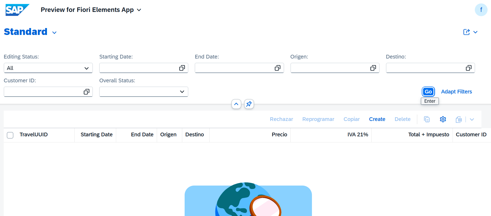

### 2.3 BEHAVIOR DEFINITIONS

Es un artefacto que especifica QUÉ operaciones están permitidas sobre una entidad 
y CÓMO se comporta esa entidad durante las operaciones CRUD (Create, Read, Update, Delete).

[...detalle](../0.%20Developing%20LIST%20REPORT%20APP%20FOR%20CREATE/md_docs/BDEF.MD)

Ventas:
* ✓ Separación de responsabilidades: Lógica de negocio separada de la UI
* ✓ Reutilización: Mismo comportamiento para múltiples interfaces (Fiori, API, etc.)
* ✓ Mantenibilidad: Cambios centralizados en un solo lugar
* ✓ Consistencia: Reglas de negocio aplicadas uniformemente
* ✓ RAP Framework: Aprovecha todas las capacidades del framework moderno de SAP

#### 2.3.1 BEHAVIOR DEFINITIONS

##### Se crea BDEF sobre CDS root o Interfaz


Markdown
# ⚙️ Documentación Técnica: Behavior Definition (BDEF)

El **Behavior Definition** actúa como el contrato de reglas de negocio para la entidad `ZrTravel03`.

Define cómo se comporta el objeto de negocio, sus restricciones y las acciones disponibles.

## 🏗️ Cabecera y Configuración Global

* **Implementation Type:** `managed`. El framework SAP RAP gestiona automáticamente las operaciones de base de datos (Insert, Update, Delete).

* **Protocolo:** `strict ( 2 )`. Obliga al uso de las mejores prácticas y validaciones más recientes del modelo RAP.

* **Manejo de Borradores:** `with draft`. Habilita la persistencia temporal de datos, permitiendo al usuario retomar ediciones sin perder cambios.

* **Control de Concurrencia:** `etag master LocalLastChangedAt`. Protege la integridad de los datos evitando que dos usuarios editen el mismo registro simultáneamente.

---

## 🔒 Control de Campos (Field Control)

| Campos | Propiedad | Razón |
| :--- | :--- | :--- |
| `TravelUUID`, `CreatedBy`, `CreatedAt`, etc. | `readonly` | Campos técnicos y de auditoría gestionados por el sistema. |
| `CurrencyCode` | <span style="color:red">**readonly**</span> | Bloqueado por regla de negocio para operar exclusivamente en **EUR**. |
| `TravelUUID` | `numbering : managed` | El sistema genera automáticamente la clave primaria (UUID). |

---

## ⚡ Operaciones y Acciones (Lógica de Negocio)

### 🔹 Operaciones Estándar
Se habilitan las capacidades CRUD básicas: `create`, `update` y `delete`.

### 🔹 Acciones Personalizadas (Botones)
| Acción Técnica | Resultado | Descripción |
| :--- | :--- | :--- |
| `setRejected` | `result [1] $self` | **Rechazar:** Cambia el estado del viaje a 'Rechazado' y refresca la instancia. |
| `copiarViaje` | `result [1] $self` | **Copiar:** Crea una nueva instancia de Draft basada en los datos actuales. |
| `reprogramarViaje` | `parameter Z_A_ReprogramarDates` | **Reprogramar:** Abre un cuadro de diálogo (Popup) para capturar nuevas fechas. |

### 🔹 Determinaciones
* **`setInitialValues`**: Se ejecuta `on modify { create; }`. 

Inicializa automáticamente la moneda en 'EUR' y el estado en 'Open' al crear el registro.

---

## 🔄 Mapeo de Datos (Mapping)

Vincula los nombres de los campos del modelo de datos (ABAP-friendly) con los nombres técnicos de la tabla de base de datos `ztravel_03`.

```abap
mapping for ztravel_03 corresponding extensible
{
  TravelUUID           = travel_uuid;
  BeginDate            = begin_date;
  EndDate              = end_date;
  AirportOriginID      = airport_origin_id;
  AirportDestinationID = airport_destination_id;
  BookingFee           = booking_fee;
  TaxAmount            = tax_amount;
  TotalPrice           = total_price;
  CurrencyCode         = currency_code;
  CustomerID           = customer_id;
  OverallStatus        = overall_status;
  // ... campos de auditoría
}
```

``` abap
managed implementation in class ZBP_R_TRAVEL_03 unique;
strict ( 2 );
with draft;
extensible;
define behavior for ZR_TRAVEL_03 alias ZrTravel03
persistent table ztravel_03
extensible
draft table ztravel_03_d
etag master LocalLastChangedAt
lock master total etag LocalLastChangedAt
authorization master ( global )
{

  field ( readonly )
  TravelUUID,
  CreatedBy,
  CreatedAt,
  LocalLastChangedBy,
  LocalLastChangedAt;

  //Esto lo hace no editable
//  field ( readonly ) CurrencyCode;

  field ( numbering : managed )
  TravelUUID;

  create;
  update;
  delete;

  draft action Activate optimized;
  draft action Discard;
  draft action Edit;
  draft action Resume;
  draft determine action Prepare;

  // -----------------------------------------------------------
  // DETERMINACIONES
  // -----------------------------------------------------------
  determination setInitialValues on modify { create; }

  // -----------------------------------------------------------
  // ACÁ DEFINIMOS LAS ACCIONES (LOS BOTONES)
  // -----------------------------------------------------------

  // Botón "Terminar Viaje"
  // El 'result [1] $self' le dice que devuelve la misma fila actualizada
  action setRejected result [1] $self;

  // Botón "Copiar Viaje" (Crea uno nuevo)
  // El [1] significa que la acción devuelve exactamente una nueva instancia
  //  factory action copiarViaje [1];
  action copiarViaje result [1] $self;

  // Botón "Reprogramar" (Con Popup - requiere Abstract Entity)
  action ( features : instance ) reprogramarViaje parameter Z_A_ReprogramarDates result [1] $self;

  // -----------------------------------------------------------

  mapping for ztravel_03 corresponding extensible
    {
      TravelUUID           = travel_uuid;
      BeginDate            = begin_date;
      EndDate              = end_date;
      AirportOriginID      = airport_origin_id;
      AirportDestinationID = airport_destination_id;
      BookingFee           = booking_fee;
      TaxAmount            = tax_amount;
      TotalPrice           = total_price;
      CurrencyCode         = currency_code;
      CustomerID           = customer_id;
      OverallStatus        = overall_status;
      DurationDays         = duration_days;
      CreatedBy            = created_by;
      CreatedAt            = created_at;
      LocalLastChangedBy   = local_last_changed_by;
      LocalLastChangedAt   = local_last_changed_at;
      LastChangedAt        = last_changed_at;
    }

}
```

#### 2.3.2 PROJECTION BEHAVIOR

#### Ventajas

1. Separación de Responsabilidades: Interface (lógica) vs Consumption (UI)
2. Múltiples UIs: Puedes tener varias proyecciones para diferentes roles
3. Mantenibilidad: Cambios en la lógica se reflejan automáticamente
4. Seguridad: Controlas qué expones en cada capa

### Se exponen los botones: `TerminarViaje`, `copiarViaje`, `reprogramarViaje`

``` abap
projection implementation in class ZBP_C_TRAVEL_03 unique;
strict ( 2 );
extensible;
use draft;
use side effects;
define behavior for ZC_TRAVEL_03 alias ZcTravel03
extensible
use etag
{
  use create;
  use update;
  use delete;

// Se exponen los botones
  use action setRejected;
  use action copiarViaje;
  use action reprogramarViaje;

  use action Edit;
  use action Activate;
  use action Discard;
  use action Resume;
  use action Prepare;

}
```


## business-services

### 3.1 services-definition

``` abap
@EndUserText: {
  label: 'Service Definition for ZC_TRAVEL_03'
}
@ObjectModel: {
  leadingEntity: {
    name: 'ZC_TRAVEL_03'
  }
}
define service ZUI_TRAVEL_03_O4 provider contracts odata_v4_ui {
  expose ZC_TRAVEL_03;
}
```

### 3.2 services-binding

Pasos para la creación una nueva vinculación.


<!--  -->


Selección del tipo de vinculación
<!--  -->


Publicar el servicio
<!--  -->


Visualizar
<!--  -->


## source-code

### 4.1 clases

``` abap
class ZBP_R_TRAVEL_03 definition
  public
  abstract
  final
  for behavior of ZR_TRAVEL_03 .

public section.
protected section.
private section.
ENDCLASS.

CLASS ZBP_R_TRAVEL_03 IMPLEMENTATION.
ENDCLASS.
```

``` abap
class lhc_zr_travel_03 definition inheriting from cl_abap_behavior_handler.

    " ══════════════════════════════════════════════════════════
    " CONSTANTES
    " ══════════════════════════════════════════════════════════
    constants c_tax_rate         type p length 5 decimals 2 value '0.21'. " 21% IVA
    constants c_default_currency type /dmo/currency_code    value 'EUR'.
    constants c_open_status      type /dmo/overall_status   value 'O'.
    constants c_rejected_status  type /dmo/overall_status   value 'X'.

  private section.

    methods get_global_authorizations for global authorization
              importing
                 request requested_authorizations for ZrTravel03
              result result.

    methods get_instance_features for instance features
                  importing keys request requested_features for ZrTravel03 result result.

    methods copiarViaje for modify
      importing keys for action ZrTravel03~copiarViaje result result.

    methods reprogramarViaje for modify
      importing keys for action ZrTravel03~reprogramarViaje result result.

    methods setRejected for modify
      importing keys for action ZrTravel03~setRejected result result.
    methods setInitialValues for determine on modify
      importing keys for ZrTravel03~setInitialValues.
endclass.


class lhc_zr_travel_03 implementation.
  method get_global_authorizations.
  endmethod.

  method get_instance_features.
  endmethod.

  method copiarViaje.
    " 1. Leemos los datos del viaje original que queremos copiar
    read entities of zr_travel_03 in local mode
         entity ZrTravel03
         all fields with corresponding #( keys )
         result data(lt_travel_read).

    " 2. Preparamos la tabla para crear el nuevo registro
    " %is_draft: Si usás draft, esto decide si el nuevo nace como borrador
    data lt_travel_create type table for create zr_travel_03\\ZrTravel03.

    lt_travel_create = value #( for ls in lt_travel_read index into i
                                ( %is_draft = if_abap_behv=>mk-on
                                  %cid      = |Copiado_{ i }|  " <-- ID temporal
                                  " Copiamos todo menos...
                                  " Usamos BASE para heredar todo y después asignar el campo OverallStatus
                                  %data     = value #( base corresponding #( ls except TravelUUID )
                                                       OverallStatus = c_open_status
                                                       CurrencyCode  = c_default_currency ) ) ).

    " 3. Ejecutamos la creación
    modify entities of zr_travel_03 in local mode
           entity ZrTravel03
           create fields ( BeginDate
                           EndDate
                           AirportOriginID
                           AirportDestinationID
                           BookingFee
                           TaxAmount
                           TotalPrice
                           CurrencyCode
                           CustomerID
                           OverallStatus
                           DurationDays )
           with lt_travel_create
           mapped data(mapped_create)
           failed failed
           reported reported.

    " 4. Devolvemos el nuevo registro creado para que Fiori lo muestre
    " Mapeamos primero el MAPPED para que el framework sepa qué se creó
    mapped-zrtravel03 = mapped_create-zrtravel03.

    " Ahora llenamos el RESULT de forma que el compilador lo entienda
    result = value #( for rel in mapped_create-zrtravel03 index into idx
                      ( %tky   = keys[ idx ]-%tky  " La clave del original
                        %param = corresponding #( rel ) ) ).
  endmethod.

  method reprogramarViaje.
    " 1. Levantamos las fechas que el usuario escribió en el Popup (%param)
    data(lv_nueva_fecha_inicio) = keys[ 1 ]-%param-begin_date.
    data(lv_nueva_fecha_fin)    = keys[ 1 ]-%param-end_date.

    " 2. Validamos rápido que no vengan vacías (opcional pero recomendado)
    if lv_nueva_fecha_inicio is initial or lv_nueva_fecha_fin is initial.
      " Aquí podrías llenar la estructura 'reported' con un mensaje de error
      return.
    endif.

    " 3. Modificamos el viaje con las nuevas fechas
    modify entities of zr_travel_03 in local mode
           entity ZrTravel03
           update fields ( BeginDate EndDate )
           with value #( for key in keys
                         ( %tky      = key-%tky
                           BeginDate = lv_nueva_fecha_inicio
                           EndDate   = lv_nueva_fecha_fin ) )
           failed failed
           reported reported.

    " 4. Leemos el resultado para refrescar la UI
    read entities of zr_travel_03 in local mode
         entity ZrTravel03
         all fields with corresponding #( keys )
         result data(lt_travel).

    result = value #( for travel in lt_travel
                      ( %tky   = travel-%tky
                        %param = travel ) ).
  endmethod.

  method setRejected.
    " ¿Qué acabamos de hacer?
    " MODIFY ENTITIES: Es el comando que le dice a RAP: "Buscá este viaje y cambiale el campo OverallStatus".

    " IN LOCAL MODE: Esto es clave, le dice al sistema que no chequee autorizaciones otra vez porque ya estamos adentro de la clase de confianza.

    " READ ENTITIES: Después de cambiarlo, lo volvemos a leer para que el botón de Fiori sepa que terminó bien y refresque la fila automáticamente.

    " 1. Modificamos el estatus de las entidades seleccionadas
    modify entities of zr_travel_03 in local mode
           entity ZrTravel03
           update fields ( OverallStatus )
           with value #( for key in keys
                         ( %tky          = key-%tky
                           OverallStatus = c_rejected_status ) ) " Rechazado
           failed failed
           reported reported.

    " 2. Leemos el resultado para refrescar la pantalla
    read entities of zr_travel_03 in local mode
         entity ZrTravel03
         all fields with corresponding #( keys )
         result data(lt_travel).

    result = value #( for travel in lt_travel
                      ( %tky   = travel-%tky
                        %param = travel ) ).
  endmethod.

  method setInitialValues.
    " Leemos los registros que se están creando
    read entities of zr_travel_03 in local mode
         entity ZrTravel03
         fields ( CurrencyCode ) with corresponding #( keys )
         result data(lt_travel).

    " Si el campo está vacío, le mandamos el EUR de una
    " Ya que estamos, lo dejamos en Open
    modify entities of zr_travel_03 in local mode
           entity ZrTravel03
           update fields ( CurrencyCode OverallStatus )
           with value #( for travel in lt_travel
                         ( %tky          = travel-%tky
                           CurrencyCode  = c_default_currency
                           OverallStatus = c_open_status ) ).
  endmethod.
endclass.
```

## Pruebas


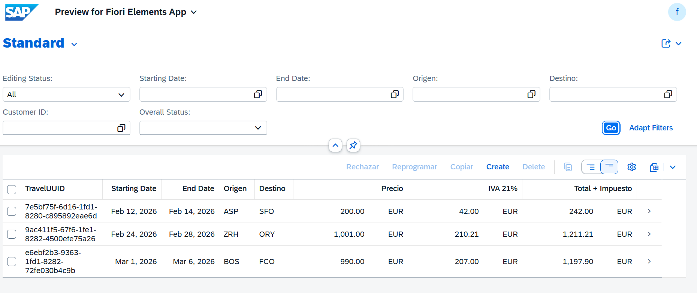

### Rechazar (viaje)

#### Seleccionar registro y click en `Rechazar`
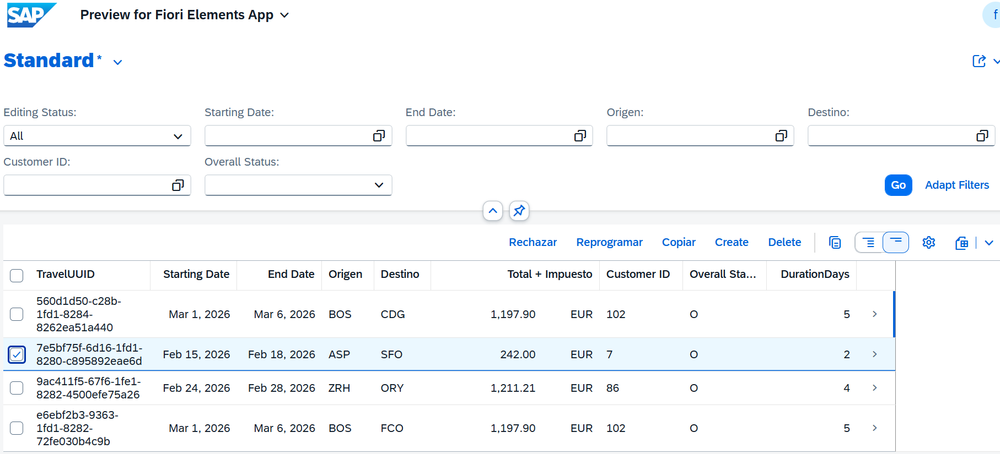

#### En el listado aparece el registro con estado rechazado
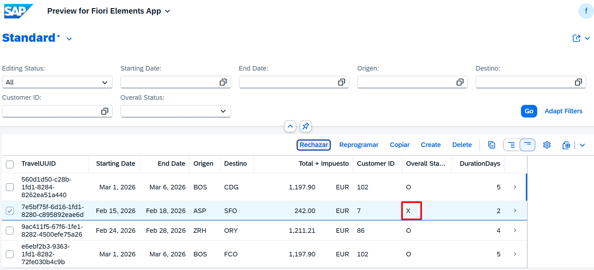

### Reprogramar (viaje)

#### Seleccionar registro y click en `Reprogramar`
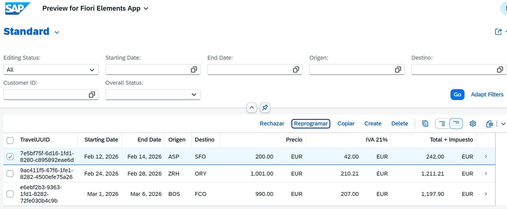

#### Sistema solicita fechas nuevas
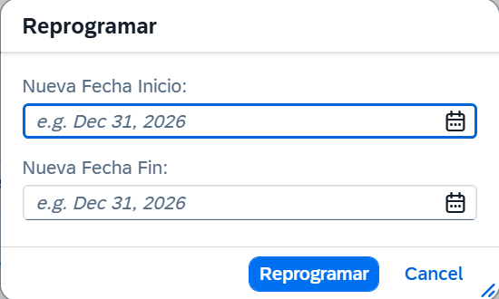

#### El usuario llena las fechas
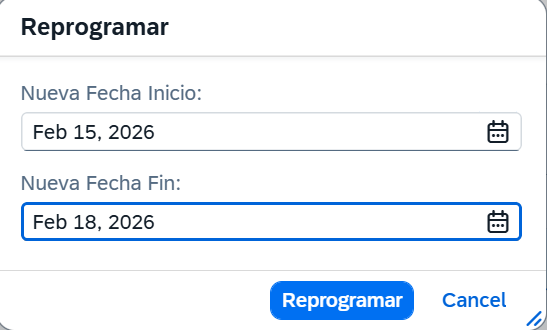

#### En el listado aparece el registro con las fechas modificadas
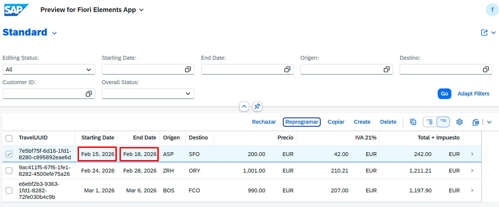

### Copiar (viaje)

#### Seleccionar registro y click en `Copiar`
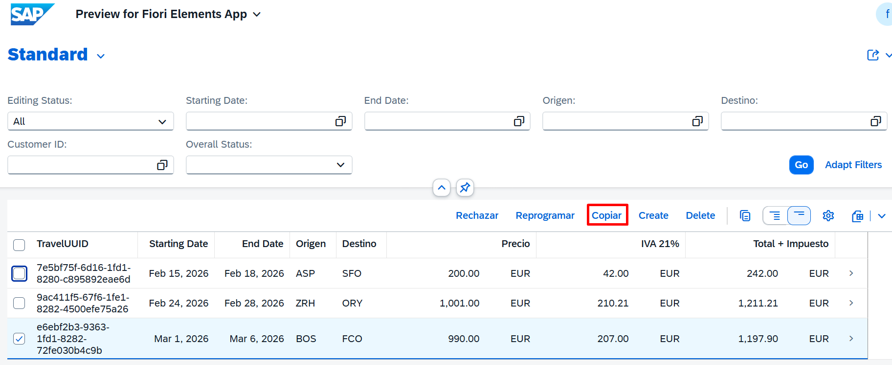

#### Se presenta registro nuevo con información copiada
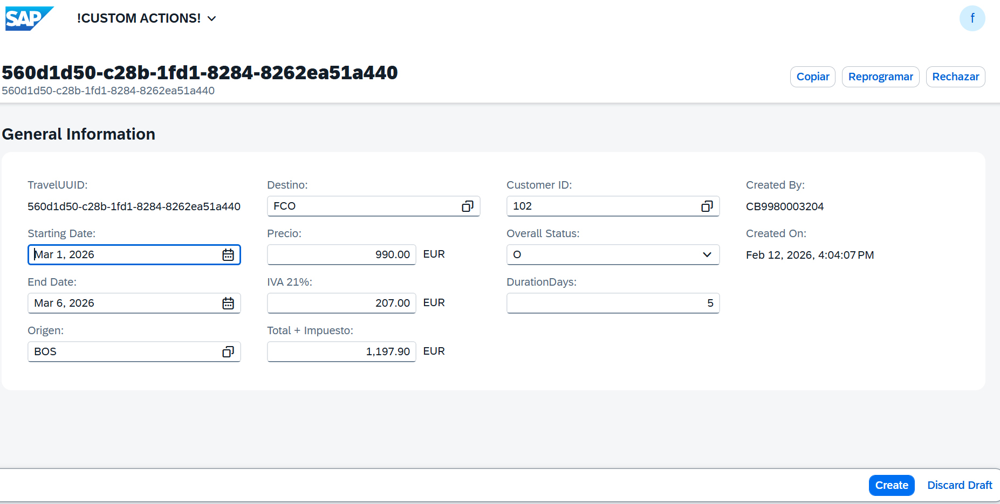

#### Se modifica aeropuerto destino y grabamos
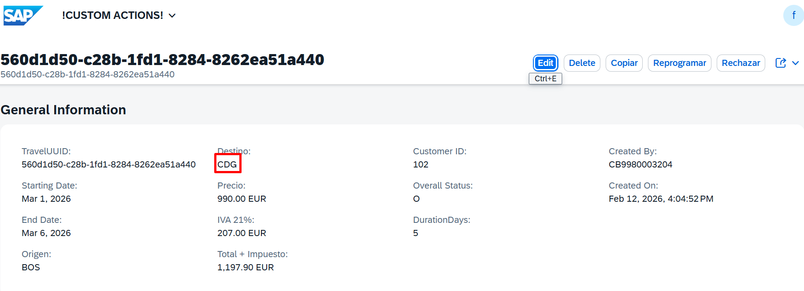

#### Se muestra listado con registro nuevo
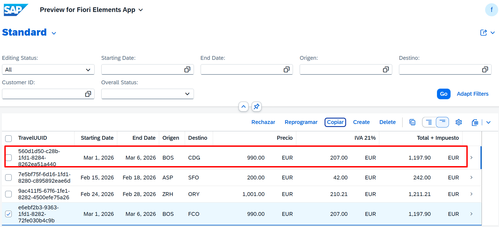