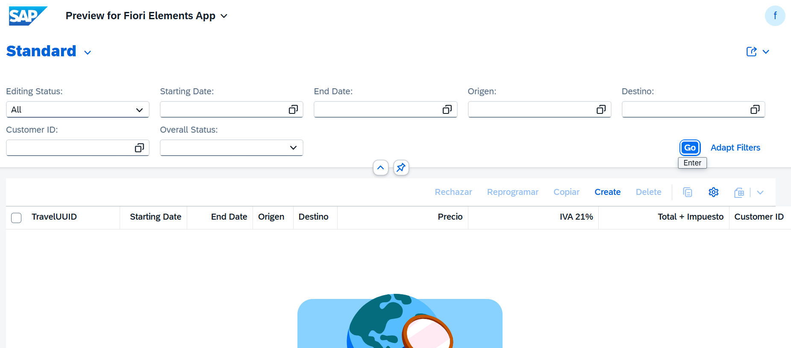
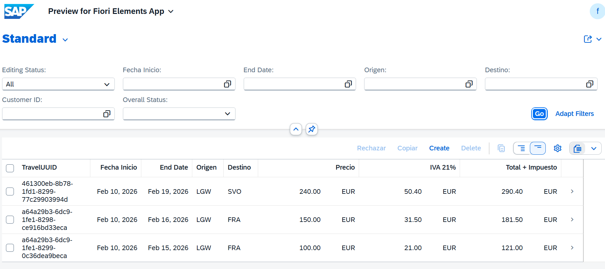
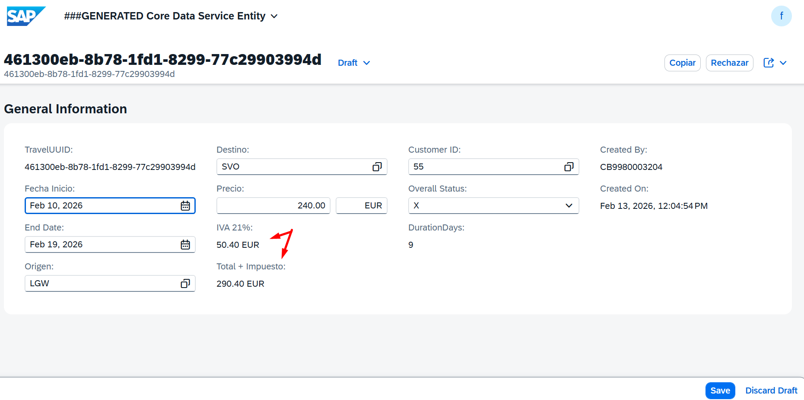
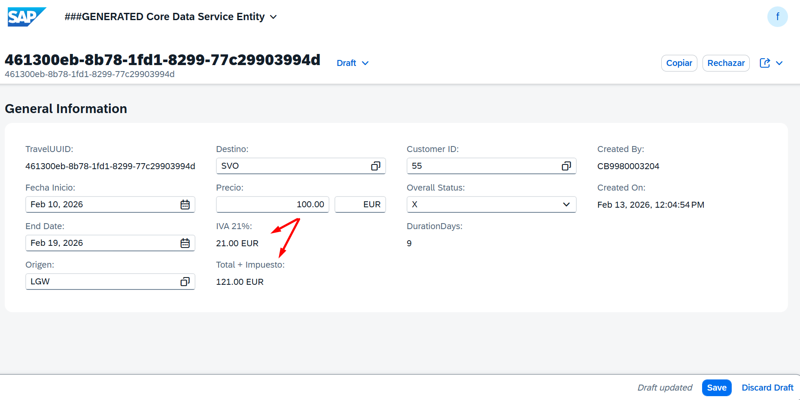
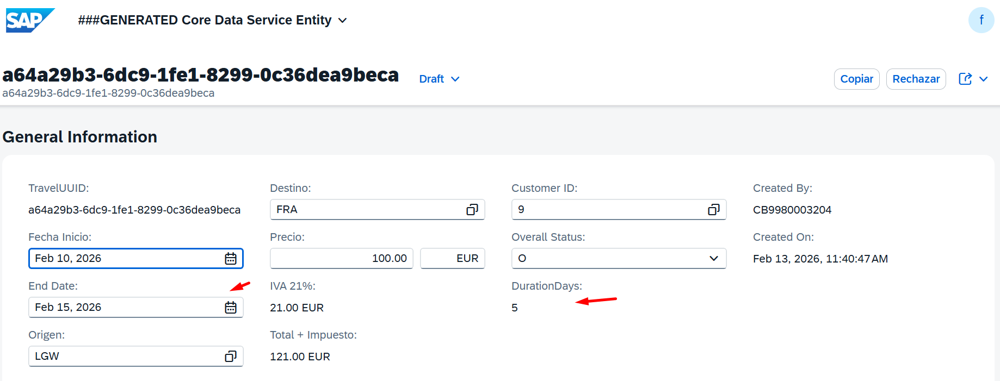
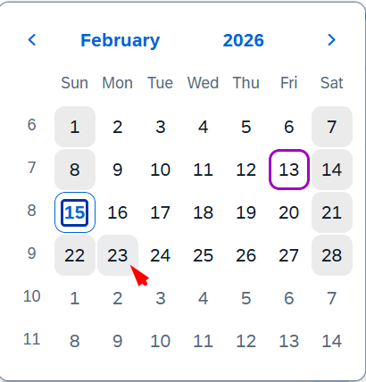
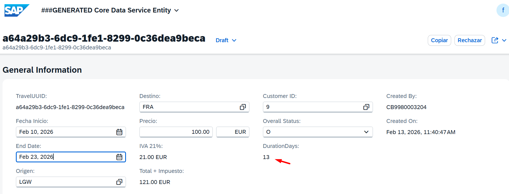

# MANAGED APP

0. [RESÚMEN](#resúmen)
1. [DICTIONARY](#dictionary)
   - 1.1 [Tabla BBDD](#11-tabla-bbdd)
   - 1.2 [Tabla BBDD DRAFT](#12-tabla-bbdd-draft)

2. [Core Data Services](#core-data-services)
   - 2.1 [DATA DEFINITIONS](#21-data-definitions)
     - 2.1.1 [ROOT VIEW](#211-root-view)
     - 2.1.2 [PROJECTION VIEW](#212-projection-view)
     - 2.1.3 [ABSTRACT ENTITY](#213-abstract-entity)
   - 2.2 [METADATA EXTENSIONS ¡Aquí se definen tres botones de interacción!](#22-metadata-extensions)
    - 2.3 [BEHAVIOR DEFINITIONS](#23-behavior-definitions)
     - 2.3.1 [BEHAVIOR DEFINITIONS](#231-behavior-definitions)
     - 2.3.2 [PROJECTION BEHAVIOR](#232-projection-behavior)

3. [Business Services](#business-services)
   - 3.1 [Services Definition](#31-services-definition)
   - 3.2 [Services Binding](#32-services-binding)

4. [Source Code Library](#source-code)
   - 4.1 [Clases](#41-clases)

5. [Pruebas](#Pruebas)

---

## RESÚMEN 

## 🚀 1. Creación de SIDE EFFECTS
# Escenarios de Side Effects - Aplicación de Turismo

| # | Escenario | Trigger (Disparador) | Target (Lo que se refresca) |
| :--- | :--- | :--- | :--- |
| **1** | **Cálculo de Tiempo** | `begin_date`, `end_date` | `duration_days` |
| **2** | **Cálculo de Costos** | `booking_fee`, `tax_amount` | `total_price` |
| **3** | **Gestión de Estado** | Acción `rejectTravel` | `overall_status` y **Permissions** (Field Control) |

Para el 1 y 2: Se necesita usar field ... affects field ....

Para el 3: usar action ... affects field ..., permissions ( self ).

## DICTIONARY

### 1.1 Tabla BBDD

``` abap
@EndUserText.label : 'Tabla turismo para side effects'
@AbapCatalog.enhancement.category : #NOT_EXTENSIBLE
@AbapCatalog.tableCategory : #TRANSPARENT
@AbapCatalog.deliveryClass : #A
@AbapCatalog.dataMaintenance : #RESTRICTED
define table ztravel_04 {

  key client             : abap.clnt not null;
  key travel_uuid        : sysuuid_x16 not null;
  begin_date             : /dmo/begin_date;
  end_date               : /dmo/end_date;
  airport_origin_id      : /dmo/airport_id;
  airport_destination_id : /dmo/airport_id;
  @Semantics.amount.currencyCode : 'ztravel_04.currency_code'
  booking_fee            : /dmo/booking_fee;
  @Semantics.amount.currencyCode : 'ztravel_04.currency_code'
  tax_amount             : /dmo/total_price;
  @Semantics.amount.currencyCode : 'ztravel_04.currency_code'
  total_price            : /dmo/total_price;
  currency_code          : /dmo/currency_code;
  customer_id            : /dmo/customer_id;
  overall_status         : /dmo/overall_status;
  duration_days          : abap.int4;
  created_by             : abp_creation_user;
  created_at             : abp_creation_tstmpl;
  local_last_changed_by  : abp_locinst_lastchange_user;
  local_last_changed_at  : abp_locinst_lastchange_tstmpl;
  last_changed_at        : timestampl;

}
```

### 1.2 Tabla BBDD DRAFT

``` abap
@EndUserText.label : 'Draft Database Table for ZTRAVEL_04_D'
@AbapCatalog.enhancement.category : #EXTENSIBLE_ANY
@AbapCatalog.tableCategory : #TRANSPARENT
@AbapCatalog.deliveryClass : #A
@AbapCatalog.dataMaintenance : #RESTRICTED
define table ztravel_04_d {

  key mandt            : mandt not null;
  key traveluuid       : sysuuid_x16 not null;
  begindate            : /dmo/begin_date;
  enddate              : /dmo/end_date;
  airportoriginid      : /dmo/airport_id;
  airportdestinationid : /dmo/airport_id;
  @Semantics.amount.currencyCode : 'ztravel_04_d.currencycode'
  bookingfee           : /dmo/booking_fee;
  @Semantics.amount.currencyCode : 'ztravel_04_d.currencycode'
  taxamount            : /dmo/total_price;
  @Semantics.amount.currencyCode : 'ztravel_04_d.currencycode'
  totalprice           : /dmo/total_price;
  currencycode         : /dmo/currency_code;
  customerid           : /dmo/customer_id;
  overallstatus        : /dmo/overall_status;
  durationdays         : abap.int4;
  createdby            : abp_creation_user;
  createdat            : abp_creation_tstmpl;
  locallastchangedby   : abp_locinst_lastchange_user;
  locallastchangedat   : abp_locinst_lastchange_tstmpl;
  lastchangedat        : timestampl;
  "%admin"             : include sych_bdl_draft_admin_inc;

}
```

## Core Data Services

### 2.1 DATA DEFINITIONS

#### 2.1.1 ROOT VIEW

``` abap
@AccessControl.authorizationCheck: #MANDATORY
@EndUserText.label: '###GENERATED Core Data Service Entity'
@Metadata.allowExtensions: true
@ObjectModel.sapObjectNodeType.name: 'ZTRAVEL_04'

define root view entity ZR_TRAVEL_04
  as select from ztravel_04

{
  key travel_uuid            as TravelUUID,

      begin_date             as BeginDate,
      end_date               as EndDate,
      airport_origin_id      as AirportOriginID,
      airport_destination_id as AirportDestinationID,
      booking_fee            as BookingFee,
      tax_amount             as TaxAmount,
      total_price            as TotalPrice,
      currency_code          as CurrencyCode,
      customer_id            as CustomerID,
      overall_status         as OverallStatus,
      duration_days          as DurationDays,

      @Semantics.user.createdBy: true
      created_by             as CreatedBy,

      @Semantics.systemDateTime.createdAt: true
      created_at             as CreatedAt,

      @Semantics.user.localInstanceLastChangedBy: true
      local_last_changed_by  as LocalLastChangedBy,

      @Semantics.systemDateTime.localInstanceLastChangedAt: true
      local_last_changed_at  as LocalLastChangedAt,

      last_changed_at        as LastChangedAt
}

``` 

#### 2.1.2 PROJECTION VIEW

``` abap
@AccessControl.authorizationCheck: #MANDATORY
@EndUserText.label: '###GENERATED Core Data Service Entity'
@Metadata.allowExtensions: true
@Metadata.ignorePropagatedAnnotations: true
@ObjectModel.sapObjectNodeType.name: 'ZTRAVEL_04'

define root view entity ZC_TRAVEL_04
  provider contract transactional_query
  as projection on ZR_TRAVEL_04

  association [1..1] to ZR_TRAVEL_04 as _BaseEntity on $projection.TravelUUID = _BaseEntity.TravelUUID

{
  key TravelUUID,

      BeginDate,
      EndDate,

      @Consumption.valueHelpDefinition: [ { entity: { name: '/DMO/I_Airport_StdVH', element: 'AirportID' } } ]
      AirportOriginID,

      @Consumption.valueHelpDefinition: [ { entity: { name: '/DMO/I_Airport_StdVH', element: 'AirportID' } } ]
      AirportDestinationID,

      @Semantics.amount.currencyCode: 'CurrencyCode'
      BookingFee,

      @Semantics.amount.currencyCode: 'CurrencyCode'
      TaxAmount,

      @Semantics.amount.currencyCode: 'CurrencyCode'
      TotalPrice,

     @UI.hidden: true
      CurrencyCode,

      @Consumption.valueHelpDefinition: [ { entity: { name: '/DMO/I_Customer_StdVH', element: 'CustomerID' } } ]
      CustomerID,

      @Consumption.valueHelpDefinition: [ { entity: { name: '/DMO/I_Overall_Status_VH_Text', element: 'OverallStatus' } } ]
      OverallStatus,

      DurationDays,

      @Semantics.user.createdBy: true
      CreatedBy,

      @Semantics.systemDateTime.createdAt: true
      CreatedAt,

      @Semantics.user.localInstanceLastChangedBy: true
      LocalLastChangedBy,

      @Semantics.systemDateTime.localInstanceLastChangedAt: true
      LocalLastChangedAt,

      LastChangedAt,

      _BaseEntity
}

```

#### 2.1.3 ABSTRACT ENTITY

Se comporta como la definicion de una estructura de datos para pasar parámetros
``` js
no aplica
```

```js
no aplica
```

### 2.2 METADATA EXTENSIONS

Los Metadata Extensions sirven para definir la configuración de la UI (interfaz de usuario) de forma declarativa, permitiendo la separación entre:

* Lógica de datos (CDS View)
* Presentación visual (anotaciones UI)

Estas anotaciones se publican automáticamente en el servicio **OData** y son interpretadas por **Fiori Elements** para generar la interfaz sin programación manual.

Configuran cómo se ve y comporta la aplicación Fiori sin tocar código de datos ni frontend.

[...detalle](../0.%20Developing%20LIST%20REPORT%20APP%20FOR%20CREATE/md_docs/metadata_extensions.md)

🔘 Documentación de Interfaz: Acciones Custom (Botones)
En SAP Fiori Elements, las acciones definidas en el Backend (BDEF) se exponen en la interfaz mediante anotaciones en la Metadata Extension (MDE). En este caso, se utilizan sobre el campo OverallStatus.

🛠️ Desglose de Anotaciones
1. `@UI.identification` (Object Page)
Define cómo se comportan los botones dentro de la página de detalles del objeto.

Ubicación: Los botones aparecerán en la barra de herramientas de la sección donde se encuentre el campo.

Acciones vinculadas: Se exponen tres botones críticos: `Rechazar` y `Copiar`.

Tipo: `#FOR_ACTION` vincula el botón directamente con el nombre de la acción definido en el Behavior Definition.

2. `@UI.lineItem` (List Report)
Define la presencia de los botones en la tabla principal (lista de registros).

Funcionalidad: Permite al usuario ejecutar acciones sobre uno o varios registros seleccionados sin necesidad de entrar al detalle.

Posición: Se le asigna la position: 110 para mantener la jerarquía visual junto al estado del viaje.

3. `@UI.selectionField`
Muestra el campo `OverallStatus` como un filtro de búsqueda en la parte superior de la aplicación.

Beneficio: Permite al usuario segmentar la lista de viajes rápidamente (ej: ver solo los viajes "Rechazados").


| Acción Técnica | Etiqueta (Label) | Función Principal |
| :--- | :--- | :--- |
| `setRejected` | **Rechazar** | Cambia el estado del viaje a 'X' (Rechazado). |
| `copiarViaje` | **Copiar** | Crea una nueva instancia tipo Draft basada en la actual. |

``` abap
@Metadata.layer: #CORE

@UI.headerInfo: { title: { type: #STANDARD, value: 'TravelUUID' },
                  description: { type: #STANDARD, value: 'TravelUUID' } }

annotate view ZC_TRAVEL_04 with

{
  @EndUserText.label: 'TravelUUID'
  @UI.facet: [ { label: 'General Information',
                 id: 'GeneralInfo',
                 purpose: #STANDARD,
                 position: 10,
                 type: #IDENTIFICATION_REFERENCE } ]
                 
  @UI.identification: [ { position: 10, label: 'TravelUUID' } ]
  @UI.lineItem: [ { position: 10, label: 'TravelUUID' } ]
  TravelUUID;

  @EndUserText.label: 'Fecha Inicio'
  @UI.identification: [ { position: 20 } ]
  @UI.lineItem: [ { position: 20 } ]
  @UI.selectionField: [ { position: 20 } ]
  BeginDate;

  @UI.identification: [ { position: 30 } ]
  @UI.lineItem: [ { position: 30 } ]
  @UI.selectionField: [ { position: 30 } ]
  EndDate;

  @EndUserText.label: 'Origen'
  @UI.identification: [ { position: 40 } ]
  @UI.lineItem: [ { position: 40 } ]
  @UI.selectionField: [ { position: 40 } ]
  AirportOriginID;

  @EndUserText.label: 'Destino'
  @UI.identification: [ { position: 50 } ]
  @UI.lineItem: [ { position: 50 } ]
  @UI.selectionField: [ { position: 50 } ]
  AirportDestinationID;

  @EndUserText.label: 'Precio'
  @UI.identification: [ { position: 60 } ]
  @UI.lineItem: [ { position: 60 } ]
  BookingFee;

  @UI.identification: [ { position: 70 } ]
  CurrencyCode;

  @EndUserText.label: 'IVA 21%'
  @UI.identification: [ { position: 80 } ]
  @UI.lineItem: [ { position: 80 } ]
  TaxAmount;

  @EndUserText.label: 'Total + Impuesto'
  @UI.identification: [ { position: 90 } ]
  @UI.lineItem: [ { position: 90 } ]
  TotalPrice;

  @UI.identification: [ { position: 100 } ]
  @UI.lineItem: [ { position: 100 } ]
  @UI.selectionField: [ { position: 100 } ]
  CustomerID;

  // ---------------------------------------------------------
  // !BOTONES!
  // ---------------------------------------------------------
  @UI.identification: [ { position: 110 },
                        { type: #FOR_ACTION, dataAction: 'setRejected', label: 'Rechazar' },
                        { type: #FOR_ACTION, dataAction: 'copiarViaje', label: 'Copiar' } ]
  @UI.lineItem: [ { position: 110 },
                  { type: #FOR_ACTION, dataAction: 'setRejected', label: 'Rechazar' },
                  { type: #FOR_ACTION, dataAction: 'copiarViaje', label: 'Copiar' } ]
  @UI.selectionField: [ { position: 110 } ]
  OverallStatus;
  // ---------------------------------------------------------

  @EndUserText.label: 'DurationDays'
  @UI.identification: [ { position: 120, label: 'DurationDays' } ]
  @UI.lineItem: [ { position: 120, label: 'DurationDays' } ]
  DurationDays;

  @UI.identification: [ { position: 130 } ]
  @UI.lineItem: [ { position: 130 } ]
  CreatedBy;

  @UI.identification: [ { position: 140 } ]
  @UI.lineItem: [ { position: 140 } ]
  CreatedAt;

  @UI.hidden: true
  LocalLastChangedBy;

  @UI.hidden: true
  LocalLastChangedAt;

  @UI.hidden: true
  LastChangedAt;

  @UI.hidden: true
  _BaseEntity;
}
```


### 2.3 BEHAVIOR DEFINITIONS

Es un artefacto que especifica QUÉ operaciones están permitidas sobre una entidad 
y CÓMO se comporta esa entidad durante las operaciones CRUD (Create, Read, Update, Delete).

[...detalle](../0.%20Developing%20LIST%20REPORT%20APP%20FOR%20CREATE/md_docs/BDEF.MD)

Ventas:
* ✓ Separación de responsabilidades: Lógica de negocio separada de la UI
* ✓ Reutilización: Mismo comportamiento para múltiples interfaces (Fiori, API, etc.)
* ✓ Mantenibilidad: Cambios centralizados en un solo lugar
* ✓ Consistencia: Reglas de negocio aplicadas uniformemente
* ✓ RAP Framework: Aprovecha todas las capacidades del framework moderno de SAP

#### 2.3.1 BEHAVIOR DEFINITIONS

##### Se crea BDEF sobre CDS root o Interfaz


permissions ( update ): Es la forma de decirle a Fiori "volvé a fijarte si los campos ahora son solo lectura o no".

Nombres de campos: Fijate que puse BeginDate y no begin_date, porque como tenés un mapping, la BDEF prefiere los nombres de los campos de la entidad (los que están a la izquierda en tu mapping).

La Llave: Asegurate de que el bloque side effects { ... } esté bien cerradito con su llave antes de que empiecen las determinations.

---

## ⚡ Operaciones y Acciones (Lógica de Negocio)

### 🔹 Side Effects

📋 Nuestros Side Effects (El "Si pasa A, entonces refrescamos B")
1. El "Efecto Calendario" 📅
Trigger (Si cambias): begin_date o end_date.

Target (Refrescar): duration_days.

¿Por qué? Porque si cambiás las fechas, el cálculo de los días de viaje tiene que actualizarse al toque en la pantalla.

2. El "Efecto Billetera" 💰
Trigger (Si cambias): booking_fee.

Target (Refrescar): total_price y tax_amount.

¿Por qué? Para que el usuario vea cuánto le duele el bolsillo en tiempo real sin tener que sacar la calculadora.

## `SIDE EFFECTS (La magia)`

```abap

  side effects
  {
    // 1. Cálculo de Tiempo dias de duración
    field BeginDate affects field DurationDays;
    field EndDate affects field DurationDays;

    // 2. Cálculo de Costos: IVA imp. y Precio Total
    field BookingFee affects field TaxAmount, field TotalPrice;

    // 3. Gestión de Estado y Permisos
    action setRejected affects field OverallStatus, permissions ( update );
  }
```

---

``` abap
managed implementation in class ZBP_R_TRAVEL_04 unique;
strict ( 2 );
with draft;
extensible;
define behavior for ZR_TRAVEL_04 alias ZrTravel04
persistent table ztravel_04
extensible
draft table ztravel_04_d
etag master LocalLastChangedAt
lock master total etag LocalLastChangedAt
authorization master ( global )
{
  field ( readonly )
  TravelUUID,
  CreatedBy,
  CreatedAt,
  LocalLastChangedBy,
  LocalLastChangedAt,
//  CurrencyCode,
  // Campos que se calculan solos
  TaxAmount,
  TotalPrice,
  DurationDays;

  field ( numbering : managed )
  TravelUUID;

  create;
  update;
  delete;

  draft action Activate optimized;
  draft action Discard;
  draft action Edit;
  draft action Resume;
  draft determine action Prepare;

  // --- SIDE EFFECTS (La magia) ---
  side effects
  {
    // 1. Cálculo de Tiempo dias de duración
    field BeginDate affects field DurationDays;
    field EndDate affects field DurationDays;

    // 2. Cálculo de Costos: IVA imp. y Precio Total
    field BookingFee affects field TaxAmount, field TotalPrice;

    // 3. Gestión de Estado y Permisos
    action setRejected affects field OverallStatus, permissions ( update );
  }

  // --- ACCIONES ---
  // Acción para el Punto 3 de nuestra tabla
  action setRejected result [1] $self;

  // Tu acción de copiar (aunque no tenga side effects específicos ahora)
  action copiarViaje result [1] $self;

  // --- DETERMINACIONES ---
  determination calculateTotalPrice on modify { field BookingFee; }

  determination calculateDuration on modify { field BeginDate, EndDate; }

  determination setInitialValues on modify { create; }

  mapping for ztravel_04 corresponding extensible
    {
      TravelUUID           = travel_uuid;
      BeginDate            = begin_date;
      EndDate              = end_date;
      AirportOriginID      = airport_origin_id;
      AirportDestinationID = airport_destination_id;
      BookingFee           = booking_fee;
      TaxAmount            = tax_amount;
      TotalPrice           = total_price;
      CurrencyCode         = currency_code;
      CustomerID           = customer_id;
      OverallStatus        = overall_status;
      DurationDays         = duration_days;
      CreatedBy            = created_by;
      CreatedAt            = created_at;
      LocalLastChangedBy   = local_last_changed_by;
      LocalLastChangedAt   = local_last_changed_at;
      LastChangedAt        = last_changed_at;
    }

}
```

#### 2.3.2 PROJECTION BEHAVIOR

#### Ventajas

1. Separación de Responsabilidades: Interface (lógica) vs Consumption (UI)
2. Múltiples UIs: Puedes tener varias proyecciones para diferentes roles
3. Mantenibilidad: Cambios en la lógica se reflejan automáticamente
4. Seguridad: Controlas qué expones en cada capa

### Se exponen los botones: `Rechazar` y `Copiar`

``` abap
projection implementation in class ZBP_C_TRAVEL_04 unique;
strict ( 2 );
extensible;
use draft;
use side effects;
define behavior for ZC_TRAVEL_04 alias ZcTravel04
extensible
use etag
{
  use create;
  use update;
  use delete;

  use action Edit;
  use action Activate;
  use action Discard;
  use action Resume;
  use action Prepare;

// Proyectamos nuestras acciones personalizadas
  use action setRejected;
  use action copiarViaje;

}
```

``` abap
```

## business-services

### 3.1 services-definition

``` abap
@EndUserText: {
  label: 'Service Definition for ZC_TRAVEL_04'
}
@ObjectModel: {
  leadingEntity: {
    name: 'ZC_TRAVEL_04'
  }
}
define service ZUI_TRAVEL_04_O4 provider contracts odata_v4_ui {
  expose ZC_TRAVEL_04;
}
```

### 3.2 services-binding

Pasos para la creación una nueva vinculación.


<!--  -->


Selección del tipo de vinculación
<!--  -->


Publicar el servicio
<!--  -->


Visualizar
<!--  -->


## source-code

### 4.1 clases

``` abap
class ZBP_R_TRAVEL_04 definition
  public
  abstract
  final
  for behavior of ZR_TRAVEL_04 .

public section.
protected section.
private section.
ENDCLASS.

CLASS ZBP_R_TRAVEL_04 IMPLEMENTATION.
ENDCLASS.
```

``` abap
class lhc_zr_travel_04 definition inheriting from cl_abap_behavior_handler.

  public section.
    " ══════════════════════════════════════════════════════════
    " CONSTANTES
    " ══════════════════════════════════════════════════════════
    constants c_tax_rate         type p length 5 decimals 2 value '0.21'. " 21% IVA
    constants c_default_currency type /dmo/currency_code    value 'EUR'.
    constants c_open_status      type /dmo/overall_status   value 'O'.
    constants c_rejected_status  type /dmo/overall_status   value 'X'.

  private section.
    methods get_global_authorizations for global authorization
              importing
                 request requested_authorizations for ZrTravel04
              result result.

    methods copiarViaje for modify
                  importing keys for action ZrTravel04~copiarViaje result result.

    methods setRejected for modify
      importing keys for action ZrTravel04~setRejected result result.

    methods calculateDuration for determine on modify
      importing keys for ZrTravel04~calculateDuration.

    methods calculateTotalPrice for determine on modify
      importing keys for ZrTravel04~calculateTotalPrice.

    methods setInitialValues for determine on modify
      importing keys for ZrTravel04~setInitialValues.

endclass.


class lhc_zr_travel_04 implementation.
  method get_global_authorizations.
  endmethod.

  method copiarViaje.
    " 1. Leemos los datos del viaje original que queremos copiar
    read entities of zr_travel_04 in local mode
         entity ZrTravel04
         all fields with corresponding #( keys )
         result data(lt_travel_read).

    " 2. Preparamos la tabla para crear el nuevo registro
    " %is_draft: Si usás draft, esto decide si el nuevo nace como borrador
    data lt_travel_create type table for create zr_travel_04\\ZrTravel04.

    lt_travel_create = value #( for ls in lt_travel_read index into i
                                ( %is_draft = if_abap_behv=>mk-on
                                  %cid      = |Copiado_{ i }|  " <-- ID temporal
                                  " Copiamos todo menos...
                                  " Usamos BASE para heredar todo y después asignar el campo OverallStatus
                                  %data     = value #( base corresponding #( ls except TravelUUID )
                                                       OverallStatus = c_open_status
                                                       CurrencyCode  = c_default_currency ) ) ).

    " 3. Ejecutamos la creación
    modify entities of zr_travel_04 in local mode
           entity ZrTravel04
           create fields ( BeginDate
                           EndDate
                           AirportOriginID
                           AirportDestinationID
                           BookingFee
                           TaxAmount
                           TotalPrice
                           CurrencyCode
                           CustomerID
                           OverallStatus
                           DurationDays )
           with lt_travel_create
           mapped data(mapped_create)
           failed failed
           reported reported.

    " 4. Devolvemos el nuevo registro creado para que Fiori lo muestre
    " Mapeamos primero el MAPPED para que el framework sepa qué se creó
    mapped-zrtravel04 = mapped_create-zrtravel04.

    " Ahora llenamos el RESULT de forma que el compilador lo entienda
    result = value #( for rel in mapped_create-zrtravel04 index into idx
                      ( %tky   = keys[ idx ]-%tky  " La clave del original
                        %param = corresponding #( rel ) ) ).
  endmethod.

  method calculateDuration.
    " Punto 1: Lógica para calcular la diferencia de días
    read entities of zr_travel_04 in local mode
         entity ZrTravel04
         fields ( BeginDate EndDate ) with corresponding #( keys )
         result data(travels).

    modify entities of zr_travel_04 in local mode
           entity ZrTravel04
           update fields ( DurationDays )
           with value #( for travel in travels
                         ( %tky         = travel-%tky
                           DurationDays = travel-EndDate - travel-BeginDate ) )
    " TODO: variable is assigned but never used (ABAP cleaner)
           reported data(reported_calc).
  endmethod.

  method calculateTotalPrice.
    " PREPARAMOS EL BUFFER

    " 1. Variables locales para el cálculo
    data lv_tax_amount    type ztravel_04-tax_amount.
    data lv_total_price   type ztravel_04-total_price.
    data lt_travel_update type table for update zr_travel_04.

    " 2. Recuperar los datos actuales del Buffer
    read entities of zr_travel_04 in local mode
         entity ZrTravel04
         fields ( BookingFee ) with corresponding #( keys )
         result data(travels).

    if travels is initial.
      return.
    endif.

    " 3. Aplicar el cambio en ABAP (Procesamiento campo por campo)
    loop at travels into data(ls_travel).

      " Recuperamos/Calculamos los nuevos valores en variables ABAP
      lv_tax_amount  = ls_travel-BookingFee * c_tax_rate.
      lv_total_price = ls_travel-BookingFee + lv_tax_amount.

      " 4. Pasamos las variables modificadas a una estructura de actualización
      append value #( %tky       = ls_travel-%tky
                      TaxAmount  = lv_tax_amount
                      TotalPrice = lv_total_price )
             to lt_travel_update.
    endloop.

    " 5. Ejecutar el MODIFY una sola vez con todos los cambios recolectados
    modify entities of zr_travel_04 in local mode
           entity ZrTravel04
           update fields ( TaxAmount TotalPrice )
           with lt_travel_update
           " TODO: variable is assigned but never used (ABAP cleaner)
           reported data(reported_price).
  endmethod.

  method setRejected.
    " Punto 3: Cambiamos el estado a Rechazado ('X')
    modify entities of zr_travel_04 in local mode
           entity ZrTravel04
           update fields ( OverallStatus )
           with value #( for key in keys
                         ( %tky          = key-%tky
                           OverallStatus = c_rejected_status ) )
           failed failed
           reported reported.

    " Devolvemos el resultado para que el Side Effect refresque la UI
    read entities of zr_travel_04 in local mode
         entity ZrTravel04
         all fields with corresponding #( keys )
         result data(travels).

    result = value #( for travel in travels
                      ( %tky   = travel-%tky
                        %param = travel ) ).
  endmethod.

  method setInitialValues.

    " Leemos los registros que se están creando
    read entities of zr_travel_04 in local mode
         entity ZrTravel04
         fields ( CurrencyCode ) with corresponding #( keys )
         result data(lt_travel).

    " Si el campo está vacío, le mandamos el EUR de una
    " Ya que estamos, lo dejamos en Open
    modify entities of zr_travel_04 in local mode
           entity ZrTravel04
           update fields ( CurrencyCode OverallStatus )
           with value #( for travel in lt_travel
                         ( %tky          = travel-%tky
                           CurrencyCode  = c_default_currency
                           OverallStatus = c_open_status ) ).
  endmethod.
endclass.
```

## Pruebas




### SIDE EFFECTS: Actualizar IVA y Precio Total





### SIDE EFFECTS: Actualizar Duración de días





