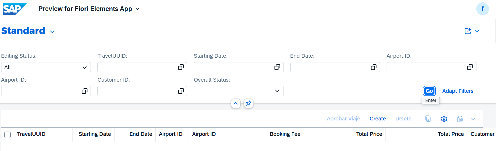
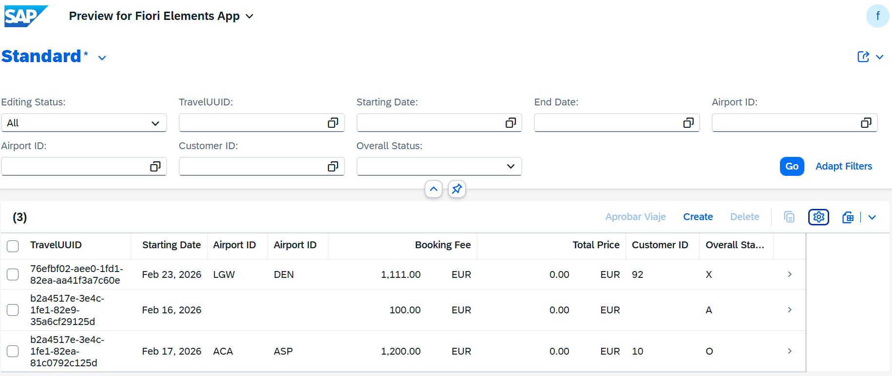
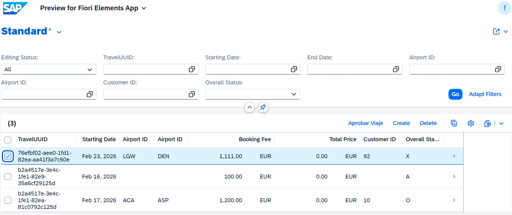
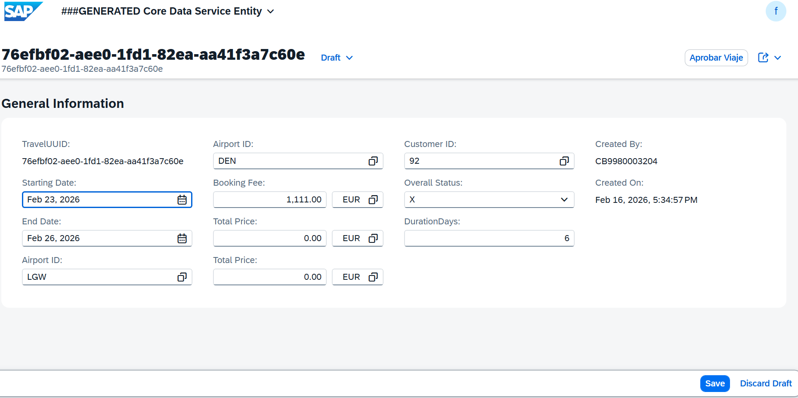
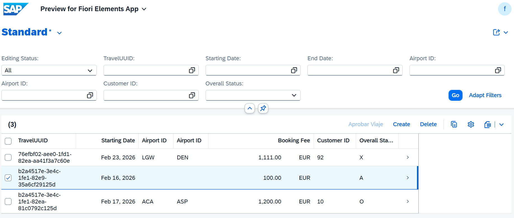
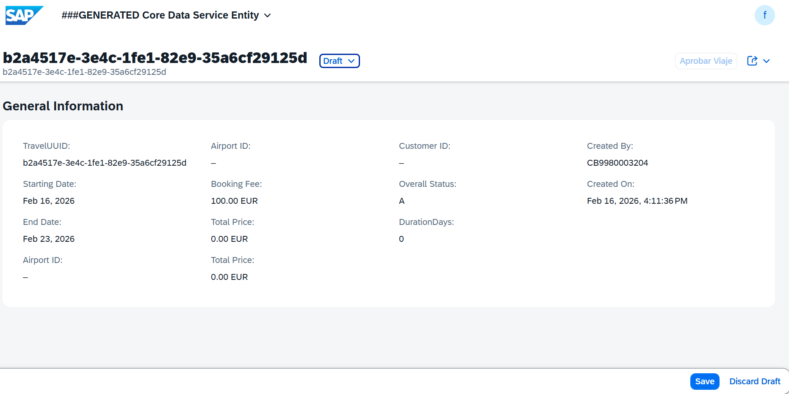

# MANAGED APP

0. [RESÚMEN](#resúmen)
1. [DICTIONARY](#dictionary)
   - 1.1 [Tabla BBDD](#11-tabla-bbdd)
   - 1.2 [Tabla BBDD DRAFT](#12-tabla-bbdd-draft)

2. [Core Data Services](#core-data-services)
   - 2.1 [DATA DEFINITIONS](#21-data-definitions)
     - 2.1.1 [ROOT VIEW](#211-root-view)
     - 2.1.2 [PROJECTION VIEW](#212-projection-view)
     - 2.1.3 [ABSTRACT ENTITY](#213-abstract-entity)
   - 2.2 [METADATA EXTENSIONS ¡Aquí se definen tres botones de interacción!](#22-metadata-extensions)
    - 2.3 [BEHAVIOR DEFINITIONS](#23-behavior-definitions)
     - 2.3.1 [BEHAVIOR DEFINITIONS](#231-behavior-definitions)
     - 2.3.2 [PROJECTION BEHAVIOR](#232-projection-behavior)

3. [Business Services](#business-services)
   - 3.1 [Services Definition](#31-services-definition)
   - 3.2 [Services Binding](#32-services-binding)

4. [Source Code Library](#source-code)
   - 4.1 [Clases](#41-clases)

5. [Pruebas](#Pruebas)

---

## RESÚMEN 

## 🚀 1. Creación de FEATURES CONTROL

### 1. ¿Qué es en pocas palabras?
Es la capacidad de ABAP RAP para decidir, en tiempo real, qué se puede hacer y qué no con los datos. No es una validación de error (eso es otra cosa), es habilitar o deshabilitar opciones en la pantalla de Fiori antes de que el usuario las toque.

### 2. 🛡️ Los dos "Modos" del Seguridad (Feature Control)

En **ABAP RAP**, el Feature Control actúa como el seguridad de un boliche, decidiendo quién entra y qué se puede hacer.

#### A. El Control Estático (Las Reglas de la Casa)
Son reglas fijas que **no cambian nunca**. Están "escritas en el cartel de la puerta".

* **En ABAP:** Se definen directamente en la **BDEF**.
* **Ejemplo:** *"El ID de la orden no se toca"* o *"La fecha de creación es solo lectura"*.
* **Código (BDEF):**
    ```abap
    field ( readonly ) TravelID;
    field ( mandatory ) CustomerID;
    ```
* **Resultado en Fiori:** El campo siempre aparece grisado (read-only) o con el asterisco rojo (mandatory).

#### B. El Control Dinámico (El "Depende")
Acá el seguridad te mira a vos y decide según tu situación actual. **Depende del estado del registro**.

* **En ABAP:** Se definen en la **BDEF** con la cláusula `features: instance` y la lógica se programa en la clase de comportamiento (**CCIMP**).
* **Ejemplo:** *"Si el viaje ya está Aceptado, no podés editarlo ni borrarlo"*.
* **Código (BDEF):**
    ```abap
    update ( features : instance );
    delete ( features : instance );
    action ( features : instance ) acceptTravel result [1] $self;
    ```
* **Resultado en Fiori:** Los botones de **"Edit"**, **"Delete"** o acciones personalizadas se deshabilitan (se ponen grises) o desaparecen mágicamente cuando el estado del registro cambia.

### 3. ¿Cómo funciona el "teléfono descompuesto" entre ABAP y Fiori?
Es un proceso de 3 pasos que ocurre todo el tiempo:

1. **Fiori pregunta:** "Che, ABAP, voy a mostrar estos 10 viajes. ¿Qué botones habilito para cada uno?".

2. **ABAP responde** (`get_instance_features`): El código que me pasaste recién hace el laburo. Mira el `OverallStatus` y manda una tablita de vuelta:

    * Viaje 1 (Pendiente): `Update = Enabled`, `Delete = Enabled`.

    * Viaje 2 (Aprobado): `Update = Disabled`, `Delete = Disabled`.

3. **Fiori dibuja:** La pantalla se refresca y el usuario ve los botones activos solo donde corresponde.

### 4. ¿Por qué es tan importante en RAP?
* **Experiencia de Usuario (UX):** Evitás que el usuario complete todo un formulario, toque "Guardar" y recién ahí le salte un error de "No se puede editar". Le avisás antes grisando el botón.

* **Seguridad:** Te asegurás de que los estados críticos (como una factura paga o un viaje aprobado) queden blindados contra cambios accidentales.

Resumen para el examen:
* BDEF: Es donde "prometés" que vas a controlar algo (`features: instance`).

* Clase Handler: Es donde cumplís la promesa con código `IF/ELSE` o `COND`.

* Fiori Elements: Es el que pone la "carita linda" y apaga los botones basándose en lo que decidió ABAP.


## DICTIONARY

### 1.1 Tabla BBDD

``` abap
@EndUserText.label : 'Tabla turismo para feature control'
@AbapCatalog.enhancement.category : #NOT_EXTENSIBLE
@AbapCatalog.tableCategory : #TRANSPARENT
@AbapCatalog.deliveryClass : #A
@AbapCatalog.dataMaintenance : #RESTRICTED
define table ztravel_05 {

  key client             : abap.clnt not null;
  key travel_uuid        : sysuuid_x16 not null;
  begin_date             : /dmo/begin_date;
  end_date               : /dmo/end_date;
  airport_origin_id      : /dmo/airport_id;
  airport_destination_id : /dmo/airport_id;
  @Semantics.amount.currencyCode : 'ztravel_05.currency_code'
  booking_fee            : /dmo/booking_fee;
  @Semantics.amount.currencyCode : 'ztravel_05.currency_code'
  tax_amount             : /dmo/total_price;
  @Semantics.amount.currencyCode : 'ztravel_05.currency_code'
  total_price            : /dmo/total_price;
  currency_code          : /dmo/currency_code;
  customer_id            : /dmo/customer_id;
  overall_status         : /dmo/overall_status;
  duration_days          : abap.int4;
  created_by             : abp_creation_user;
  created_at             : abp_creation_tstmpl;
  local_last_changed_by  : abp_locinst_lastchange_user;
  local_last_changed_at  : abp_locinst_lastchange_tstmpl;
  last_changed_at        : timestampl;

}
```

### 1.2 Tabla BBDD DRAFT

``` abap
@EndUserText.label : 'Draft Database Table for ZTRAVEL_05_D'
@AbapCatalog.enhancement.category : #EXTENSIBLE_ANY
@AbapCatalog.tableCategory : #TRANSPARENT
@AbapCatalog.deliveryClass : #A
@AbapCatalog.dataMaintenance : #RESTRICTED
define table ztravel_05_d {

  key mandt            : mandt not null;
  key traveluuid       : sysuuid_x16 not null;
  begindate            : /dmo/begin_date;
  enddate              : /dmo/end_date;
  airportoriginid      : /dmo/airport_id;
  airportdestinationid : /dmo/airport_id;
  @Semantics.amount.currencyCode : 'ztravel_05_d.currencycode'
  bookingfee           : /dmo/booking_fee;
  @Semantics.amount.currencyCode : 'ztravel_05_d.currencycode'
  taxamount            : /dmo/total_price;
  @Semantics.amount.currencyCode : 'ztravel_05_d.currencycode'
  totalprice           : /dmo/total_price;
  currencycode         : /dmo/currency_code;
  customerid           : /dmo/customer_id;
  overallstatus        : /dmo/overall_status;
  durationdays         : abap.int4;
  createdby            : abp_creation_user;
  createdat            : abp_creation_tstmpl;
  locallastchangedby   : abp_locinst_lastchange_user;
  locallastchangedat   : abp_locinst_lastchange_tstmpl;
  lastchangedat        : timestampl;
  "%admin"             : include sych_bdl_draft_admin_inc;

}
```

## Core Data Services

### 2.1 DATA DEFINITIONS

#### 2.1.1 ROOT VIEW

``` abap
@AccessControl.authorizationCheck: #MANDATORY
@Metadata.allowExtensions: true
@ObjectModel.sapObjectNodeType.name: 'ZTRAVEL_05'
@EndUserText.label: '###GENERATED Core Data Service Entity'
define root view entity ZR_TRAVEL_05
  as select from ztravel_05
{
  key travel_uuid            as TravelUUID,
      begin_date             as BeginDate,
      end_date               as EndDate,
      airport_origin_id      as AirportOriginID,
      airport_destination_id as AirportDestinationID,
      @Semantics.amount.currencyCode: 'CurrencyCode'
      booking_fee            as BookingFee,
      @Semantics.amount.currencyCode: 'CurrencyCode'
      tax_amount             as TaxAmount,
      @Semantics.amount.currencyCode: 'CurrencyCode'
      total_price            as TotalPrice,
      currency_code          as CurrencyCode,
      customer_id            as CustomerID,
      overall_status         as OverallStatus,
      duration_days          as DurationDays,
      @Semantics.user.createdBy: true
      created_by             as CreatedBy,
      @Semantics.systemDateTime.createdAt: true
      created_at             as CreatedAt,
      @Semantics.user.localInstanceLastChangedBy: true
      local_last_changed_by  as LocalLastChangedBy,
      @Semantics.systemDateTime.localInstanceLastChangedAt: true
      local_last_changed_at  as LocalLastChangedAt,
      last_changed_at        as LastChangedAt
}

``` 

#### 2.1.2 PROJECTION VIEW

``` abap
@AccessControl.authorizationCheck: #MANDATORY
@EndUserText.label: '###GENERATED Core Data Service Entity'
@Metadata.allowExtensions: true
@Metadata.ignorePropagatedAnnotations: true
@ObjectModel.sapObjectNodeType.name: 'ZTRAVEL_05'

define root view entity ZC_TRAVEL_05
  provider contract transactional_query
  as projection on ZR_TRAVEL_05

  association [1..1] to ZR_TRAVEL_05 as _BaseEntity on $projection.TravelUUID = _BaseEntity.TravelUUID

{
  key TravelUUID,

      BeginDate,
      EndDate,

      @Consumption.valueHelpDefinition: [ { entity: { name: '/DMO/I_Airport_StdVH', element: 'AirportID' } } ]
      AirportOriginID,

      @Consumption.valueHelpDefinition: [ { entity: { name: '/DMO/I_Airport_StdVH', element: 'AirportID' } } ]      
      AirportDestinationID,

      @Semantics.amount.currencyCode: 'CurrencyCode'
      BookingFee,

      @Semantics.amount.currencyCode: 'CurrencyCode'
      TaxAmount,

      @Semantics.amount.currencyCode: 'CurrencyCode'
      TotalPrice,

      @Consumption.valueHelpDefinition: [ { entity: { element: 'Currency', name: 'I_CurrencyStdVH' },
                                            useForValidation: true } ]
      CurrencyCode,

      @Consumption.valueHelpDefinition: [ { entity: { name: '/DMO/I_Customer_StdVH', element: 'CustomerID' } } ]
      CustomerID,

      @Consumption.valueHelpDefinition: [ { entity: { name: '/DMO/I_Overall_Status_VH_Text', element: 'OverallStatus' } } ]
      OverallStatus,
      DurationDays,

      @Semantics.user.createdBy: true
      CreatedBy,

      @Semantics.systemDateTime.createdAt: true
      CreatedAt,

      @Semantics.user.localInstanceLastChangedBy: true
      LocalLastChangedBy,

      @Semantics.systemDateTime.localInstanceLastChangedAt: true
      LocalLastChangedAt,

      LastChangedAt,

      _BaseEntity
}

```

#### 2.1.3 ABSTRACT ENTITY

Se comporta como la definicion de una estructura de datos para pasar parámetros
``` js
no aplica
```

```js
no aplica
```

### 2.2 METADATA EXTENSIONS

Los Metadata Extensions sirven para definir la configuración de la UI (interfaz de usuario) de forma declarativa, permitiendo la separación entre:

* Lógica de datos (CDS View)
* Presentación visual (anotaciones UI)

Estas anotaciones se publican automáticamente en el servicio **OData** y son interpretadas por **Fiori Elements** para generar la interfaz sin programación manual.

Configuran cómo se ve y comporta la aplicación Fiori sin tocar código de datos ni frontend.

[...detalle](../0.%20Developing%20LIST%20REPORT%20APP%20FOR%20CREATE/md_docs/metadata_extensions.md)

### 🔘 Anotaciones UI: Acción de Botón (OverallStatus)

Estas anotaciones vinculan la lógica del backend (la acción `acceptTravel` definida en la BDEF) con la interfaz visual de **Fiori Elements**, permitiendo que el usuario interactúe con el estado del viaje.

#### 1. `@UI.identification` (Object Page)
Define cómo se muestra el campo y sus acciones dentro del cuerpo de la **Object Page** (la vista de detalle).
* **Posición 100:** Ubica el campo/botón en el orden visual de la faceta de identificación.
* **#FOR_ACTION:** Crea un **botón** en la cabecera de la sección.
* **dataAction:** Conecta el botón específicamente con la lógica de la acción `acceptTravel` programada en ABAP.
* **label:** El texto que verá el usuario en el botón ("Aprobar Viaje").

#### 2. `@UI.lineItem` (List Report)
Define la representación del campo y la acción en la **tabla principal** (la lista de registros).
* **#FOR_ACTION:** Agrega el botón "Aprobar Viaje" directamente en la barra de herramientas de la tabla. 
* **Funcionalidad:** Permite al usuario seleccionar uno o varios registros de la lista y aprobarlos de un solo clic sin entrar al detalle.

#### 3. `@UI.selectionField` (Filtros)
* **Posición 100:** Expone el campo `OverallStatus` como un **filtro de búsqueda** en la parte superior de la aplicación (Smart Filter Bar).
* **Utilidad:** Permite al usuario buscar rápidamente, por ejemplo, todos los viajes que están en estado "Pendiente".

---

**Resumen de visualización:**
| Anotación | Elemento UI resultante |
| :--- | :--- |
| **Type #FOR_ACTION** | Un botón que dispara lógica ABAP. |
| **OverallStatus** | El campo que actúa como "ancla" para estas acciones y filtros. |

``` abap
@Metadata.layer: #CORE
@UI.headerInfo: { title: { type: #STANDARD, value: 'TravelUUID' },
                  description: { type: #STANDARD, value: 'TravelUUID' } }

annotate view ZC_TRAVEL_05 with

{
  @EndUserText.label: 'TravelUUID'
  @UI.facet: [ { label: 'General Information',
                 id: 'GeneralInfo',
                 purpose: #STANDARD,
                 position: 10,
                 type: #IDENTIFICATION_REFERENCE } ]
  @UI.identification: [ { position: 10, label: 'TravelUUID' } ]
  @UI.lineItem: [ { position: 10, label: 'TravelUUID' } ]
  @UI.selectionField: [ { position: 10 } ]
  TravelUUID;

  @UI.identification: [ { position: 20 } ]
  @UI.lineItem: [ { position: 20 } ]
  @UI.selectionField: [ { position: 20 } ]
  BeginDate;

  @UI.identification: [ { position: 30 } ]
  @UI.lineItem: [ { position: 30 } ]
  @UI.selectionField: [ { position: 30 } ]
  EndDate;

  @UI.identification: [ { position: 40 } ]
  @UI.lineItem: [ { position: 40 } ]
  @UI.selectionField: [ { position: 40 } ]
  AirportOriginID;

  @UI.identification: [ { position: 50 } ]
  @UI.lineItem: [ { position: 50 } ]
  @UI.selectionField: [ { position: 50 } ]
  AirportDestinationID;

  @UI.identification: [ { position: 60 } ]
  @UI.lineItem: [ { position: 60 } ]
  BookingFee;

  @UI.identification: [ { position: 70 } ]
  @UI.lineItem: [ { position: 70 } ]
  TaxAmount;

  @UI.identification: [ { position: 80 } ]
  @UI.lineItem: [ { position: 80 } ]
  TotalPrice;

  @UI.identification: [ { position: 90 } ]
  @UI.lineItem: [ { position: 90 } ]
  @UI.selectionField: [ { position: 90 } ]

  CustomerID;

  @UI.identification: [ { position: 100 },
                        { type: #FOR_ACTION, dataAction: 'acceptTravel', label: 'Aprobar Viaje' } ]
  @UI.lineItem: [ { position: 100 },
                  { type: #FOR_ACTION, dataAction: 'acceptTravel', label: 'Aprobar Viaje' } ]
  @UI.selectionField: [ { position: 100 } ]
  OverallStatus;

  @EndUserText.label: 'DurationDays'
  @UI.identification: [ { position: 110, label: 'DurationDays' } ]
  @UI.lineItem: [ { position: 110, label: 'DurationDays' } ]
  DurationDays;

  @UI.identification: [ { position: 120 } ]
  @UI.lineItem: [ { position: 120 } ]
  CreatedBy;

  @UI.identification: [ { position: 130 } ]
  @UI.lineItem: [ { position: 130 } ]
  CreatedAt;

  @UI.hidden: true
  LocalLastChangedBy;

  @UI.hidden: true
  LocalLastChangedAt;

  @UI.hidden: true
  LastChangedAt;

  @UI.hidden: true
  _BaseEntity;
}
```


### 2.3 BEHAVIOR DEFINITIONS

Es un artefacto que especifica QUÉ operaciones están permitidas sobre una entidad 
y CÓMO se comporta esa entidad durante las operaciones CRUD (Create, Read, Update, Delete).

[...detalle](../0.%20Developing%20LIST%20REPORT%20APP%20FOR%20CREATE/md_docs/BDEF.MD)

Ventas:
* ✓ Separación de responsabilidades: Lógica de negocio separada de la UI
* ✓ Reutilización: Mismo comportamiento para múltiples interfaces (Fiori, API, etc.)
* ✓ Mantenibilidad: Cambios centralizados en un solo lugar
* ✓ Consistencia: Reglas de negocio aplicadas uniformemente
* ✓ RAP Framework: Aprovecha todas las capacidades del framework moderno de SAP

#### 2.3.1 BEHAVIOR DEFINITIONS

##### Se crea BDEF sobre CDS root o Interfaz


### 🚀 Puntos Clave: BDEF Managed con Draft y Feature Control

Esta definición de comportamiento (BDEF) establece las reglas de negocio automáticas y manuales para la entidad de viajes.

#### 1. Configuración del Framework
* **managed:** El framework RAP se encarga de las operaciones CRUD (Insert, Update, Delete) automáticamente en la tabla persistente.
* **with draft:** Habilita el "borrador". Los datos se guardan temporalmente en `ztravel_05_d` antes de la persistencia final, permitiendo sesiones de edición largas sin perder datos.
* **strict ( 2 ):** Obliga a usar la versión más moderna y segura de la sintaxis de RAP.

#### 2. Gestión de Integridad y Concurrencia
* **lock master:** Gestiona el bloqueo de registros para que dos usuarios no editen el mismo viaje simultáneamente.
* **etag master (LocalLastChangedAt):** Control de concurrencia optimista. Si alguien modificó el registro mientras vos lo tenías abierto, el sistema impide que "pises" sus cambios.
* **field ( numbering : managed ) TravelUUID:** El sistema genera automáticamente la clave primaria (UUID) al crear un nuevo registro.

#### 3. Control de Operaciones (Feature Control)
* **update / delete ( features : instance ):** No son operaciones libres. El sistema llamará a ABAP (`get_instance_features`) para preguntar si el botón "Editar" o "Borrar" debe estar habilitado según el estado del viaje.
* **action ( features : instance ) acceptTravel:** Define una acción personalizada para aprobar el viaje, también controlada dinámicamente por el estado del registro.

#### 4. Ciclo de Vida del Draft
* **draft action (Edit, Activate, Discard, Resume):** Acciones estándar necesarias para manejar el ciclo de vida del borrador (pasar de tabla de borrador a persistente y viceversa).
* **determine action Prepare:** Punto clave donde se ejecutan las validaciones antes de que el borrador se convierta en un registro real.

#### 5. Mapping
* **mapping for ztravel_05:** Vincula los nombres de campos "lindos" de la vista CDS (CamelCase) con los nombres técnicos de la tabla de base de datos (SNAKE_CASE), permitiendo que el framework sepa exactamente dónde guardar cada dato.

---

``` abap
managed implementation in class ZBP_R_TRAVEL_05 unique;
strict ( 2 );
with draft;
extensible;
define behavior for ZR_TRAVEL_05 alias ZrTravel05
persistent table ztravel_05
extensible
draft table ztravel_05_d
etag master LocalLastChangedAt
lock master total etag LocalLastChangedAt
authorization master ( global )
{
  field ( readonly )
  TravelUUID,
  CreatedBy,
  CreatedAt,
  LocalLastChangedBy,
  LocalLastChangedAt;

  field ( numbering : managed )
  TravelUUID;


  create;
// Añadimos ( features : instance ) a las operaciones que queremos dinamizar
  update ( features : instance );
  delete ( features : instance );


  // Si tienes una acción para aprobar, también la incluimos
  action ( features : instance ) acceptTravel result [1] $self;

  draft action Activate optimized;
  draft action Discard;
  draft action Edit;
  draft action Resume;
  draft determine action Prepare;

  mapping for ztravel_05 corresponding extensible
    {
      TravelUUID           = TRAVEL_UUID;
      BeginDate            = BEGIN_DATE;
      EndDate              = END_DATE;
      AirportOriginID      = AIRPORT_ORIGIN_ID;
      AirportDestinationID = AIRPORT_DESTINATION_ID;
      BookingFee           = BOOKING_FEE;
      TaxAmount            = TAX_AMOUNT;
      TotalPrice           = TOTAL_PRICE;
      CurrencyCode         = CURRENCY_CODE;
      CustomerID           = CUSTOMER_ID;
      OverallStatus        = OVERALL_STATUS;
      DurationDays         = DURATION_DAYS;
      CreatedBy            = CREATED_BY;
      CreatedAt            = CREATED_AT;
      LocalLastChangedBy   = LOCAL_LAST_CHANGED_BY;
      LocalLastChangedAt   = LOCAL_LAST_CHANGED_AT;
      LastChangedAt        = LAST_CHANGED_AT;
    }

}
```

#### 2.3.2 PROJECTION BEHAVIOR

#### Ventajas

1. Separación de Responsabilidades: Interface (lógica) vs Consumption (UI)
2. Múltiples UIs: Puedes tener varias proyecciones para diferentes roles
3. Mantenibilidad: Cambios en la lógica se reflejan automáticamente
4. Seguridad: Controlas qué expones en cada capa

### Se exponen los botones: `Aprobar viaje`

``` abap
projection implementation in class ZBP_C_TRAVEL_05 unique;
strict ( 2 );
extensible;
use draft;
use side effects;
define behavior for ZC_TRAVEL_05 alias ZcTravel05
extensible
use etag
{
  use create;
  use update;
  use delete;
  use action acceptTravel;

  use action Edit;
  use action Activate;
  use action Discard;
  use action Resume;
  use action Prepare;

}
```

## business-services

### 3.1 services-definition

``` abap
@EndUserText: {
  label: 'Service Definition for ZC_TRAVEL_05'
}
@ObjectModel: {
  leadingEntity: {
    name: 'ZC_TRAVEL_05'
  }
}
define service ZUI_TRAVEL_05_O4 provider contracts odata_v4_ui {
  expose ZC_TRAVEL_05;
}
```

### 3.2 services-binding

Pasos para la creación una nueva vinculación.


<!--  -->


Selección del tipo de vinculación
<!--  -->


Publicar el servicio
<!--  -->


Visualizar
<!--  -->


## source-code

### 4.1 clases

``` abap
class ZBP_R_TRAVEL_05 definition
  public
  abstract
  final
  for behavior of ZR_TRAVEL_05 .

public section.
protected section.
private section.
ENDCLASS.

CLASS ZBP_R_TRAVEL_05 IMPLEMENTATION.
ENDCLASS.
```

``` abap
class lhc_zr_travel_05 definition inheriting from cl_abap_behavior_handler.

  private section.

    methods get_global_authorizations for global authorization
              importing
                 request requested_authorizations for ZrTravel05
              result result.

    methods get_instance_features for instance features
                  importing keys request requested_features for ZrTravel05 result result.

    methods acceptTravel for modify
      importing keys for action ZrTravel05~acceptTravel result result.

endclass.


class lhc_zr_travel_05 implementation.
  method get_global_authorizations.
  endmethod.

  method get_instance_features.
*    " 1. Leemos el estado (overall_status) de las instancias solicitadas
*    read entities of zr_travel_05 in local mode
*         entity ZrTravel05
*         fields ( OverallStatus )
*         with corresponding #( keys )
*         result data(lt_travels).
*
*    " 2. Construimos el resultado evaluando la condición
*    result = value #( for travel in lt_travels
*                      ( %tky                 = travel-%tky
*
*                        " Control de UPDATE (Editar)
*                        %update              = cond #( when travel-OverallStatus = 'A' " A = Aceptado
*                                                       then if_abap_behv=>fc-o-disabled
*                                                       else if_abap_behv=>fc-o-enabled )
*
*                        " Control de DELETE (Borrar)
*                        %delete              = cond #( when travel-OverallStatus = 'A'
*                                                       then if_abap_behv=>fc-o-disabled
*                                                       else if_abap_behv=>fc-o-enabled )
*
*                        " Control de tu acción personalizada (si la declaraste en el paso 1)
*                        %action-acceptTravel = cond #( when travel-OverallStatus = 'A'
*                                                       then if_abap_behv=>fc-o-disabled
*                                                       else if_abap_behv=>fc-o-enabled ) ) ).

    " --- 1. LENGUAJE EML: Lectura de datos ---
    " Leemos el estado de las instancias que el framework nos solicita en 'keys'
    read entities of zr_travel_05 in local mode
         entity ZrTravel05
         fields ( OverallStatus )
         with corresponding #( keys )
         result data(lt_travels).

    " --- 2. TRANSFORMACIONES ABAP: Lógica de negocio ---
    " Declaramos una tabla local con la estructura del resultado para manipularla
    data lt_feature_result type table for features result zr_travel_05\\ZrTravel05.

    data ls_feature        like line of result.

    loop at lt_travels assigning field-symbol(<fs_travel>).

      ls_feature-%tky = <fs_travel>-%tky.

      " Aplicamos la lógica ABAP tradicional con IF/ELSE
      if <fs_travel>-OverallStatus = 'A'. " Si está Aceptado ('A')

        ls_feature-%update = if_abap_behv=>fc-o-disabled.
        ls_feature-%delete = if_abap_behv=>fc-o-disabled.
        ls_feature-%action-acceptTravel = if_abap_behv=>fc-o-disabled.

      else. " Para cualquier otro estado

        ls_feature-%update = if_abap_behv=>fc-o-enabled.
        ls_feature-%delete = if_abap_behv=>fc-o-enabled.
        ls_feature-%action-acceptTravel = if_abap_behv=>fc-o-enabled.

      endif.

      " Insertamos el resultado procesado en nuestra tabla temporal
      append ls_feature to lt_feature_result.
      clear ls_feature.
    endloop.

    " --- 3. LENGUAJE EML: Asignación final ---
    " Devolvemos la tabla procesada al parámetro de salida del método
    result = corresponding #( lt_feature_result ).
  endmethod.

  method acceptTravel.
*Implementación del método acceptTravel (Desglosado)
*ABAP
    " 1. Recuperar los datos actuales a una tabla interna ABAP
    read entities of zr_travel_05 in local mode
         entity ZrTravel05
         all fields with corresponding #( keys )
         result data(lt_travel_data).

    " 2. Aplicar transformaciones en ABAP puro
    " Aquí puedes hacer cualquier lógica compleja antes de guardar
    loop at lt_travel_data assigning field-symbol(<fs_travel>).

      " Ejemplo de transformación:
      <fs_travel>-OverallStatus = 'A'. " Cambiamos el estado

      " Podrías añadir más lógica aquí:
      " <fs_travel>-description = |Aprobado el { cl_abap_context_info=>get_system_date( ) }|.

    endloop.

    " 3. Devolver los cambios al framework usando EML (MODIFY)
    modify entities of zr_travel_05 in local mode
           entity ZrTravel05
           update fields ( OverallStatus ) " Agrega aquí más campos si los transformaste
           with value #( for travel in lt_travel_data
                         ( %tky          = travel-%tky
                           OverallStatus = travel-OverallStatus ) )
           failed failed
           reported reported.

    " 4. Llenar el parámetro RESULT (Obligatorio para que la UI se refresque)
    " Reutilizamos la tabla lt_travel_data que ya tiene los valores nuevos
    result = value #( for travel_res in lt_travel_data
                      ( %tky   = travel_res-%tky
                        %param = travel_res ) ).
  endmethod.
endclass.
```

## Pruebas




### Modificar `Precio` o `Aprobar viaje` -> Se puede





### Modificar registro o `Aprobar viaje` -> No se puede, Update y Aprobar viaje deshabilitado




