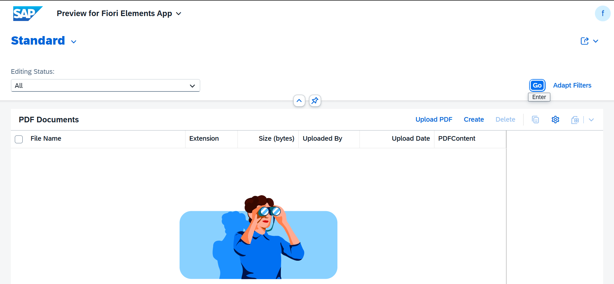
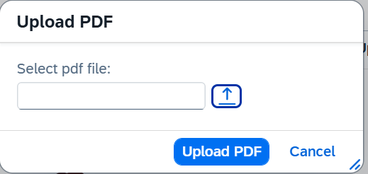
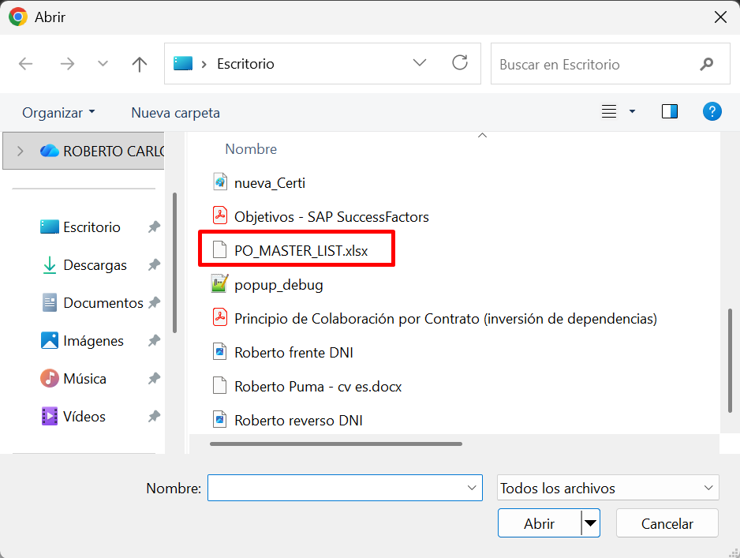
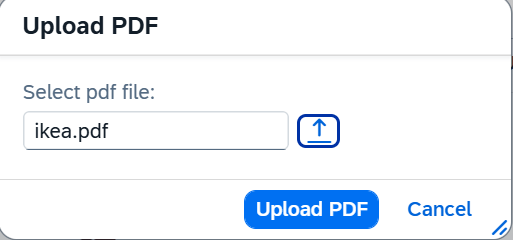
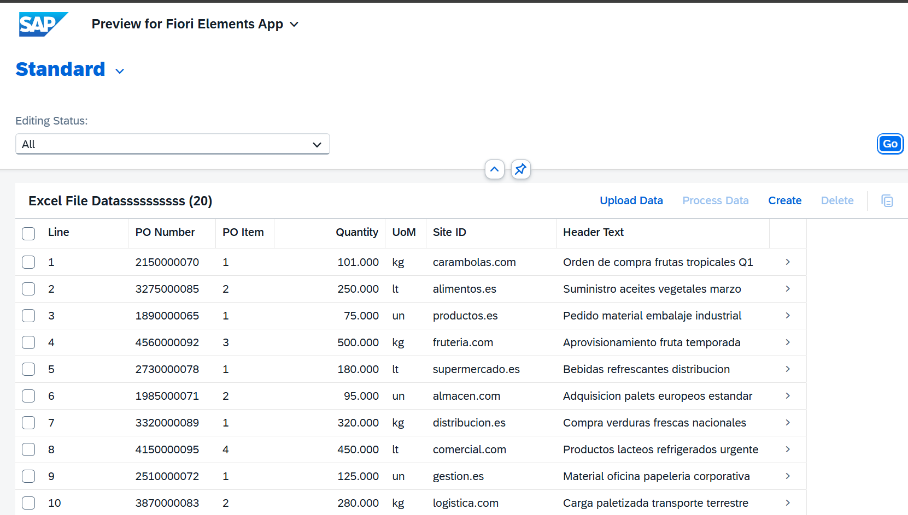
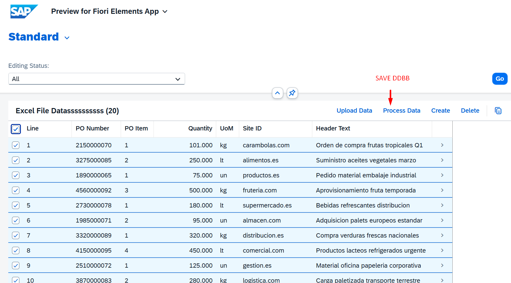

# MANAGED APP

1. [DICTIONARY](#dictionary)
   - 1.1 [Tabla BBDD](#11-tabla-bbdd)
   - 1.2 [Tabla BBDD DRAFT](#12-tabla-bbdd-draft)

2. [Core Data Services](#core-data-services)
   - 2.1 [DATA DEFINITIONS](#21-data-definitions)
     - 2.1.1 [ROOT VIEW](#211-root-view)
     - 2.1.2 [PROJECTION VIEW](#212-projection-view)
     - 2.1.3 [ABSTRACT ENTITY](#213-abstract-entity)
   - 2.2 [METADATA EXTENSIONS ¡Aquí se definen tres botones de interacción!](#22-metadata-extensions)
    - 2.3 [BEHAVIOR DEFINITIONS](#23-behavior-definitions)
     - 2.3.1 [BEHAVIOR DEFINITIONS](#231-behavior-definitions)
     - 2.3.2 [PROJECTION BEHAVIOR](#232-projection-behavior)

3. [Business Services](#business-services)
   - 3.1 [Services Definition](#31-services-definition)
   - 3.2 [Services Binding](#32-services-binding)

4. [Source Code Library](#source-code)
   - 4.1 [Clases](#41-clases)

5. [Pruebas](#pruebas)

---

## DICTIONARY

### 1.1 Tabla BBDD

``` abap
@EndUserText.label : 'Pdf file documents'
@AbapCatalog.enhancement.category : #NOT_EXTENSIBLE
@AbapCatalog.tableCategory : #TRANSPARENT
@AbapCatalog.deliveryClass : #A
@AbapCatalog.dataMaintenance : #RESTRICTED
define table zpdf_documents {

  key client      : abap.clnt not null;
  key document_id : sysuuid_x16 not null;
  file_name       : abap.char(128);
  file_extension  : abap.char(10);
  mime_type       : abap.char(128);
  file_size       : abap.int8;
  description     : abap.char(128);
  attachment      : abap.rawstring(0);
  uploaded_by     : syuname;
  uploaded_at     : abap.dec(15,0);
  changed_by      : syuname;
  changed_at      : abap.dec(15,0);

}
```

### 1.2 Tabla BBDD DRAFT

``` abap
@EndUserText.label : 'Pdf file documents'
@AbapCatalog.enhancement.category : #NOT_EXTENSIBLE
@AbapCatalog.tableCategory : #TRANSPARENT
@AbapCatalog.deliveryClass : #A
@AbapCatalog.dataMaintenance : #RESTRICTED
define table zpdf_documentsd {

  key client     : abap.clnt not null;
  key documentid : sysuuid_x16 not null;
  filename       : abap.char(128);
  fileextension  : abap.char(10);
  mimetype       : abap.char(128);
  filesize       : abap.int8;
  description    : abap.char(128);
  attachment     : abap.rawstring(0);
  uploadedby     : syuname;
  uploadedat     : abap.dec(15,0);
  changedby      : syuname;
  changedat      : abap.dec(15,0);
  "%admin"       : include sych_bdl_draft_admin_inc;

}
```

## Core Data Services

### 2.1 DATA DEFINITIONS

#### 2.1.1 ROOT VIEW

``` abap

@AccessControl.authorizationCheck: #NOT_REQUIRED
@EndUserText.label: 'PDF Data CDS'
@Metadata.ignorePropagatedAnnotations: true
define root view entity ZI_PDF_DOCUMENTS
  as select from zpdf_documents
{
  key document_id       as DocumentId,
      file_name         as FileName,
      file_extension    as FileExtension,
      mime_type         as MimeType,
      file_size         as FileSize,
      description       as Description,    
      attachment        as Attachment,
      uploaded_by       as UploadedBy,
      uploaded_at       as UploadedAt,
      changed_by        as ChangedBy,
      changed_at        as ChangedAt

}

``` 

#### 2.1.2 PROJECTION VIEW

``` abap
@AccessControl.authorizationCheck: #NOT_REQUIRED
@EndUserText.label: 'PDF Data CDS Consumption'
@Metadata.allowExtensions: true
@Metadata.ignorePropagatedAnnotations: true

define root view entity ZC_PDF_DOCUMENTS
  provider contract transactional_query
  as projection on ZI_PDF_DOCUMENTS

{
  key DocumentId,

      FileName,
      FileExtension,
      MimeType,
      FileSize,
      Description,

      // Solución Real: Usar el patrón de Attachment
      // La forma correcta en RAP para mostrar PDFs es exponerlos como attachment en el Object Page,
      // no como acción.
      @Semantics.largeObject: { mimeType: 'MimeType', 
                                fileName: 'FileName', 
                                contentDispositionPreference: #INLINE }
      Attachment,
      
      UploadedBy,
      UploadedAt,
      ChangedBy,
      ChangedAt
}
```

#### 2.1.3 ABSTRACT ENTITY

**¿Qué es?**

* Es una entidad abstracta = Una estructura de datos que NO tiene tabla física detrás
* Se usa para definir parámetros de entrada/salida en funciones o acciones
* Similar a una estructura (TYPES) pero para RAP

En este caso:

* Tiene un campo dummy de tipo boolean
* Tiene una asociación _Stream a ZA_UPLOAD_STREAM
* Se usa probablemente para manejar la carga de archivos

``` abap
@EndUserText.label: 'Upload PDF File'
define root abstract entity ZA_UPLOAD_PDF_FILE

{
  @UI.hidden : true
  Dummy      : abap_boolean;
    
  _Stream    : association [1] to ZA_UPLOAD_STREAM on 1 = 1;
}
```

> define root abstract entity ZA_UPLOAD_STREAM

**¿Qué es?**

* Otra entidad abstracta que representa el archivo en sí
* Define cómo se va a recibir/enviar el archivo

``` abap
@EndUserText.label: 'Upload PDF Parameters'
define root abstract entity ZA_UPLOAD_STREAM

{
  @EndUserText.label: 'Select pdf file'
  @Semantics.largeObject: { mimeType: 'MimeType',
                            fileName: 'FileName',
                            contentDispositionPreference: #INLINE,
                            acceptableMimeTypes: [ 'application/pdf' ] }

  AttachmentRaw : abap.rawstring(0);

  @UI.hidden: true
  MimeType  : abap.char(128);

  @UI.hidden: true
  FileName  : abap.char(128);
}
```
Anotaciones clave:
```js
@Semantics.largeObject: { mimeType: 'MimeType',
                          fileName: 'FileName',
                          contentDispositionPreference: #INLINE,
                          acceptableMimeTypes: [ 'application/pdf' ]
}
```
Esto significa:

✅ "Este campo contiene un archivo grande (PDF)"

✅ "Solo acepta archivos PDF"

✅ "El nombre y tipo del archivo vienen en los otros campos"


Resumen en cristiano 🎯
En una app Fiori donde el usuario puede subir un archivo Excel:

ZA_UPLOAD_PDF_FILE = El "formulario" que el usuario ve (con un botón para adjuntar)

ZA_UPLOAD_STREAM = Los "datos del archivo" que se envían al backend (el contenido, nombre, y tipo)

Esto permite que desde Fiori UI puedas hacer clic en "Subir fichero" → seleccionar archivo → enviarlo al sistema SAP.

### 2.2 METADATA EXTENSIONS
¡Aquí se definen tres botones de interacción!

Los Metadata Extensions sirven para definir la configuración de la UI (interfaz de usuario) de forma declarativa, permitiendo la separación entre:

* Lógica de datos (CDS View)
* Presentación visual (anotaciones UI)

Estas anotaciones se publican automáticamente en el servicio **OData** y son interpretadas por **Fiori Elements** para generar la interfaz sin programación manual.

Configuran cómo se ve y comporta la aplicación Fiori sin tocar código de datos ni frontend.

<!-- [...detalle](md_docs/metadata_extensions.md) -->
[...detalle](../0.%20Developing%20LIST%20REPORT%20APP%20FOR%20CREATE/md_docs/metadata_extensions.md)

``` abap
@Metadata.layer: #CORE

@UI.headerInfo: { typeName: 'PDF Document',
                  typeNamePlural: 'PDF Documents',
                  title: { type: #STANDARD, value: 'DocumentId' },
                  description: { type: #STANDARD, value: 'DocumentId' } }

annotate entity ZC_PDF_DOCUMENTS with

{
  @UI.facet: [ { id: 'DocumentInfo',
                 purpose: #STANDARD,
                 type: #IDENTIFICATION_REFERENCE,
                 position: 10,
                 label: 'Document Information' } ]

  // Botón en la barra superior, sin necesidad de seleccionar una fila
  @UI.lineItem: [ { type: #FOR_ACTION, label: 'Upload PDF', dataAction: 'uploadPdf' } ]
  @UI.hidden: true
  DocumentId;

  // Campos con botón View en cada fila
  @UI.identification: [ { position: 10, label: 'File Name' } ]
  @UI.lineItem: [ { position: 10, label: 'File Name' } ]
  FileName;

  @UI.identification: [ { position: 20, label: 'Extension' } ]
  @UI.lineItem: [ { position: 20, label: 'Extension' } ]
  FileExtension;

  @UI.identification: [ { position: 30, label: 'File Size' } ]
  @UI.lineItem: [ { position: 30, label: 'Size (bytes)' } ]
  FileSize;

  @UI.identification: [ { position: 40, label: 'Uploaded By' } ]
  @UI.lineItem: [ { position: 40, label: 'Uploaded By' } ]
  UploadedBy;

  @UI.identification: [ { position: 50, label: 'Uploaded At' } ]
  @UI.lineItem: [ { position: 50, label: 'Upload Date' } ]
  UploadedAt;

  @UI.facet: [
    // ← NUEVA FACETA
    {
      id: 'PDFViewer',
      purpose: #STANDARD,
      type: #FIELDGROUP_REFERENCE,
      targetQualifier: 'PDFContent',
      position: 60,
      label: 'Ficheros adjuntos'
    }
    ]

  @UI.lineItem: [ { position: 60, label: 'PDFContent' } ]
  @UI.fieldGroup: [ { qualifier: 'PDFContent', position: 60 } ]
  Attachment;

  @UI.hidden: true
  ChangedAt;

  @UI.hidden: true
  MimeType;
}
```

### 2.3 BEHAVIOR DEFINITIONS

Es un artefacto que especifica QUÉ operaciones están permitidas sobre una entidad 
y CÓMO se comporta esa entidad durante las operaciones CRUD (Create, Read, Update, Delete).

<!-- [...detalle](./md_docs/BDEF.MD) -->
[...detalle](../0.%20Developing%20LIST%20REPORT%20APP%20FOR%20CREATE/md_docs/BDEF.MD)

Ventas:
* ✓ Separación de responsabilidades: Lógica de negocio separada de la UI
* ✓ Reutilización: Mismo comportamiento para múltiples interfaces (Fiori, API, etc.)
* ✓ Mantenibilidad: Cambios centralizados en un solo lugar
* ✓ Consistencia: Reglas de negocio aplicadas uniformemente
* ✓ RAP Framework: Aprovecha todas las capacidades del framework moderno de SAP

#### 2.3.1 BEHAVIOR DEFINITIONS

##### Se crea BDEF sobre CDS root o Interfaz
<!--  -->


``` abap
managed implementation in class zbp_i_pdf_documents unique;
strict ( 1 );
with draft;
define behavior for ZI_PDF_DOCUMENTS alias PdfDocument
persistent table zpdf_documents
draft table zpdf_documentsd
etag master DocumentId
lock master total etag DocumentId
authorization master ( global )
{
  // Operaciones CRUD básicas
  create;
  update;
  delete;
  field ( numbering : managed ) DocumentId;
  field ( readonly ) UploadedBy, UploadedAt, ChangedBy, ChangedAt;

  // Campos obligatorios
  field ( mandatory ) FileName;

  // Acciones
  // Upload - STATIC (sin fila seleccionada)
  static action uploadPdf deep parameter ZA_UPLOAD_PDF_FILE;

  // View - INSTANCIA (necesita fila seleccionada)
  // action viewPdf deep result [1]  ZA_VIEW_PDF;
  // function viewPdf deep result [1]  ZA_VIEW_PDF;

  draft action Activate optimized;
  draft action Discard;
  draft action Edit;
  draft action Resume;
  draft determine action Prepare;

  //   Mapeo de campos tabla <-> CDS
  mapping for zpdf_documents
    {
      DocumentId    = document_id;
      FileName      = file_name;
      FileExtension = file_extension;
      MimeType      = mime_type;
      FileSize      = file_size;
      Description   = description;
      Attachment    = attachment;
      UploadedBy    = uploaded_by;
      UploadedAt    = uploaded_at;
      ChangedBy     = changed_by;
      ChangedAt     = changed_at;
    }
}
```

#### 2.3.2 PROJECTION BEHAVIOR

#### Ventajas

1. Separación de Responsabilidades: Interface (lógica) vs Consumption (UI)
2. Múltiples UIs: Puedes tener varias proyecciones para diferentes roles
3. Mantenibilidad: Cambios en la lógica se reflejan automáticamente
4. Seguridad: Controlas qué expones en cada capa

``` abap
projection;
strict ( 1 );
use draft;

define behavior for ZC_PDF_DOCUMENTS //alias xxxx
{
  // Usar las mismas operaciones de la vista padre
  use create;
  use update;
  use delete;

  // Usar las mismas acciones
  use action uploadPdf ;

  use action Activate;
  use action Discard;
  use action Edit;
  use action Resume;
  use action Prepare;

}
```

``` abap
abstract;
strict ( 1 );
with hierarchy;
define behavior for ZA_UPLOAD_STREAM //alias <alias_name>
{
}
```

``` abap
abstract;
strict ( 1 );
with hierarchy;
define behavior for ZA_UPLOAD_PDF_FILE //alias <alias_name>
{
  association _Stream with hierarchy;
}
```

## business-services

### 3.1 services-definition

``` abap
@EndUserText.label: 'SERVICE DEFINITION PDF'
define service ZSD_PDF_DOC {
  expose ZC_PDF_DOCUMENTS;
}
```

### 3.2 services-binding

Pasos para la creación una nueva vinculación.


<!--  -->


Selección del tipo de vinculación
<!--  -->


Publicar el servicio
<!--  -->


Visualizar
<!--  -->


<!-- Prueba 1 - Crear o alta de registro.
<!--  -->
<!--  -->

<!-- guardar -->
<!--  -->
<!--  --> -->

## source-code

### 4.1 clases

``` abap
CLASS zbp_i_pdf_documents DEFINITION PUBLIC ABSTRACT FINAL FOR BEHAVIOR OF zi_pdf_documents.
ENDCLASS.

CLASS zbp_i_pdf_documents IMPLEMENTATION.
ENDCLASS.
```

``` abap
class lhc_ZPO_I_MASTER_LIST definition inheriting from cl_abap_behavior_handler.
  private section.
    methods get_global_authorizations for global authorization
      importing request requested_authorizations for ExcData result result.

    methods processData for modify
      importing keys for action zpo_i_master_list~processData result result.

    methods uploadExcelData for modify
      importing keys for action zpo_i_master_list~uploadExcelData.

endclass.

class lhc_PdfDocument definition inheriting from cl_abap_behavior_handler.
  private section.
    methods get_global_authorizations for global authorization
      importing request requested_authorizations for PdfDocument result result.

    methods uploadPdf for modify
      importing keys for action PdfDocument~uploadPdf.

*    methods viewPdf for read
*    importing keys for function PdfDocument~viewPdf result result.

endclass.


class lhc_PdfDocument implementation.
  method get_global_authorizations.
  endmethod.

  method uploadPdf.
    " 1.    Leer los parámetros recibidos
    " 2.    Generar uuid
    " 3.    Obtener usuario actual y timestamp
    " 4.    Construir el registro
    " 5.    Insertar en la tabla
    " 6.    Devolver resultado

    try.
        data(lv_document_id) = cl_system_uuid=>create_uuid_x16_static( ).
      catch cx_uuid_error.
    endtry.

    " Obtener timestamp actual
    cl_abap_tstmp=>systemtstmp_syst2utc( exporting syst_date = cl_abap_context_info=>get_system_date( )
                                                   syst_time = cl_abap_context_info=>get_system_time( )
                                         importing utc_tstmp = data(lv_timestamp) ).

    " Crear usando RAP
    modify entities of zi_pdf_documents in local mode
           entity PdfDocument
           create fields ( DocumentId FileName MimeType Attachment
                           FileSize FileExtension UploadedBy UploadedAt ChangedBy ChangedAt )
           with value #( ( DocumentId    = lv_document_id
                           FileName      = keys[ 1 ]-%param-_stream-FileName
                           MimeType      = keys[ 1 ]-%param-_stream-MimeType
                           Attachment    = keys[ 1 ]-%param-_stream-AttachmentRaw "PdfData
                           FileSize      = xstrlen( keys[ 1 ]-%param-_stream-AttachmentRaw )" PdfData )
                           FileExtension = 'PDF'
                           UploadedBy    = cl_abap_context_info=>get_user_technical_name( )
                           UploadedAt    = lv_timestamp
                           ChangedBy     = cl_abap_context_info=>get_user_technical_name( )
                           ChangedAt     = lv_timestamp
                           %control      = value #( DocumentId    = if_abap_behv=>mk-on
                                                    FileName      = if_abap_behv=>mk-on
                                                    MimeType      = if_abap_behv=>mk-on
                                                    Attachment    = if_abap_behv=>mk-on
                                                    FileSize      = if_abap_behv=>mk-on
                                                    FileExtension = if_abap_behv=>mk-on
                                                    UploadedBy    = if_abap_behv=>mk-on
                                                    UploadedAt    = if_abap_behv=>mk-on
                                                    ChangedBy     = if_abap_behv=>mk-on
                                                    ChangedAt     = if_abap_behv=>mk-on ) ) )
           " TODO: variable is assigned but never used (ABAP cleaner)
           mapped data(lt_mapped)
           " TODO: variable is assigned but never used (ABAP cleaner)
           reported data(lt_reported)
           failed data(lt_failed).

    if lt_failed is initial.
      " Mensaje de éxito
      append value #( %msg = new_message_with_text(
                                 severity = if_abap_behv_message=>severity-success
                                 text     = 'El fichero PDF se ha cargado de forma exitosa!. Refrescar selección' ) )
             to reported-pdfdocument.
    endif.
  endmethod.


*  method viewpdf.
*    " Leer el documento de la base de datos
*    read entities of zi_pdf_documents in local mode
*         entity PdfDocument
*         fields ( DocumentId FileName MimeType Attachment )
*         with corresponding #( keys )
*         result data(lt_documents).
*
*    " Leer el primer documento
*    read table lt_documents index 1 into data(ls_document).
*
*    if sy-subrc = 0.
*      " Construir el resultado
*      result = value #( ( %param-pdf_content = ls_document-Attachment
*                          %param-FileName    = ls_document-FileName
*                          %param-MimeType    = ls_document-MimeType ) ).
*    endif.
*  endmethod.
endclass.
```

## pruebas












