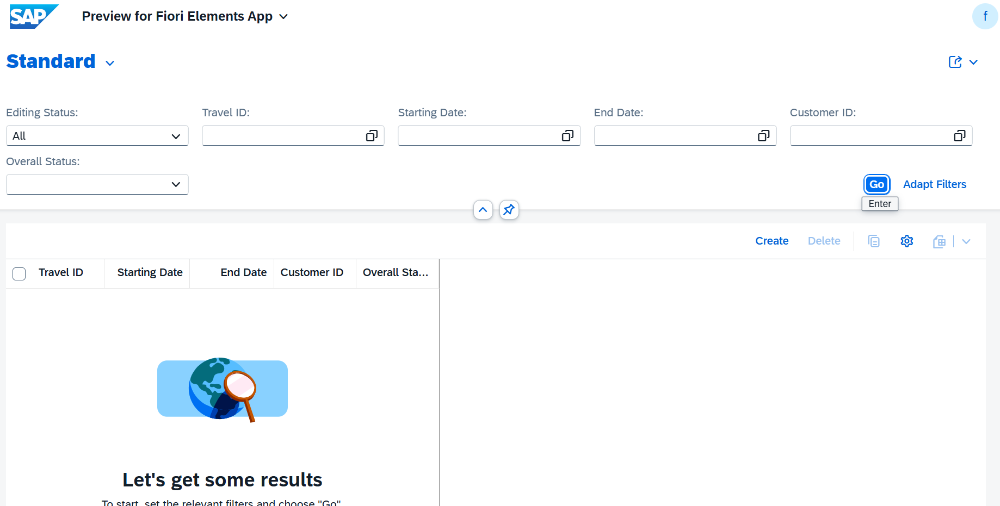
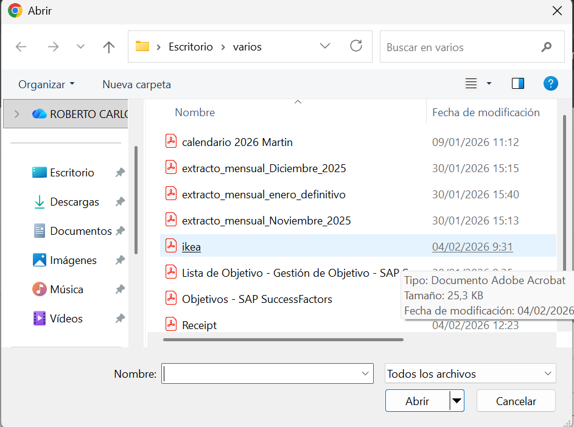
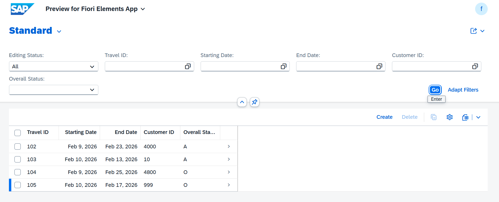
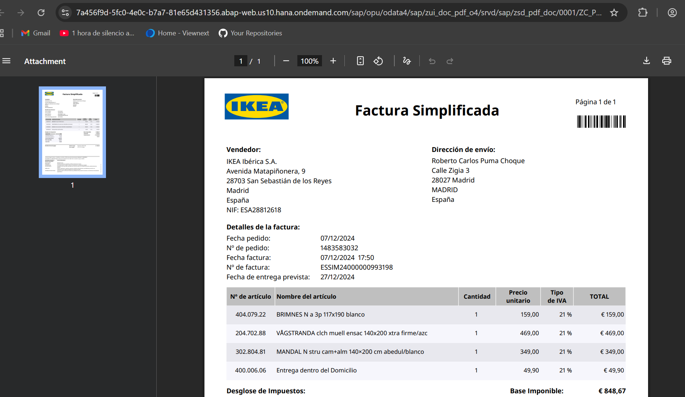

# MANAGED APP

1. [DICTIONARY](#dictionary)
   - 1.1 [Tabla BBDD](#11-tabla-bbdd)
   - 1.2 [Tabla BBDD DRAFT](#12-tabla-bbdd-draft)

2. [Core Data Services](#core-data-services)
   - 2.1 [DATA DEFINITIONS](#21-data-definitions)
     - 2.1.1 [ROOT VIEW](#211-root-view)
     - 2.1.2 [PROJECTION VIEW](#212-projection-view)
     - 2.1.3 [ABSTRACT ENTITY](#213-abstract-entity)
   - 2.2 [METADATA EXTENSIONS ¡Aquí se definen tres botones de interacción!](#22-metadata-extensions)
    - 2.3 [BEHAVIOR DEFINITIONS](#23-behavior-definitions)
     - 2.3.1 [BEHAVIOR DEFINITIONS](#231-behavior-definitions)
     - 2.3.2 [PROJECTION BEHAVIOR](#232-projection-behavior)

3. [Business Services](#business-services)
   - 3.1 [Services Definition](#31-services-definition)
   - 3.2 [Services Binding](#32-services-binding)

4. [Source Code Library](#source-code)
   - 4.1 [Clases](#41-clases)

5. [Pruebas](#pruebas)

---

## DICTIONARY

### 1.1 Tabla BBDD

``` abap
@EndUserText.label : 'Tabla turismo'
@AbapCatalog.enhancement.category : #NOT_EXTENSIBLE
@AbapCatalog.tableCategory : #TRANSPARENT
@AbapCatalog.deliveryClass : #A
@AbapCatalog.dataMaintenance : #RESTRICTED
define table ztravel_app_01 {

  key client            : abap.clnt not null;
  key travel_id         : /dmo/travel_id not null;
  begin_date            : /dmo/begin_date;
  end_date              : /dmo/end_date;
  customer_id           : /dmo/customer_id;
  overall_status        : /dmo/overall_status;
  created_by            : abp_creation_user;
  created_at            : abp_creation_tstmpl;
  local_last_changed_by : abp_locinst_lastchange_user;
  local_last_changed_at : abp_locinst_lastchange_tstmpl;
  last_changed_at       : timestampl;

}
```

### 1.2 Tabla BBDD DRAFT

``` abap
@EndUserText.label : 'Draft Database Table for ZTRAVEL_APP_01_D'
@AbapCatalog.enhancement.category : #EXTENSIBLE_ANY
@AbapCatalog.tableCategory : #TRANSPARENT
@AbapCatalog.deliveryClass : #A
@AbapCatalog.dataMaintenance : #RESTRICTED
define table ztravel_app_01_d {

  key mandt          : mandt not null;
  key travelid       : /dmo/travel_id not null;
  begindate          : /dmo/begin_date;
  enddate            : /dmo/end_date;
  customerid         : /dmo/customer_id;
  overallstatus      : /dmo/overall_status;
  createdby          : abp_creation_user;
  createdat          : abp_creation_tstmpl;
  locallastchangedby : abp_locinst_lastchange_user;
  locallastchangedat : abp_locinst_lastchange_tstmpl;
  lastchangedat      : timestampl;
  "%admin"           : include sych_bdl_draft_admin_inc;

}
```

## Core Data Services

### 2.1 DATA DEFINITIONS

#### 2.1.1 ROOT VIEW

``` abap
@AccessControl.authorizationCheck: #MANDATORY
@Metadata.allowExtensions: true
@ObjectModel.sapObjectNodeType.name: 'ZTRAVEL_APP_01'
@EndUserText.label: '###GENERATED Core Data Service Entity'
define root view entity ZR_TRAVEL_APP_01
  as select from ztravel_app_01
{
  key travel_id             as TravelID,
      begin_date            as BeginDate,
      end_date              as EndDate,
      customer_id           as CustomerID,
      overall_status        as OverallStatus,
      @Semantics.user.createdBy: true
      created_by            as CreatedBy,
      @Semantics.systemDateTime.createdAt: true
      created_at            as CreatedAt,
      @Semantics.user.localInstanceLastChangedBy: true
      local_last_changed_by as LocalLastChangedBy,
      @Semantics.systemDateTime.localInstanceLastChangedAt: true
      local_last_changed_at as LocalLastChangedAt,
      last_changed_at       as LastChangedAt
}

``` 

#### 2.1.2 PROJECTION VIEW

``` abap
@AccessControl.authorizationCheck: #MANDATORY
@EndUserText.label: '###GENERATED Core Data Service Entity'
@Metadata.allowExtensions: true
@Metadata.ignorePropagatedAnnotations: true
@ObjectModel.sapObjectNodeType.name: 'ZTRAVEL_APP_01'

define root view entity ZC_TRAVEL_APP_01
  provider contract transactional_query
  as projection on ZR_TRAVEL_APP_01

  association [1..1] to ZR_TRAVEL_APP_01 as _BaseEntity on $projection.TravelID = _BaseEntity.TravelID

{
  key TravelID,

      BeginDate,
      EndDate,

      @Consumption.valueHelpDefinition: [
             { entity: {
                name: '/DMO/I_Customer_StdVH',
                element: 'CustomerID' }
             } ]
      CustomerID,

      @Consumption.valueHelpDefinition: [
            { entity: { name: '/DMO/I_Overall_Status_VH_Text', 
              element: 'OverallStatus' } } ]      
      OverallStatus,

      @Semantics.user.createdBy: true
      CreatedBy,

      @Semantics.systemDateTime.createdAt: true
      CreatedAt,

      @Semantics.user.localInstanceLastChangedBy: true
      LocalLastChangedBy,

      @Semantics.systemDateTime.localInstanceLastChangedAt: true
      LocalLastChangedAt,

      LastChangedAt,

      _BaseEntity
}

```

#### 2.1.3 ABSTRACT ENTITY

``` abap
no aplica
```
Anotaciones clave:
```js
no aplica
```

### 2.2 METADATA EXTENSIONS

Los Metadata Extensions sirven para definir la configuración de la UI (interfaz de usuario) de forma declarativa, permitiendo la separación entre:

* Lógica de datos (CDS View)
* Presentación visual (anotaciones UI)

Estas anotaciones se publican automáticamente en el servicio **OData** y son interpretadas por **Fiori Elements** para generar la interfaz sin programación manual.

Configuran cómo se ve y comporta la aplicación Fiori sin tocar código de datos ni frontend.

[...detalle](../0.%20Developing%20LIST%20REPORT%20APP%20FOR%20CREATE/md_docs/metadata_extensions.md)

``` abap
@Metadata.layer: #CORE

@UI.headerInfo: { title: { type: #STANDARD, value: 'TravelID' },
                  description: { type: #STANDARD, value: 'TravelID' } }

annotate view ZC_TRAVEL_APP_01 with

{
  @UI.facet: [ { label: 'General Information',
                 id: 'GeneralInfo',
                 purpose: #STANDARD,
                 position: 10,
                 type: #IDENTIFICATION_REFERENCE } ]
  @UI.identification: [ { position: 10 } ]
  @UI.lineItem: [ { position: 10 } ]
  @UI.selectionField: [ { position: 10 } ]
  TravelID;

  @UI.identification: [ { position: 20 } ]
  @UI.lineItem: [ { position: 20 } ]
  @UI.selectionField: [ { position: 20 } ]
  BeginDate;

  @UI.identification: [ { position: 30 } ]
  @UI.lineItem: [ { position: 30 } ]
  @UI.selectionField: [ { position: 30 } ]
  EndDate;

  @UI.identification: [ { position: 40 } ]
  @UI.lineItem: [ { position: 40 } ]
  @UI.selectionField: [ { position: 40 } ]
  CustomerID;

  @UI.identification: [ { position: 50 } ]
  @UI.lineItem: [ { position: 50 } ]
  @UI.selectionField: [ { position: 50 } ]
  OverallStatus;

  @UI.hidden: true
  CreatedBy;

  @UI.hidden: true
  CreatedAt;

  @UI.hidden: true
  LocalLastChangedBy;

  @UI.hidden: true
  LocalLastChangedAt;

  @UI.hidden: true
  LastChangedAt;

  @EndUserText.label: '_BaseEntity'
  @UI.identification: [ { position: 110, label: '_BaseEntity' } ]
  @UI.lineItem: [ { position: 110, label: '_BaseEntity' } ]
  @UI.selectionField: [ { position: 110 } ]
  _BaseEntity;
}
```

### 2.3 BEHAVIOR DEFINITIONS

Es un artefacto que especifica QUÉ operaciones están permitidas sobre una entidad 
y CÓMO se comporta esa entidad durante las operaciones CRUD (Create, Read, Update, Delete).

[...detalle](../0.%20Developing%20LIST%20REPORT%20APP%20FOR%20CREATE/md_docs/BDEF.MD)

Ventas:
* ✓ Separación de responsabilidades: Lógica de negocio separada de la UI
* ✓ Reutilización: Mismo comportamiento para múltiples interfaces (Fiori, API, etc.)
* ✓ Mantenibilidad: Cambios centralizados en un solo lugar
* ✓ Consistencia: Reglas de negocio aplicadas uniformemente
* ✓ RAP Framework: Aprovecha todas las capacidades del framework moderno de SAP

#### 2.3.1 BEHAVIOR DEFINITIONS

##### Se crea BDEF sobre CDS root o Interfaz


``` abap
managed implementation in class ZBP_R_TRAVEL_APP_01 unique;
strict ( 2 );
with draft;
extensible;
define behavior for ZR_TRAVEL_APP_01 alias ZrTravelApp01
persistent table ztravel_app_01
extensible
draft table ztravel_app_01_d
etag master LocalLastChangedAt
lock master total etag LocalLastChangedAt
authorization master ( global )
{

  create;
  update;
  delete;

  field ( mandatory : create )
  TravelID;

  field ( readonly )
  CreatedBy,
  CreatedAt,
  LocalLastChangedBy,
  LocalLastChangedAt;

  field ( readonly : update )
  TravelID;

  // Declaración de la validación
  validation validateDates on save { field BeginDate, EndDate; create; }
  validation validateCustomer on save { field CustomerID; create; }

  draft action Activate optimized;
  draft action Discard;
  draft action Edit;
  draft action Resume;
  draft determine action Prepare;

  mapping for ztravel_app_01 corresponding extensible
    {
      TravelID           = travel_id;
      BeginDate          = begin_date;
      EndDate            = end_date;
      CustomerID         = customer_id;
      OverallStatus      = overall_status;
      CreatedBy          = created_by;
      CreatedAt          = created_at;
      LocalLastChangedBy = local_last_changed_by;
      LocalLastChangedAt = local_last_changed_at;
      LastChangedAt      = last_changed_at;
    }

}
```

#### 2.3.2 PROJECTION BEHAVIOR

#### Ventajas

1. Separación de Responsabilidades: Interface (lógica) vs Consumption (UI)
2. Múltiples UIs: Puedes tener varias proyecciones para diferentes roles
3. Mantenibilidad: Cambios en la lógica se reflejan automáticamente
4. Seguridad: Controlas qué expones en cada capa

``` abap
projection implementation in class ZBP_C_TRAVEL_APP_01 unique;
strict ( 2 );
extensible;
use draft;
use side effects;
define behavior for ZC_TRAVEL_APP_01 alias ZcTravelApp01
extensible
use etag
{
  use create;
  use update;
  use delete;

  use action Edit;
  use action Activate;
  use action Discard;
  use action Resume;
  use action Prepare;

}
```

``` abap
```

## business-services

### 3.1 services-definition

``` abap
@EndUserText: {
  label: 'Service Definition for ZC_TRAVEL_APP_01'
}
@ObjectModel: {
  leadingEntity: {
    name: 'ZC_TRAVEL_APP_01'
  }
}
define service ZUI_TRAVEL_APP_01_O4 provider contracts odata_v4_ui {
  expose ZC_TRAVEL_APP_01;
}
```

### 3.2 services-binding

Pasos para la creación una nueva vinculación.


<!--  -->


Selección del tipo de vinculación
<!--  -->


Publicar el servicio
<!--  -->


Visualizar
<!--  -->


## source-code

### 4.1 clases

``` abap
class ZBP_R_TRAVEL_APP_01 definition
  public
  abstract
  final
  for behavior of ZR_TRAVEL_APP_01 .

public section.
protected section.
private section.
ENDCLASS.


CLASS ZBP_R_TRAVEL_APP_01 IMPLEMENTATION.
ENDCLASS.
```

``` abap
class lhc_zr_travel_app_01 definition inheriting from cl_abap_behavior_handler.
  private section.
    methods get_global_authorizations for global authorization
              importing
                 request requested_authorizations for ZrTravelApp01
              result result.
    methods validateDates for validate on save
                  importing keys for ZrTravelApp01~validateDates.
    methods validateCustomer for validate on save
      importing keys for ZrTravelApp01~validateCustomer.
endclass.


class lhc_zr_travel_app_01 implementation.
  method get_global_authorizations.
  endmethod.

  method validateDates.
    " 1. Leer las fechas de los registros que se están guardando
    read entities of ZR_Travel_App_01 in local mode
         entity ZrTravelApp01
         fields ( BeginDate EndDate )
         with corresponding #( keys )
         result data(lt_travels).

    loop at lt_travels into data(ls_travel).

      " 2. Lógica de validación
      if ls_travel-EndDate < ls_travel-BeginDate. " Fecha fin antes que inicio

        " 3. Reportar el error a la UI
        append value #( %tky = ls_travel-%tky ) to failed-zrtravelapp01.

        append value #( %tky               = ls_travel-%tky
                        %state_area        = 'VALIDATE_DATES'
                        %msg               = new_message_with_text(
                                                 severity = if_abap_behv_message=>severity-error
                                                 text     = 'La fecha de fin no puede ser anterior a la de inicio' )
                        %element-begindate = if_abap_behv=>mk-on
                        %element-enddate   = if_abap_behv=>mk-on ) to reported-zrtravelapp01.

      elseif ls_travel-BeginDate < cl_abap_context_info=>get_system_date( ). " Fecha en el pasado

        append value #( %tky = ls_travel-%tky ) to failed-zrtravelapp01.

        append value #( %tky               = ls_travel-%tky
                        %state_area        = 'VALIDATE_DATES'
                        %msg               = new_message_with_text(
                                                 severity = if_abap_behv_message=>severity-error
                                                 text     = 'No puedes registrar viajes en el pasado' )
                        %element-begindate = if_abap_behv=>mk-on ) to reported-zrtravelapp01.
      endif.

    endloop.
  endmethod.

  method validateCustomer.
    " ========================================
    " PASO 1: Declarar variables de trabajo
    " ========================================
    data ls_reported type structure for reported zr_travel_app_01\\ZrTravelApp01.

    " 1. Leer las fechas de los registros que se están guardando
    read entities of ZR_Travel_App_01 in local mode
         entity ZrTravelApp01
         fields ( CustomerID )
         with corresponding #( keys )
         result data(lt_travels).

    loop at lt_travels into data(ls_travel).

      select count(*) from /DMO/I_Customer
        where CustomerID = @ls_travel-CustomerID.

      if sy-subrc = 0.
        continue.
      endif.

      " ========================================
      " PASO 2: Crear la estructura para REPORTED
      " ========================================
      " Inicializamos la estructura vacía
      clear ls_reported.

      " ========================================
      " PASO 3: Asignar la clave técnica (%tky)
      " ========================================
      " %tky identifica de forma única la instancia que falló
      " Copia todos los campos clave de la entidad
      ls_reported-%tky        = ls_travel-%tky.
      " Ejemplo: si tu clave es TravelID, esto es equivalente a:
      " ls_reported-TravelID = ls_travel-TravelID.

      " ========================================
      " PASO 4: Asignar el state_area
      " ========================================
      " Define el área de estado donde ocurrió el error
      " Agrupa mensajes relacionados
      ls_reported-%state_area = 'VALIDATE_CUSTOMER'.

      " Alternativa: Para marcar TODOS los state areas
      " ls_reported-%state_area = if_abap_behv=>state_area_all.

      " ========================================
      " PASO 5: Crear el mensaje de error
      " ========================================
      " Método 1: new_message_with_text (el que usas actualmente)
*      ls_reported-%msg        = new_message_with_text( severity = if_abap_behv_message=>severity-error
*                                                       text     = |¡El cliente { ls_travel-CustomerID } no existe!| ).

      ls_reported-%msg        = new_message( id       = 'ZRAP_MSG_VAL'
                                             number   = '001'
                                             severity = if_abap_behv_message=>severity-error
                                             v1       = ls_travel-CustomerID ).

      " ========================================
      " PASO 6: Marcar el campo que tiene el error
      " ========================================
      " Marca el campo CustomerID como el que tiene el problema
      " if_abap_behv=>mk-on = 'X' (marca activada)
      ls_reported-%element-customerid = if_abap_behv=>mk-on.

      " Esto hace que en Fiori Elements se resalte el campo en rojo

      " ========================================
      " PASO 7: Agregar al tabla REPORTED
      " ========================================
      insert initial line into table reported-zrtravelapp01 assigning field-symbol(<f>).
      <f> = corresponding #( ls_reported ).

    endloop.
  endmethod.
endclass.
```

## pruebas










