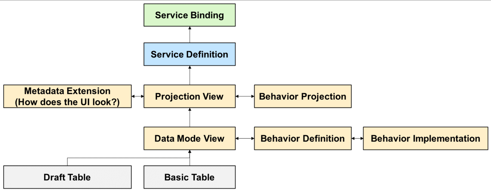
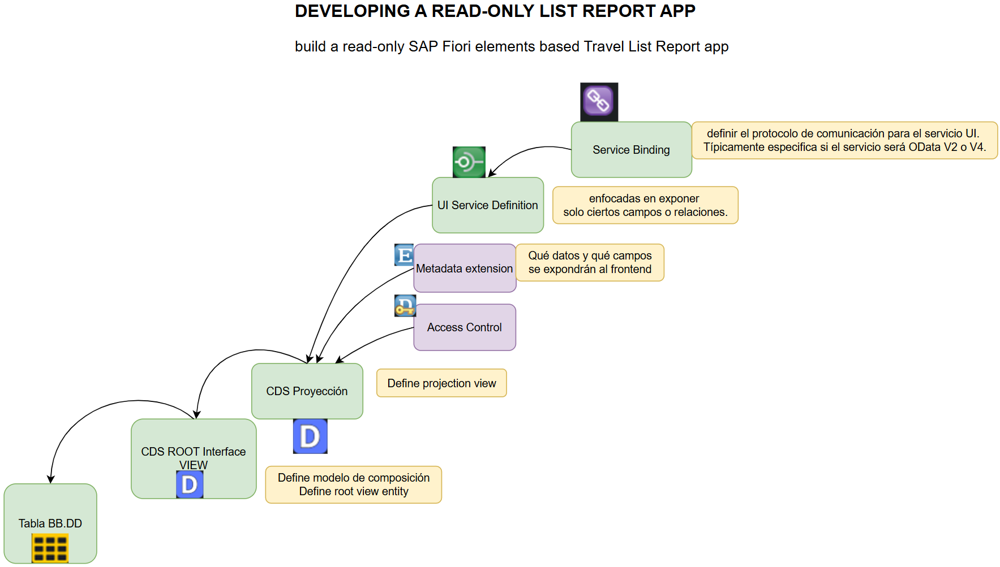
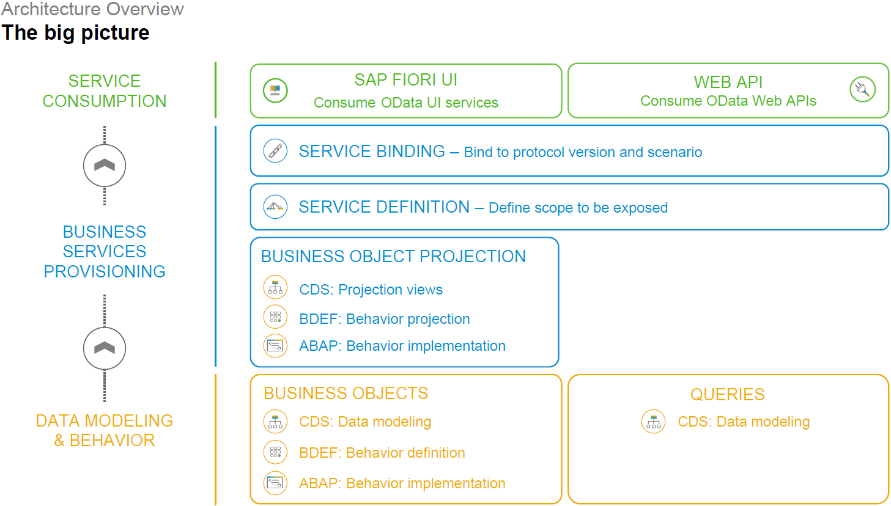
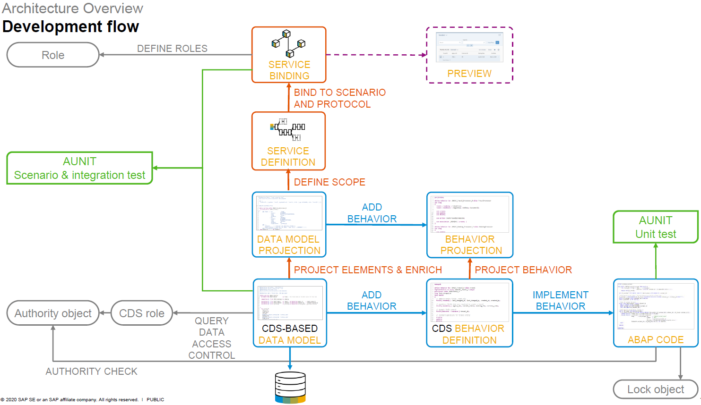

# Building Apps with the ABAP RESTful Application Programming Model 

## Construcción

## Orden de creación de los objetos

## The big picture

## Developement flow

## Vocabulario

[vocabulario](./vocabulario.md)

## MANAGED APP

>   ### Managed Behavior + Draft = STANDARD INSERT

[...detalle](./BTP%20ejercicios/0.%20Developing%20LIST%20REPORT%20APP%20FOR%20CREATE/README.MD)

## UNMANAGED APP

[....detalle](sss)

## List of Useful SAP Fiori TCodes

[....detalle](transacciones.MD)